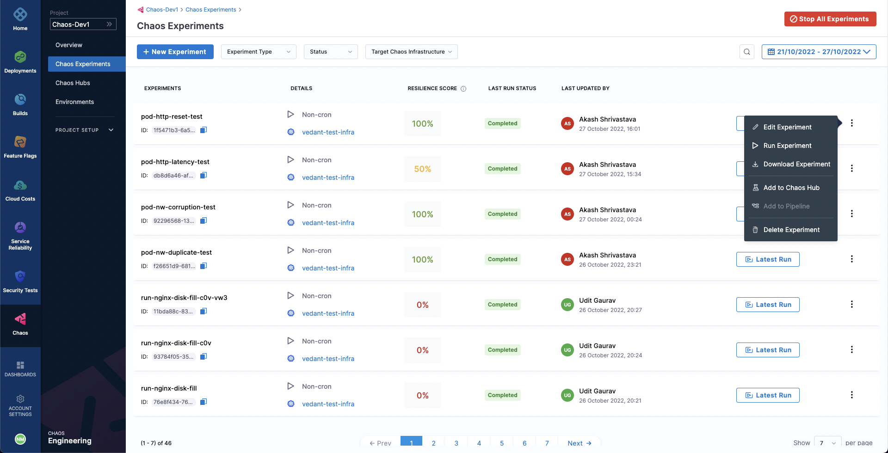

Deleting an experiment removes it from the list of experiments in the **Chaos Experiments** sidebar option under Chaos tab.
- Deleting an initialized or completed experiment will permanently remove the experiment.
- Deleting a running experiment will not only remove the experiment permanently but also immediately stop the experiment execution.
- Deleting an experiment doesn't remove any template which has been created using that experiment.

To delete any experiment, go to the **Chaos Experiments** page, select the **More options** icon (**⋮**) for the experiment you want to delete, and then select **Delete Experiment**.

