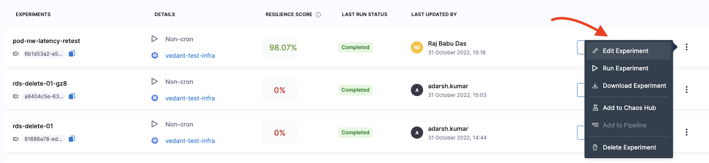

An existing chaos experiment may be edited to update the experiment to update it's metadata, faults, schedule, etc. 

To edit an experiment, in the **Chaos Experiments** page, select the **`⋮`** icon against the name of the experiment you want to edit and select **Edit Experiment**.

You can either update the changes to the same experiment and save it or create a copy of the experiment and then apply the changes to it.
