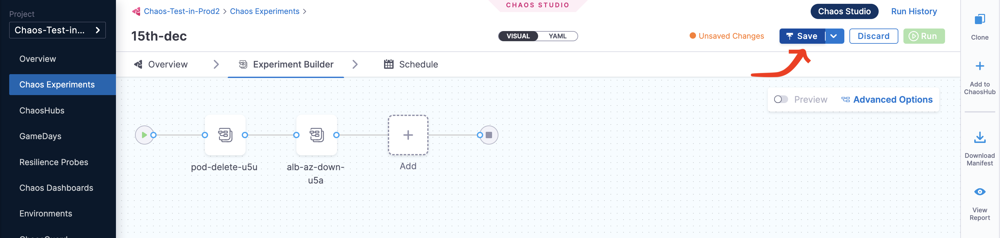
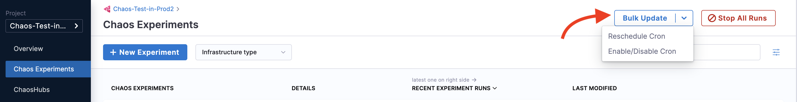
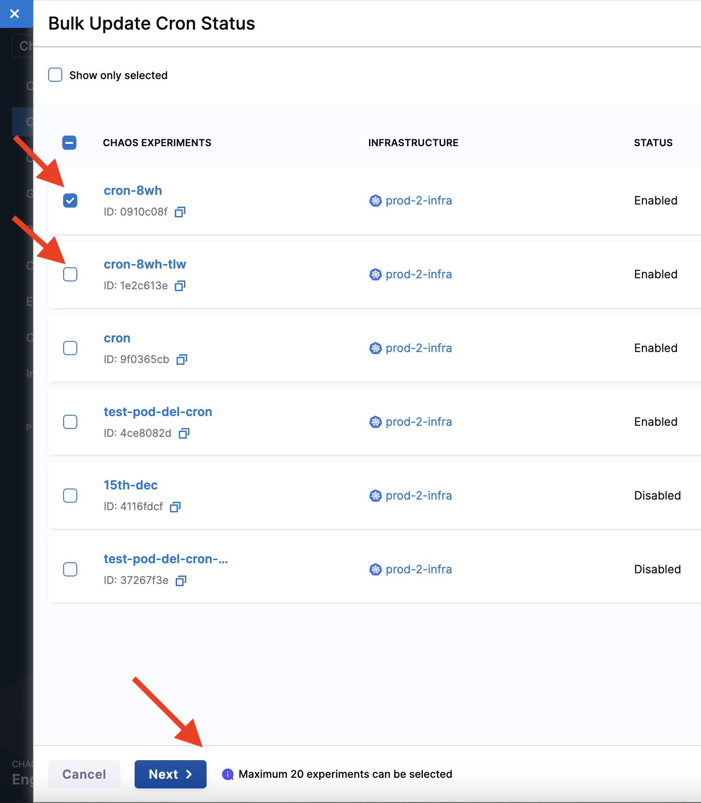
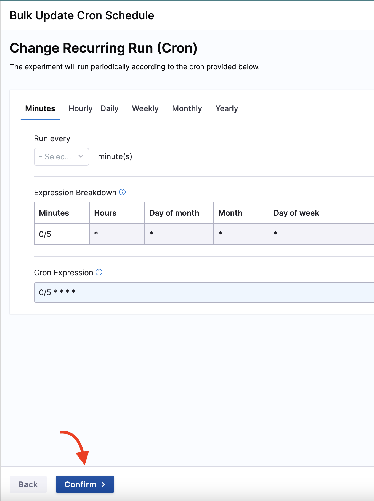
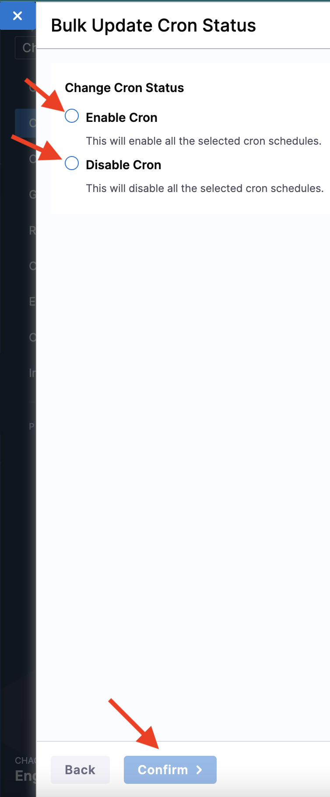
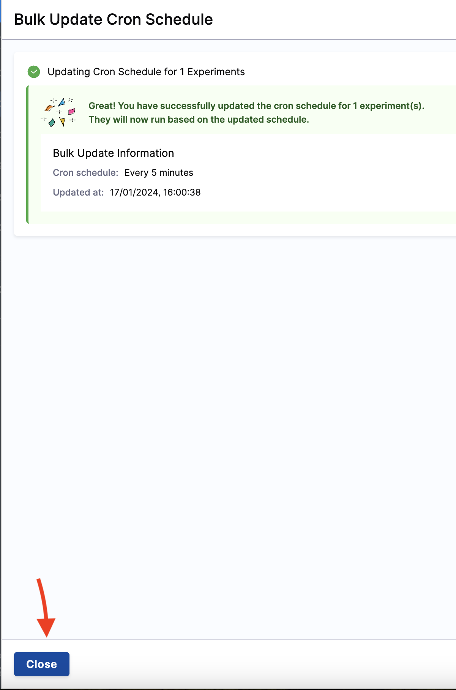

import Tabs from '@theme/Tabs';
import TabItem from '@theme/TabItem';

You can edit an existing chaos experiment to update the experiment's metadata, faults, schedule, etc. This section describes two actions:
1. Editing an experiment 
2. Bulk updating cron schedules

## Edit a chaos experiment

Described below are the steps to edit a chaos experiment. 

### Step 1: Click Edit experiment

On the **Chaos Experiments** page, select the **`⋮`** icon against the name of the experiment you want to edit and select **Edit Experiment**.

### Step 2: Make changes and save

You can either update the changes to the same experiment and save it or create a copy of the experiment and then apply the changes to it.

## Bulk update cron schedules

You can update multiple cron-scheduled chaos experiments in one go. One important aspect is that you can **bulk update** multiple cron schedules to a **single value**, that is, the cron schedules you select to update will all update to a single common value. You **can't** map different cron schedules to their respective values while performing a bulk update.
You can: 
1. Bulk disable active schedules
2. Bulk enable inactive cron schedules
3. Bulk stop running experiments

To enable/disable a cron schedule,

### Step 1: Click Bulk update

Once you click **Bulk update** at the top right of the **Chaos Experiments** page, you will see two options: 
1. Reschedule cron 
2. Enable/disable cron

Select one of the above based on your requirements.

:::tip
You can bulk update (reschedule or enable/disable) not more than 20 experiments in one go.
:::

### Step 2: Select experiments

Select one or more experiments that you wish to reschedule or enable/disable.

### Step 3: Perform the bulk update on selected experiments

Based on your choice between rescheduling or enabling (or disabling) a cron schedule, you will see one of the screens.

<Tabs>
  <TabItem value="Reschedule">

You can change the schedule of the experiments by changing the values, and click **Confirm**.

 </TabItem>
  <TabItem value="Enable/disable">

You can select one of the options (enable cron or disable cron), and click **Confirm**.

</TabItem>
</Tabs>

### Step 4: Click close
You will see a confirmation message on your screen about the updated schedule. Click **Close**.

