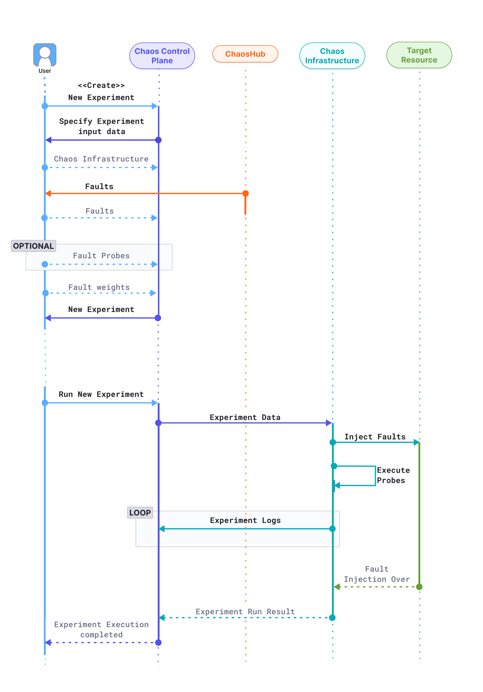

## Experiment execution

The below diagram shows the flow of control when a user creates a new chaos experiment.

1. The user attempts to create a new chaos experiment in the Chaos Control Plane.
2. The Control plane prompts the user to input the required information for the creation a new experiment, such as

   * **Chaos infrastructure:** Which chaos infrastructure will be targeted as part of the experiment.
   * **Fault and fault tunables:** The fault templates can be fetched from any connected chaos hubs, where the tunables can be modified wherever necessary. Multiple faults can be added in any desired order.
   * **Fault probes:** Optionally, additional probes can be defined on top of the default “Healthcheck” probe for a fault, to validate custom hypothesis conditions as part of the experiment.
   * **Fault weights:** Fault weights define the importance of a fault with respect to other faults present in an experiment. More formally, it is used for calculating the experiment’s resiliency score, a quantitative measure of the target environment’s resiliency when the respective experiment is performed.

   The experiment is now created and ready to be executed.

3. When the user attempts to run the experiment, the control plane relays the experiment data to the target chaos infrastructure, which undertakes four distinct responsibilities during the experiment execution:

   * **Inject faults:** Faults received as part of the experiment are interpreted and injected into the target resource. Depending on the experiment, multiple faults might be injected simultaneously.
   * **Execute probes:** Respective fault probes are executed as and when the faults execute and their result is stored.
   * **Stream logs:** When an experiment is being executed, real-time logs can be streamed, and retrieved when required.
   Experiment execution logs are streamed and accessible in real-time in the chaos control plane.
   * **Send result:** Finally, the experiment execution result, including the probe execution result, is sent back to the chaos control plane.

   The chaos experiment execution is now concluded.

## Chaos hub

Chaos hub is a collection of experiment templates and faults that helps create new chaos experiments.

- In essence, Chaos Hub is a collection of manifests and charts, which represent the experiments and faults that exist as part of the hub.
- You can add Chaos Hub using a Git service provider such as GitHub, where Chaos Hub exists as a repository. This allows native version control and management of the faults and experiment artifacts.
- Apart from an Enterprise Chaos Hub (out of the box), you can also add custom Chaos Hubs to maintain and distribute private faults and experiments within your organization.

Experiments are templates to create new chaos experiments, which contain a collect of chaos faults and certain custom actions ordered in a specific sequence. Faults refer to the failures injected as part of an experiment.

Both experiments and faults are stored as manifests in an appropriate directory structure. Hence, you can add new experiment templates and faults directly to the repository as files. In addition, you can derive the experiment templates from the existing experiments and save them to the Chaos Hub from the UI.

## How the resilience score is calculated

The **resilience score** is a quantitative measure obtained when you run a chaos experiment. This score represents how resilient the target environment is when you run that chaos experiment on it.

The score is calculated based on:

* The weight you give each fault in the experiment.
* The success rate of the probes in each fault.

### Fault weight

While creating a chaos experiment, you can assign a weight between 1 - 10 to each fault. This represents the priority/importance of the respective fault. The higher the weight, the more significant the fault is.

For example:

- Low Priority: 0 - 3
- Medium Priority: 4 - 6
- High Priority: 7 - 10

### Success rate of probes in each fault

The **probe success percentage** for a fault is the ratio of successful probes to total probes. For example, if a fault has 4 probes and only 2 of them are successful, then the probe success percentage for this fault is 50%.

### Resilience calculation

Based on fault weights and probe success rates, you can calculate two types of resilience score (represented as a percentage):

* **A fault's resilience** = fault weight * probe success percentage 
* **The experiment's total resilience** = sum of all fault resilience / sum of all fault weights of the experiments

Here's an example:

* **Experiment A** runs, and includes 3 faults. Fault weights, number of probes, and resulting success rates of this experiment are as follows.

   | Fault | Weight | Number of probes | Probes succeeded | Fault resilience |
   |:----:|:---:|:---:|:-------:|:-------:|
   | Fault1 | 2 | 1 | 0 (or 0%) | 0%    | 
   | Fault2 | 4 | 2 | 2 (or 100%) | 400%  | 
   | Fault3 | 8 | 4 | 3 (or 75%) | 600%   | 
   |        | **Sum: 14** |  |    | **Sum: 1000%**   |  
 
* **Experiment A's total resilience score** 

   Divide the sum of all fault resilience by the sum of all fault weights:

   **1000% / 14 = 71%**

