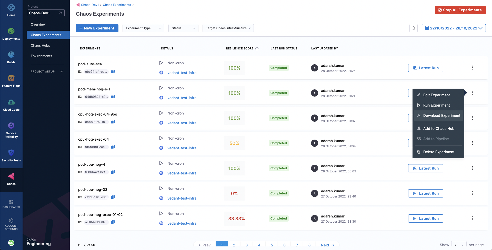
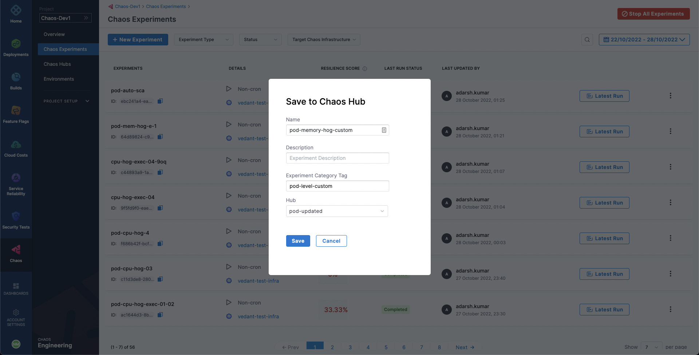

Chaos experiments can be exported to save them for later use. Although simply creating or running an experiment using the Chaos Studio saves it to be later accessed through the **Chaos Experiments** sidebar option, you can also download the experiment as a manifest file to your machine or save it in any chaos hub.

## Download experiment manifest file
To download the manifest file for an experiment, select the **Chaos Experiments** sidebar option. You can access all the experiments that have been created or run in the past.

To export an experiment, select the **`⋮`** icon against the name of the experiment.
Select **Download Experiment**. This downloads the experiment file to your machine.

You can directly upload this manifest file while creating a new experiment to use it as a template for the new experiment. Otherwise, a better way to save, manage, and distribute the experiments as templates is to use chaos hubs.

## Add an experiment to chaos hub
To add an experiment to chaos hub, select the **`⋮`** icon against the name of the experiment.
Select **Add to Chaos Hub**. Then, add an experiment name, optionally a description and a category tag, and choose the chaos hub to add the experiment to from the list of added chaos hubs.

Select **Save**. Now, you should be able to see this experiment added to your chaos hub. You can access it and use it as a template for your new experiments.

