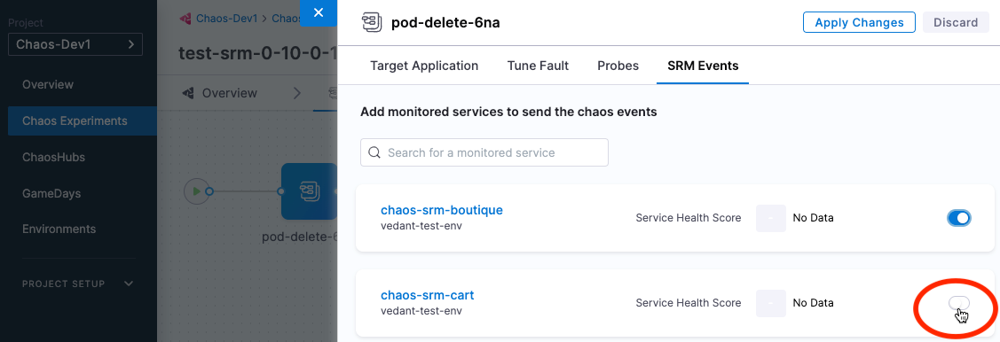
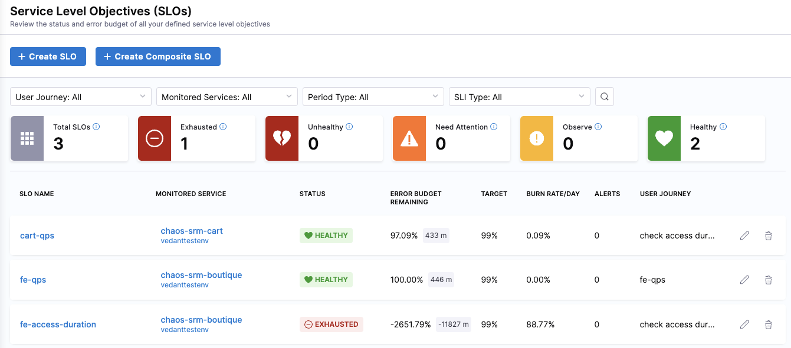

Within Harness, you can see the impact of chaos faults on your target environments by using [Service Reliability Management (SRM)](/docs/service-reliability-management).
To do this, you connect any chaos fault within an experiment to monitored services. A monitored service in Harness is a combination of a service and environment that [SRM](/docs/service-reliability-management) monitors for changes, events, and health trends. When you connect chaos faults to a monitored service you can then use the SRM dashboard to see their impact.

For example, let's say you use SRM to monitor services and to correlate change events to service health. Now you want to see how one or more chaos faults impacts your target environment. By adding the target environment as a monitored service, and linking faults to that service, you can see the impacts on service health when you run experiments containing those faults. 

For more information on monitored services, go to the [SRM documentation](/docs/service-reliability-management).

## Before you begin

Create a monitored service that represents your target environment for running chaos experiments, and then create one or more Service Level Objectives (SLOs) for the monitored service. For instructions, go to: 

* [Create a monitored service](/docs/service-reliability-management/monitored-service/create-monitored-service).
* [Create your first SLO](/docs/service-reliability-management/getting-started/create-first-slo)

## Connect a fault to a monitored service

To connect a fault to a monitored service:

1. In Harness, select **Chaos > Chaos Experiments**, and then find and select an experiment.
1. In Experiment Builder, select a fault, and then select the **SRM Events** tab.

	

1. Select the toggle on the monitored service(s) that you want to link this fault to, and then click **Apply Changes**.

## Check the impact of a fault on a monitored service

Once you've connected faults to a monitored service corresponding to your target environment, when you run the experiment(s) containing those faults, you can use the SRM dashboard to check the health of that service.

To check the impact of a fault on a monitored service:

1. In Harness, select **Service Reliability**.

	The SLOs dashboard appears.
	
	 

For more information on monitored services, go to these topics to:

* [Create a monitored service](/docs/service-reliability-management/monitored-service/create-monitored-service)
* [Use the **Service Health** dashboard](/docs/service-reliability-management/change-impact-analysis/change-impact-analysis-service-health-dashboard)
* [Use the **Changes** dashboard](/docs/service-reliability-management/change-impact-analysis/change-impact-analysis-changes-dash-board)
