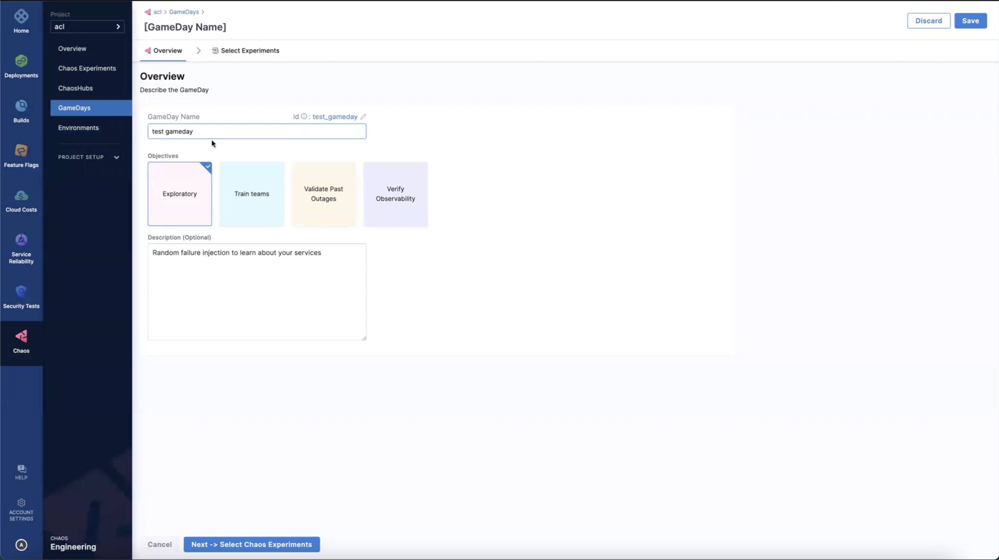
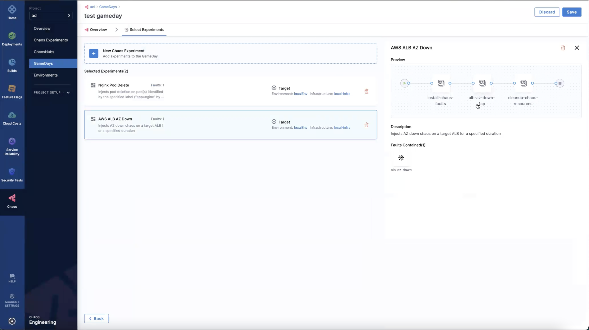
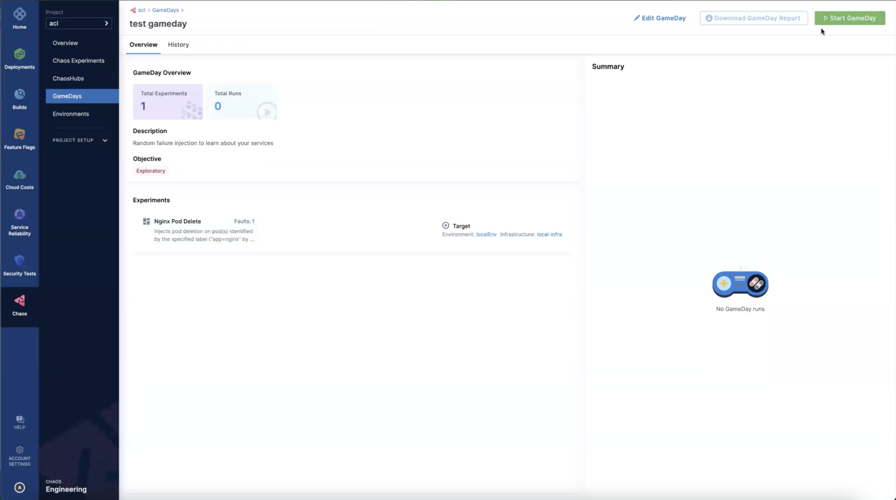
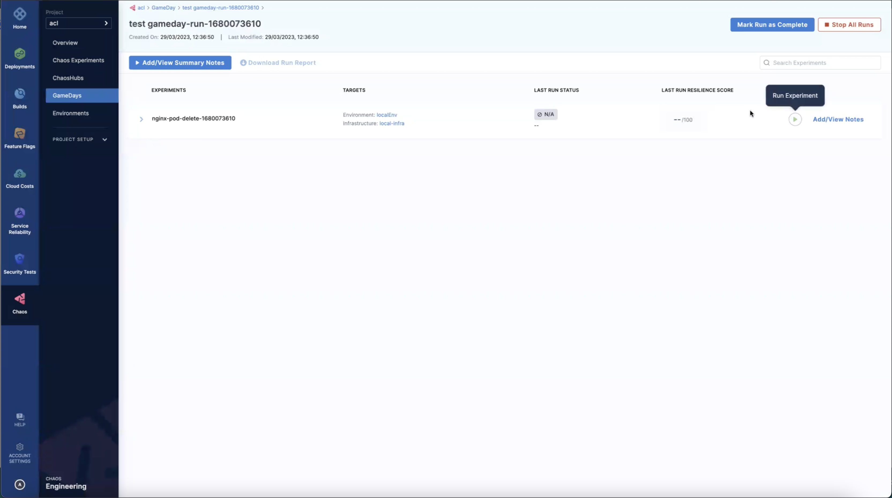

This section describes what a GameDay is, how a typical GameDay is run, and its outcomes.

## Introduction

GameDay is a methodology to execute chaos experiments in your application during a specific time period. It acts as a template to schedule and execute one or more chaos experiments within your application. In general, GameDays help apply a fatal scenario to your application in a safe environment, thereby determining the resilience of the application and verifying the system at scale. 

At every step in implementing a GameDay, you will either find a glitch in the system that you can address or gain confidence in your application.

A GameDay typically involves the following steps:

1. Run chaos experiments on your application,
2. Observe the impact of the failure,
3. Discuss the technical outcomes.

:::tip
GameDays help decide the type of failure the system would undergo based on the nature of the chaos experiments present within the GameDay. Hence, it is strongly recommended to begin with easy use cases where the blast radius is minimal, such as breaking one container, degrading one instance, and making one availability zone unavailable. Later on, you can delve into more complex failures, such as failing an entire service or affecting a large percentage of requests.
:::

Running a GameDay by using CE’s GameDay feature involves the following steps:

1. Plan your GameDay
2. Create a GameDay and specify the details
3. Add experiments to the GameDay and save it
4. Schedule or run the GameDay
5. Record the conclusion and action items

:::info note
Once you create a GameDay in CE, you can run it as many times as you wish. CE saves information about every run, which includes the date, summary, and any notes you add.
:::

## Prerequisites
You can create a GameDay provided you have the following prerequisites.
1. CE account
2. Access to a cluster

## Creating a GameDay
You can create and run a GameDay with the following steps.

### 1: Plan your GameDay

Address the following questions before proceeding to run a Gameday:
1. Which services should I test?
2. What is the goal of the GameDay? 
3. What should I verify or determine by the end of the GameDay?

Once these questions have a viable answer, you can proceed to create a GameDay. 

### 2: Create a GameDay and specify the details
1. Creating a GameDay involves two steps:
* Specifying details about the GameDay,
* Adding chaos experiments to the GameDay. 
To create a GameDay, click **+New GameDay**. 

2. Add details such as **GameDay name**, **Objectives**, and **Description** (optional). Click **Next-> Select Chaos Experiments**.

### 3: Add experiments to the GameDay and save it
1. After creating a GameDay, add experiments to the GameDay by clicking **New Chaos Experiment**.

2. You can add experiments by selecting the ones available in the chaos hub.  

3. Select a chaos infrastructure. Click **Add experiments to the GameDay**.

:::info
You can add up to 20 experiments to every GameDay, and every chaos experiment can be executed on a different chaos infrastructure.
:::

4. This will lead you to a page that lists the experiments you selected for the current GameDay. You can add or delete experiments from this page.

5. Select the experiment to see a preview of the experiment's pipeline.

6. After adding the experiments to the GameDay, click **Save**.

### 4: Schedule or run the GameDay
1. Now that you have the experiments in the GameDay, you are all set to run them. 

2. Click **Start GameDay**. This creates experiments within your GameDay.

3. Clicking GameDay leads you to the page that contains the experiments associated with the GameDay.

4. On this page, you can **Run** the experiment. 

5. Click **Run Experiment**. This begins the execution of the experiment. 

### 5: Record the conclusion and action items
1. You can add a summary of the experiments in the GameDay by clicking **Add/View Notes**.  

2. You can mark a GameDay run as complete by clicking **Mark Run as Complete**. After this action, you will not be able to rerun the experiments inside the GameDay run. This completed run serves as a checkpoint within the GameDay that helps keep track of how the application fared during a specific situation.

## Conclusion
Congratulations! You have successfully executed your first GameDay in CE. Don’t forget to check out [other CE tutorials](/tutorials/chaos-experiments).

