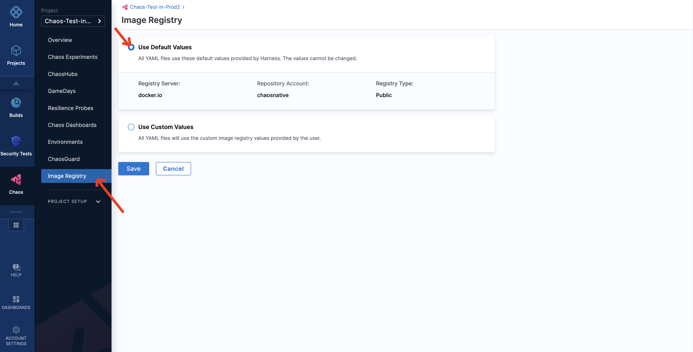

```mdx-code-block
import Tabs from '@theme/Tabs';
import TabItem from '@theme/TabItem';
```

This section describes an image registry, and how it can be used within a chaos experiment. 

Image registry is a repository that hosts container images which are used by chaos experiments. Registries can be **public** or **private**. HCE allows you to use custom image registries for chaos experiments.

Follow the steps mentioned below to use default or custom values of image registry in your chaos experiment. 

```mdx-code-block
<Tabs>
  <TabItem value="Default values">
```
## Default image registry 

### Step 1: Navigate to Image Registry
To use a default image, go to **Image Registry** on the left-hand side, and select **Use default values**. 



### Step 2: Save the default values
Click **Save** to save your changes. 


In your chaos experiment manifest, the above default setting will be reflected as shown below.
```yaml
container:
  name: ""
  image: docker.io/chaosnative/k8s:1.23.0
  command:
    - sh
    - "-c"
  args:
    - kubectl apply -f /tmp/ -n {{workflow.parameters.adminModeNamespace}} && sleep 30
```

```mdx-code-block
  </TabItem>
  <TabItem value="Custom values">
```
## Custom image registry
### Step 1: Navigate to Image Registry

To use a custom image, go to **Image Registry** on the left-hand side, and select **Use custom values**.


### Step 2: Specify parameters
Specify parameters for the custom values, such as **Custom image registry server**, **Custom image registry account**, and **Registry type**.


You can choose between **Public** or **Private** in the **Registry type**. When you select **Private** registry type, add the **secret name**.


### Step 3: Save the custom values
Click **Save** to save your changes.

In your chaos experiment manifest, the above custom setting will be reflected as shown below.

```yaml
container:
  name: ""
  image: test-registry/harness.io/k8s:main-latest
  command:
    - sh
    - "-c"
  args:
    - kubectl apply -f /tmp/ -n {{workflow.parameters.adminModeNamespace}} && sleep 30
```

```mdx-code-block
  </TabItem>
</Tabs>
```