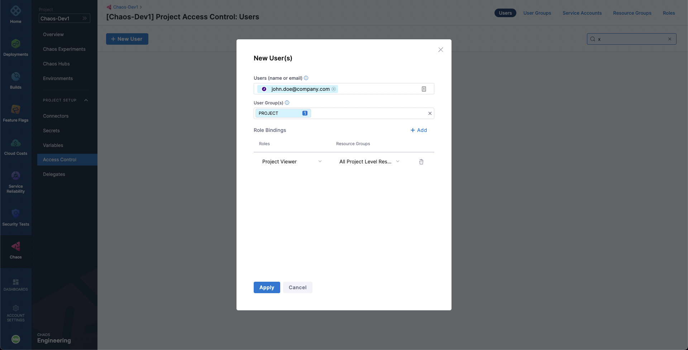

This topic describes the requirements and resources you need to run chaos experiments on your target environments.

## Chaos infrastructure requirements

The following are the chaos infrastructure Execution Plane components and required resources. These components are installed in your target cluster, allowing the chaos infrastructure to run experiments there. Chaos infrastructure runs within your target environment to aid CE in accessing the target resources and injecting chaos at a cloud-native scale.

| Deployment | Container | CPU required | Memory required | Image |
|------------|-----------|-------------------|----------------------|-------|
| chaos-operator-ce  | chaos-operator-ce     | 125m | 300M | chaosnative/chaos-operator          |
| chaos-exporter     | chaos-exporter        | 125m | 300M | chaosnative/chaos-exporter          |
| subscriber         | subscriber            | 125m | 300M | chaosnative/harness-chaos-subscriber|
| workflow-controller| workflow-controller   | 125m | 300M | chaosnative/workflow-controller     |

## Add users to a project to run chaos experiments

You must have at least one user in a project, and allow that user to do chaos experiments. The following steps generate an email invitation to the new user(s) to add themselves to the project.

To add a new user to a project: 

1. In Harness, select a project. 

1. Expand the **PROJECT SETUP** menu, and then select **Access Control**.

	This page lists all the users added to the current project.

1. Select **New User**, and then:

	1. In **New User(s)**, add the email(s) of the user(s) you want to add. 
	1. In **User Groups**, select any of the existing user groups to which the user should be added. 
	1. Add the roles for the user(s) to enforce their access permissions. 

	

1. Select **Apply**.

## Prerequisites for individual chaos faults

In the [chaos faults reference](/docs/chaos-engineering/technical-reference/chaos-faults/), you'll find fault-specific requirements listed in the **Use cases** section of each fault, as shown, for example, in the use cases for the [Docker service kill](/docs/chaos-engineering/technical-reference/chaos-faults/kubernetes/node/docker-service-kill#use-cases) fault. 
