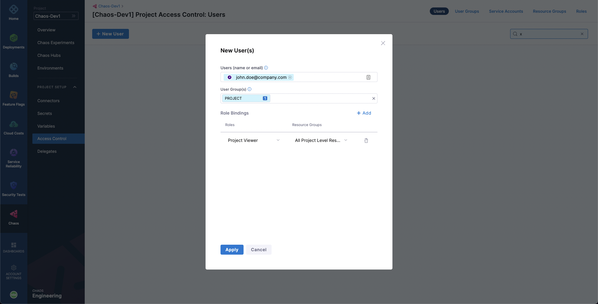

Given that you have sufficient permissions, to add a new user to a project, go to the **Access Control** page which is accessible under the `PROJECT SETUP` dropdown in the sidebar. This page lists all the users added to the current project.

To add a new user, select **New User**. Add the email of the user you want to add under **Users** input. Under **User Groups**, you can select any of the existing user groups to which the user should be added. Lastly, add the roles for the user to enforce RBAC. Select **Apply**.

This will send an email invite to the new user, using which they can add themselves to the project.
