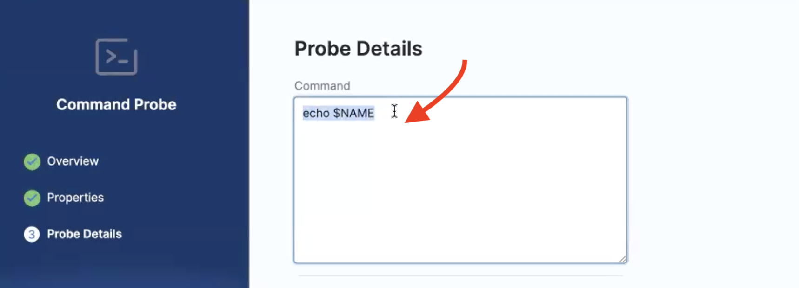
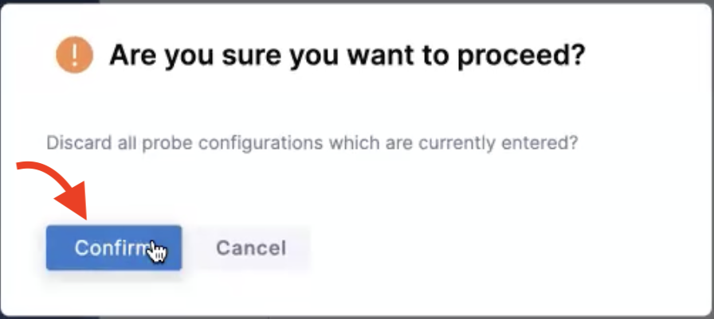

import Tabs from '@theme/Tabs';
import TabItem from '@theme/TabItem';

This section guides you through steps to use the [**command probe**](/docs/chaos-engineering/technical-reference/probes/cmd-probe) in **inline mode** and **source mode**.

## Before you begin

* [Probe overview](/docs/chaos-engineering/configure-chaos-experiments/probes/overview)
* [Command probe](/docs/chaos-engineering/technical-reference/probes/cmd-probe)

## Enter command probe details

1. Provide a name for the probe, and other parameters like chaos interval, timeout, and so on. 

2. Enter a command in the **Command** section.

<Tabs>
  <TabItem value="Inline">

To use the command probe in the **inline** mode:

3. Enter the **Type**, **Comparison criteria**, **Value**. Toggle to switch off the **Source** mode. Click **Setup probe**.

</TabItem>
  <TabItem value="Source">

To use the command probe in the **source** mode:

3. Enter the **Type**, **Comparison criteria**, **Value**. Toggle to switch oon the **Source** mode. Click **Setup probe**.

</TabItem>
</Tabs>

4. Click **Confirm** to create the probe with the parameters you entered. 

