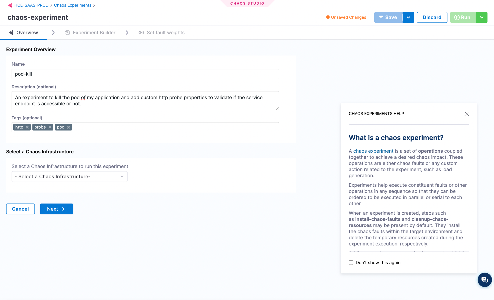
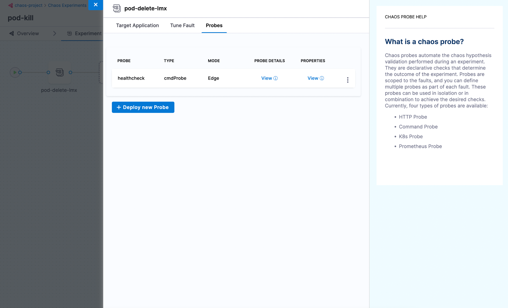
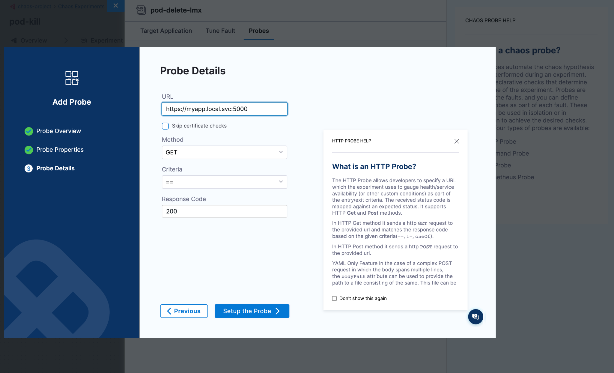
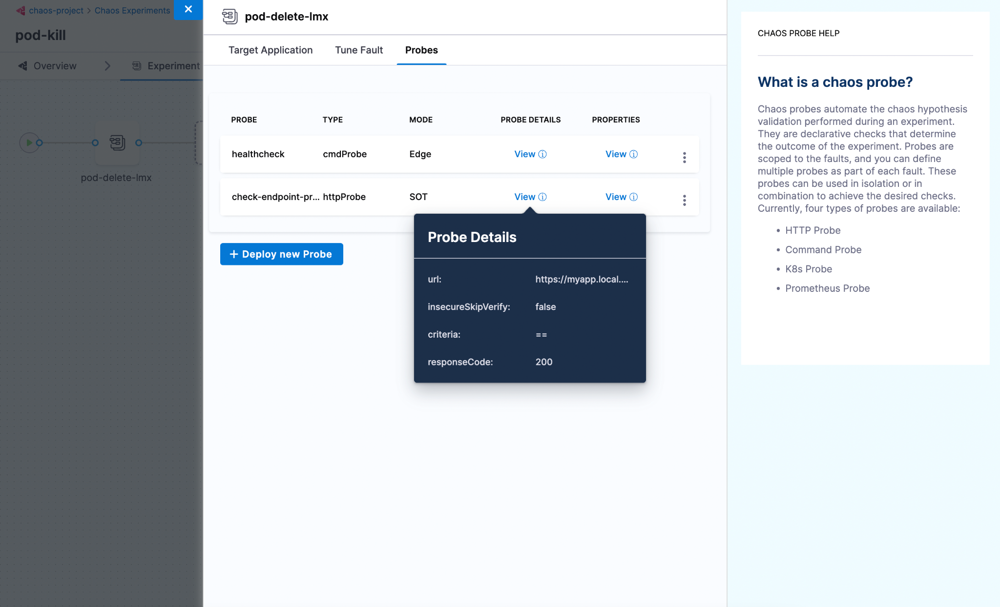

A probe explores the behavior of a [system that is in a chaotic or unpredictable state](../../technical-reference/chaos-faults) and helps validate the [declarative hypothesis](../../technical-reference/probes/overview.md) set by the user. The goal of a chaos probe is to understand the underlying patterns and laws that govern the behavior of these systems, and use this understanding to predict or control their behavior.

This section walks you through how to configure and add probes to a chaos experiment.

## Before you begin

- [Probe Overview](/docs/chaos-engineering/technical-reference/probes/overview.md)
- [Chaos Faults](/docs/chaos-engineering/technical-reference/chaos-faults/chaos-faults.md)

## Prerequisites

- You should have an active chaos infrastructure where you can schedule the chaos experiment.
- Enterprise Hub connectivity status should be active
- Read/write access to the chaos experiment to schedule or navigate to the probe addition UI.
- Read access to the chaos infrastructure to select a chaos infrastructure when creating an experiment.
- Read access to the chaos hub to select faults from the chaos hub while creating an experiment.

Once the prerequisites are fulfilled, you can configure and add a probe to your experiment using the following steps. 

## Step 1: Navigate to the chaos experiment creation
Navigate to the **Create Experiment View** by clicking `+ New Experiment` button. Provide a name, description and tag for your experiment. The description and tag are optional fields. 

Choose the active chaos infrastructure on which this experiment would be scheduled. This step is required so that we can proceed to the fault selection step where probes can be configured.



And then click on `Start with blank canvas` once you see the start off drawer pop out.


## Step 2: Select a fault

Select the `+` icon to open the fault selection drawer and choose the fault to execute in your chaos experiment based on the hypothesis decided.

Once you select a fault, a **Tuning drawer** opens up. Navigate to the last tab `Probes`. A default health check command probe will already be present. You can either add or replace the existing probe with a new one by selecting `+ Deploy new Probe` button.



## Step 3: Add a probe

Once the `Add Probe` screen opens up, provide a name, the type of the probe (HTTP or Command or Kubernetes or Prometheus) and the mode in which you want to run the probe.


Now, the screen shows common probe properties, such as `Probe timeout`, `Retry`, `Interval`, and so on. Enter relevant values, and select `Continue`.


Provide the required probe attributes. In this case, you have chosen HTTP probe, which shows attributes associated with it, such as `URL`, `Method`, `Criteria`, and so on. Enter relevant values, and select `Setup the probe`.


## Step 4: Save the probe

Once you have added the parameters for the probe, select `Setup the Probe >`. The newly configured probe is saved and appended to the manifest. To view the configurations that you saved, hover over `View` of the respective probe.



## Using YAML

The entire manifest is available as a YAML file, which can be accessed by switching over to the YAML view in chaos studio. Below is a sample manifest for the pod delete fault.

```yaml
kind: Workflow
apiVersion: argoproj.io/v1alpha1
spec:
 templates:
    - name: pod-delete-lmx
     inputs:
       artifacts:
         - name: pod-delete-lmx
           path: /tmp/chaosengine-pod-delete-lmx.yaml
           raw:
             data: |
               apiVersion: litmuschaos.io/v1alpha1
               kind: ChaosEngine
               spec:
                 experiments:
                   - name: pod-delete
                     spec:
                       probe:
                         - name: healthcheck
                           type: cmdProbe
                           mode: Edge
                           runProperties:
                             probeTimeout: 180
                             retry: 0
                             interval: 1
                             stopOnFailure: true
                           cmdProbe/inputs:
                             command: ./healthcheck -name pod-level
                             source:
                               image: chaosnative/go-runner:ci
                               inheritInputs: true
                             comparator:
                               type: string
                               criteria: contains
                               value: "[P000]"
                         - name: check-endpoint-probe
                           type: httpProbe
                           mode: SOT
                           httpProbe/inputs:
                             url: https://myapp.local.svc:5000
                             insecureSkipVerify: false
                             method:
                               get:
                                 criteria: ==
                                 responseCode: "200"
                           runProperties:
                             probeTimeout: 1000
                             interval: 2
                             retry: 1
                             probePollingInterval: 2
                             initialDelaySeconds: 3
                             stopOnFailure: false
```
