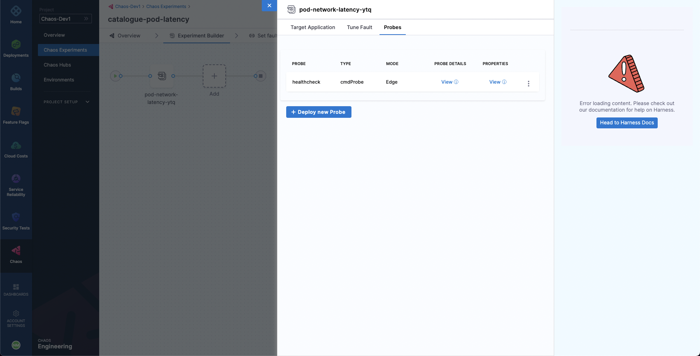
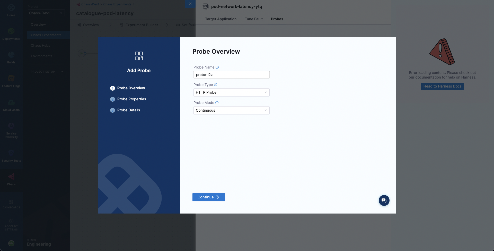

A probe explores a system's behavior when it is in a chaotic or unpredictable state. Probes validate the [declarative hypothesis](../../technical-reference/probes/overview/#declarative-hypothesis) that you set.

The hypothesis serves as a way to ensure that the experiment is well-defined and that the results can be easily understood. It also helps to ensure that the experiment is repeatable and that the results can be compared across different runs.

To add a probe for a fault while constructing an experiment, once you add a fault to the experiment you'll be prompted to configure it. You can simply switch to the **Probes** tab to access the list of probes for the fault. By default, most of the experiments will have a default target application health check.

Select **Deploy new Probe** to add a new probe. Next, you will need to specify the name, type, and mode of the probe.Select **Continue**. Then specify the probe properties. Select **Continue**. Finally, specify the probe specific details and select **Setup the Probe** to add the probe. 

