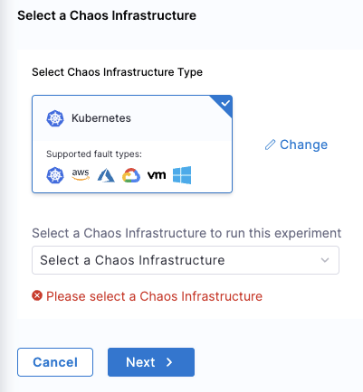

You can launch experiments from the default Enterprise Chaos Hub or from custom hubs. 

:::info note
Launching the experiment from a hub is different from running an experiment from the Chaos Experiments page. The experiments in chaos hubs are actually templates, so when you launch them from a hub you must provide some additional details. The experiments in the Chaos Experiments page execute immediately, as configured, when you run them.
:::

To launch an experiment from a chaos hub:

1. In Harness, navigate to **Chaos > ChaosHubs**, and then select the hub you want.
1. Find the experiment you want to launch, and then select **Launch Experiment**.
1. Select a chaos infrastructure, and then select **Next**.

	You can change the infrastructure type if necessary.

	

	Chaos Studio is displayed when you select **Next**.

1. In Chaos Studio's Experiment Builder, select the faults in the experiment to configure them.

	You can add more faults or delete faults from the experiment, or update the sequence of faults. 

1. Select **Run** to execute the experiment.

	You can also save your customized experiment as a template in a chaos hub using the **Save** button.
