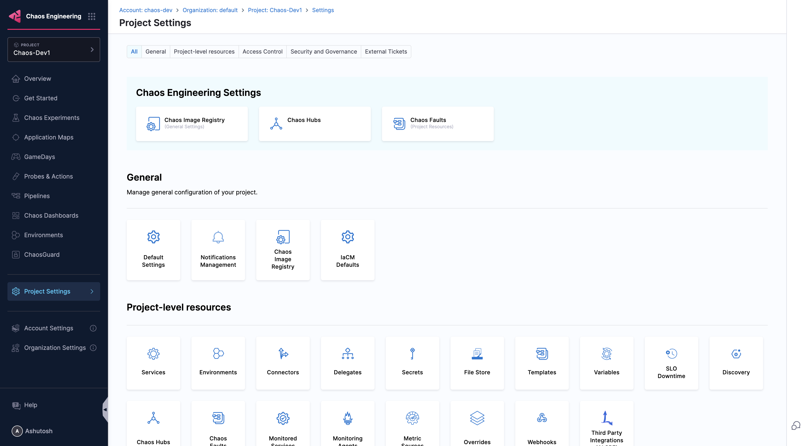
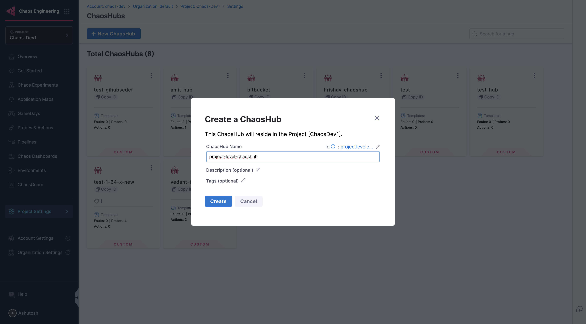

## ChaosHub Scopes

Harness Chaos supports Chaos Hubs at different organizational scopes, allowing you to manage and share chaos experiments and faults at various levels within your organization. This hierarchical approach provides flexibility in organizing and controlling access to your chaos engineering resources.

### Different available Scopes

Chaos Hubs can be configured at three different scopes:

#### 1. Account Level ChaosHub

**Scope**: Available across all projects within a specific Harness account

**Access**: Accessible to all users within the account (subject to RBAC permissions)

**Use Cases**:
- Cross-project standardized experiments
- Common infrastructure chaos scenarios
- Shared best practices across teams
- Account-wide chaos engineering templates

**Benefits**:
- **Standardization**: Promote consistent chaos engineering practices across projects
- **Resource Sharing**: Avoid duplication of common experiments across projects
- **Centralized Management**: Single point of control for account-wide chaos scenarios
- **Knowledge Sharing**: Teams can learn from and build upon each other's experiments

#### 2. Organization Level ChaosHub

**Scope**: Available across all accounts within a Harness organization

**Access**: Accessible to all users across the entire organization (subject to RBAC permissions)

**Use Cases**:
- Enterprise-wide chaos engineering standards
- Global infrastructure resilience testing
- Cross-account shared experiments
- Corporate governance and compliance scenarios

**Benefits**:
- **Enterprise Governance**: Maintain organization-wide chaos engineering standards
- **Maximum Reusability**: Share experiments across all accounts and projects
- **Global Visibility**: Centralized view of all chaos engineering activities
- **Compliance**: Ensure consistent security and compliance practices

#### 3. Project Level ChaosHub

**Scope**: Limited to a specific project within an organization

**Access**: Available only to users within that particular project

**Use Cases**:
- Project-specific experiments and faults
- Team-focused chaos engineering scenarios
- Isolated testing environments
- Custom experiments tailored to specific applications or services

**Benefits**:
- **Isolation**: Experiments are contained within the project boundary
- **Focused Management**: Easier to manage project-specific chaos scenarios
- **Team Autonomy**: Project teams can maintain their own chaos experiments
- **Reduced Complexity**: Smaller scope makes it easier to organize and find relevant experiments

### Scope Hierarchy and Inheritance

The Chaos Hub scopes follow a hierarchical structure:

```
Account Level (Global)
    ↓
Organization Level (Cross-project)
    ↓
Project Level (Team-specific)
```

### Choosing the Right Scope

Consider the following factors when deciding on the appropriate scope for your Chaos Hub:

| Factor | Account Level | Organization Level | Project Level |
|--------|---------------|-------------------|---------------|
| **Audience** | Multiple teams in account | Enterprise-wide | Single team/project |
| **Maintenance** | Account admins | Organization admins | Team responsibility |
| **Standardization** | Account-wide | Enterprise-wide | Team-specific |
| **Governance** | Moderate | High | Minimal |
| **Reusability** | Moderate | Maximum | Limited |

### Managing ChaosHub Scopes

#### Setting Up Scoped ChaosHub

1. **Navigate to ChaosHubs**: Go to the Chaos Engineering module and choose the scope you want to create a ChaosHub for.

    

2. **Create a ChaosHub**: Click on the **ChaosHubs**, then click on **New ChaosHub**, Enter the name of your ChaosHub and click **Create**

    

#### Access Control

ChaosHub access is controlled through Harness RBAC (Role-Based Access Control):

- **Account Level**: Requires account-level permissions
- **Organization Level**: Requires organization-level permissions
- **Project Level**: Requires project-level permissions

:::tip
Start with Project-level ChaosHubs for team-specific experiments, then gradually move to Account or Organization level as your chaos engineering practices mature and standardize.
:::
