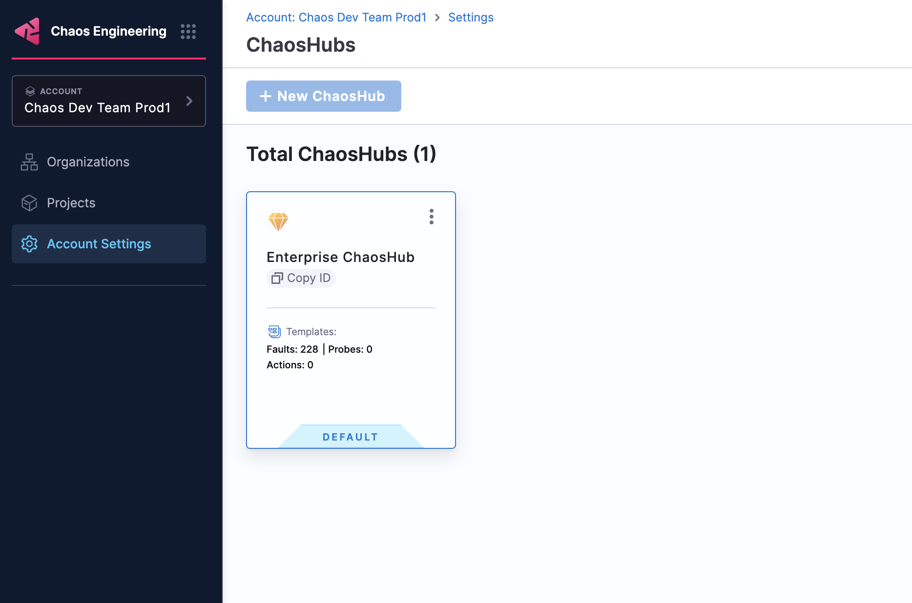

## ChaosHub

A ChaosHub is a collection of reusable faults, probes, and action templates that you can use to create chaos experiments. 

You can reuse these templates to build consistent and reliable chaos experiments while sharing proven chaos scenarios across teams and projects, maintaining consistency in chaos engineering practices, and enabling collaboration and knowledge sharing within your organization.

Harness Chaos Engineering supports creating ChaosHubs at three different levels, each serving specific use cases and providing different levels of access and control.

## Project Level ChaosHub

Project Level ChaosHubs are scoped to individual projects, providing teams with dedicated spaces for their specific chaos engineering needs.

#### Creating a Project Level ChaosHub

1. Navigate to your specific Chaos Engineering project in Harness
2. Go to **Project Settings** → **ChaosHubs**

    

3. Click **New ChaosHub**
4. Enter the ChaosHub details and click **Create**

    

---

## Organization Level ChaosHub

Organization Level ChaosHubs are available across all projects within a specific Harness organization, providing standardization for teams within that organization.

#### Creating an Organization Level ChaosHub

1. Navigate to **Chaos Engineering** in your Harness account
2. Go to **Organization Settings** → **ChaosHubs**
3. Click **New ChaosHub**
4. Enter the ChaosHub details and click **Create**

---

## Account Level ChaosHub

Account Level ChaosHubs provide the highest scope, available across all organizations and projects within your Harness account, making them ideal for enterprise-wide chaos engineering governance and standardization.

#### Creating an Account Level ChaosHub

1. Navigate to the **Chaos Engineering** in your Harness account
2. Go to **Account Settings** → **ChaosHubs**
3. Click **New ChaosHub**
4. Enter the ChaosHub details and click **Create**

:::note Enterprise ChaosHub
Harness provides a default **Enterprise ChaosHub** at the account level, which comes pre-configured with a wide array of faults and chaos scenarios. This enterprise hub includes battle-tested chaos experiments for various platforms and technologies, giving you a head start with proven chaos engineering patterns.

:::

---

## Access Control and Permissions

ChaosHub access is managed through Harness RBAC (Role-Based Access Control):

- **Account Level**: Requires account-level chaos engineering permissions
- **Organization Level**: Requires organization-level chaos engineering permissions  
- **Project Level**: Requires project-level chaos engineering permissions

:::note Permission Requirements
If you don't have the necessary permissions to create ChaosHubs at your desired level, reach out to your Organization admins to request the appropriate chaos engineering permissions for your role.
:::

:::tip Tip
Start with Project-level ChaosHubs for team-specific experiments, then gradually create Account or Organization level hubs as your chaos engineering practices mature and require broader standardization.
:::

## Next Steps

Now that you have created your ChaosHub, you can start building your chaos engineering resources:

- **Create Templates**: Add reusable fault and experiment templates to your ChaosHub. Learn how to [create and manage templates](/docs/chaos-engineering/guides/templates).

- **Build Experiments**: Use the templates from your ChaosHub to create chaos experiments in the new Chaos Studio. Get started with [creating experiments](/docs/chaos-engineering/guides/experiments).
