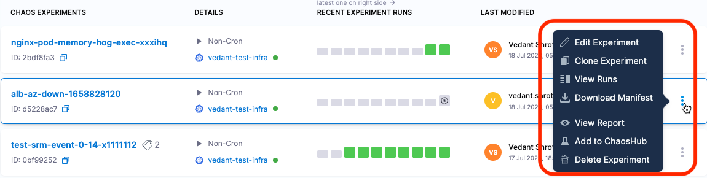
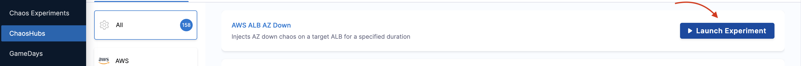

## ChaosHub

A ChaosHub is a collection of experiment templates (defined as workflow custom resources) and faults (defined as ChaosExperiment CR and ChaosEngine CR) that you can use to create and launch chaos experiments. Both experiments and faults are stored as manifests in an appropriate directory structure. This way, you can add new experiment templates and faults directly to the repository as files. In addition, you can derive the experiment templates from the existing experiments and save them to the ChaosHub from the UI.

You can add ChaosHub using a Git service provider such as GitHub, where ChaosHub exists as a repository. This allows native version control and management of the faults and experiment artefact.

HCE provides a default Enterprise ChaosHub that includes a wide array of experiments and faults out of the box. You can also add your own custom ChaosHubs to maintain and share private scenarios and faults within your organization.

[This](https://youtu.be/b4ggnJcZrcM) video provides a step-by-step walkthrough of using a ChaosHub.

#### Permissions required

ChaosHubs are associated with chaos experiments, hence you need permissions to create new experiments and modify exisiting experiments. Chaos experiments, in turn, are executed in a chaos infrastructure, hence you need to have access to **create/edit** and **view** the **chaos infrastructure**. Go to **Project Settings** -> **Access Control** -> **Roles** and create a new role or ask your project admin to create an appropriate role.

#### Enterprise ChaosHub

It is a ChaosHub with additional security and teaming features for better collaboration around chaos scenarios. It is a private GitHub repository that you can access using a special key.

Also known as Enterprise hub, it comes out-of-the-box with HCE and consists of pre-built manifests (YAML files) and chaos experiment templates. It is a prebuilt ChaosHub that represents the existing experiments and chaos faults. You can use faults from multiple categories to create chaos experiments in the Enterprise ChaosHub.

##### Use cases of ChaosHubs

- You can get secure storage of your git keys. except admins, no one else can access your git keys.
- You can export a given chaos scenario to an Enterprise ChaosHub. Once you export a chaos scenario, it is hosted in the hub and is ready to be used as a base for cloning.
- You get access to many chaos scenarios in the Enterprise hub where you can browse through a scenarios and directly execute it.

##### Reason for adding custom ChaosHub

* Add custom experiments suited to specific needs in your organization.
* Share your experiments with others in your Harness project or in other Harness projects—you can add the same custom hub(s) to many projects.
* Maintain and upgrade experiments in one place so those you share your hubs with always have the latest version.
* Provide secure access to your custom experiments.

:::info note
Resilience probes are currently not supported with Chaos Hubs.
:::

## Connect to a ChaosHub

This topic describes how to add and connect a custom ChaosHub.

#### Prerequisites for Adding a Custom ChaosHub

1. Make sure you have a Git repository for your custom ChaosHub, where you will store experiments and faults. The repository must include two folders: `experiments` and `faults`. Here's an example repo:

	

1. [Generate a personal access token](https://docs.github.com/en/authentication/keeping-your-account-and-data-secure/managing-your-personal-access-tokens#creating-a-personal-access-token-classic) [from GitHub](https://github.com/settings/tokens) to access and sync your repository with Harness. The token must have at least the **repo** scope.

	

#### Add a Custom ChaosHub

1. In your Harness project, navigate to the **Chaos > ChaosHubs**, and then select **+ New ChaosHub**.

1. Enter a **Name** for the hub and optionally add a **Description** and **Tags**.

1. Select **Continue**.

1. On the Git Connection screen, add a new Git connector to access and sync your repository with Harness.

	

	1. In the **ChaosHub Connector** field. you'll see existing Git connectors listed under separate tabs for Project, Organization, and Account scopes.

		

	1. Select **New Connector**, and then choose **GitHub Connector**.

	1. In the Overview screen, enter a **Name** and optional description and tags, and then select **Continue**.

		The Details screen is displayed.

		

	1. In the Details screen, for **URL Type**, select **Repository**.

		You can select **Account** if you want to create an account-scoped GitHub connector. This can be used for connecting multiple ChaosHubs from a single GitHub account.

	1. For **Connection Type**, select **HTTP**.

	1. In **GitHub Repository URL**, enter the URL of your custom ChaosHub repository.

		If you selected **Account** for **URL Type**, fill out these fields instead:

		* In **GitHub Account URL**, enter the account URL for your custom ChaosHub repository.

		* In **Test Repository**, enter any repository name from your GitHub account to validate the connection.

	1. Select **Continue**.

		The Credentials screen appears.

		

1. On the Credentials screen, enter the **Username** (in plain text) for authenticating with your GitHub repository.

1. In **Personal Access Token**, select **Create or Select a Secret**.

	This displays all the secrets in separate tabs for Project, Organization, and Account scopes.

	

1. Select **New Secret Text**.

	

1. In the **Add new Encrypted Text** screen, fill out the fields as follows:

	1. In **Secret Name**, enter a name for this secret.
	1. In **Secret Value**, enter a personal access token (PAT) generated from [GitHub](https://github.com/settings/tokens).

		Ensure that the token has at least a **repo** scope.

1. Select **Save**, and then on the Credentials screen, select **Continue**.

	

	This adds your GitHub repository connector and initializes the PAT for authentication.

1. In the **Connect to provider** screen, select **Connect through Harness Platform**, and then select **Save and Continue**.

	This starts a connection test to validate that Harness can access the Git repository with the given configuration.

	

1. When the test is successful, select **Finish**.

	The Git Connection screen appears.

	

1. In **Hub Repository Branch**, enter the repository branch in which the ChaosHub files are located.
1. Select **Connect Hub**, and then select **Finish**.

	Your new custom ChaosHub appears on the **ChaosHubs** page.

:::info note
To share your custom ChaosHub with another Harness project, add the hub to the other project by following the same procedure.
:::

## Manage ChaosHub

This section explains how to save and manage experiments in your custom ChaosHub(s) and how to sync your ChaosHub GitHub repository with Harness.

#### View ChaosHubs

The experiments in various ChaosHubs are templates that you can launch after specifying some details.

To view the default and custom ChaosHubs:

1. In Harness, navigate to **Chaos > ChaosHubs**.

	This page lists the default Enterprise ChaosHub and any custom ChaosHubs.

	

1. Select the ChaosHub you want to view.

	The experiments below are in a custom hub. By default, all experiments are displayed. You can select a tag (circled below) to filter the experiments.

	

	The experiments below are in the default Enterprise ChaosHub, organized by platform/technology.

	

#### Add Experiments to a Custom ChaosHub

When you add an experiment to a custom ChaosHub, it's saved as a template from which you can launch the experiment after specifying some details.

To add an experiment to a custom ChaosHub:

1. [Create an experiment](/docs/chaos-engineering/guides/experiments).

1. In the Chaos Experiments page, find the experiment you want to add to a custom ChaosHub, select the **More options** icon (**⋮**), and then select **Add to ChaosHub**.

	

1. On the Save to ChaosHub screen, verify the **Name**, **Description** and **Experiment Category Tag**.

	To add a new tag, type its name and then press the Enter/Return key.

	

	:::tip
	Including **Experiment Category Tag(s)** helps organize your experiments. When you view the custom ChaosHub, you can see all experiments or filter them by tag.
	:::

1. In the **Hub** field, choose the custom ChaosHub you want to save the experiment, and then select **Apply**.

1. Select **Save**.

	This saves your experiment as a template in a custom ChaosHub.

:::info note
You can also save an experiment as a template to a custom ChaosHub while [creating the experiment](/docs/chaos-engineering/guides/experiments) in Chaos Studio. The **Save** button saves the experiment itself so that it appears on the Chaos Experiments page. Selecting the **down-arrow** next to **Save** lets you add the experiment as a template to a custom ChaosHub.

:::

#### Sync Harness with a ChaosHub Git repository

When you connect a custom ChaosHub, you can add and edit experiments in that hub in either Harness or the custom hub's GitHub repository.
Changes made in Harness sync automatically with your repository. However, when you make changes in your repository, you need to sync them with Harness using the UI.

To sync your custom ChaosHub's Git repository with Harness:

1. In Harness, navigate to **Chaos > ChaosHubs**.
1. Select the **More options** icon (**⋮**) for the hub you want to sync, and then select **Sync Hub**.

	

#### Launch an Experiment from a ChaosHub

You can launch experiments from either the default Enterprise ChaosHub or from custom hubs.

:::info note
Launching an experiment from a hub is different from running one directly from the Chaos Experiments page. The experiments in ChaosHubs are templates, so when you launch them, you'll need to provide additional details. On the other hand, experiments on the Chaos Experiments page execute immediately, as configured.
:::

To launch an experiment from a ChaosHub:

1. In Harness, go to **Chaos > ChaosHubs**. Select the hub from which you want to launch an experiment.

	

1. Find the experiment you want to launch, and then select **Launch Experiment**.

	

1. Choose a chaos infrastructure, and then select **Next**. You can change the infrastructure type if needed.

	

1. This takes you to the **Experiment Builder** where you can configure the faults in the experiment. You can add,remove or rearrange faults as needed.

	

1. Select **Run** to execute the experiment.

	

:::tip
You can also save your customized experiment as a template in a ChaosHub by selecting the **Save** button.

	
:::
