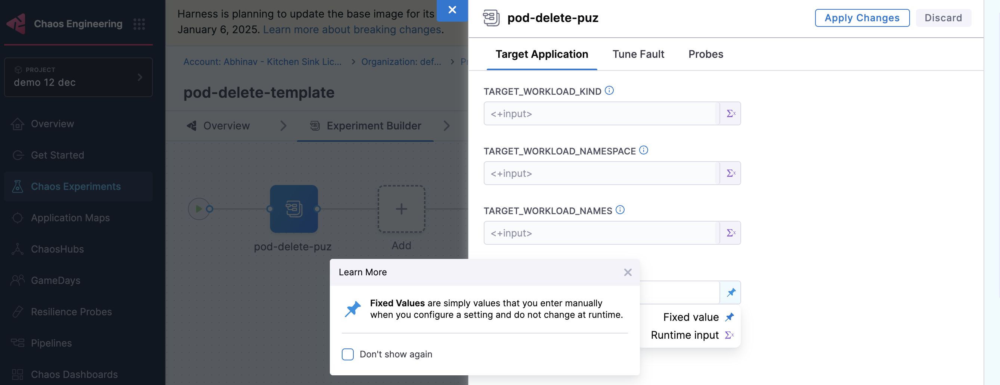

The **New Chaos Studio** offers an enhanced, streamlined approach to chaos experiment design.

## What is a Chaos Experiment?

A **chaos experiment** is a testing methodology that validates system resilience by introducing controlled failures and observing system behavior. In the New Chaos Studio, experiments are composed of three core components:

- **Faults**: Controlled disruptions injected into your system to simulate real-world failures
- **Probes**: Enhanced validation mechanisms that continuously monitor system health and behavior
- **Actions**: Automated responses and workflows that execute based on experiment conditions

#### Advantages Over Old Chaos Studio

The New Chaos Studio significantly expands experiment capabilities compared to the legacy version:

- **New Studio**: Complete experiment lifecycle with faults, standalone probes, and actions
- **Enhanced Validation**: Probes can now be defined independently and reused across experiments
- **Actions**: New automated response workflows based on experiment conditions

---

## Create a Chaos Experiment

1. Navigate to **Chaos Experiments** and click on **New Experiment**.

2. In the next screen, enter the **Name**, select your **Chaos Infrastructure**.

3. In the **Experiment Builder** screen, you can build chaos experiments by adding:
   - **Faults** to simulate system failures
   - **Probes** to validate system behavior and health
   - **Actions** to automate responses based on experiment outcomes

    

:::tip Alternative Method
You can also create experiments by uploading YAML files directly, which is useful for version control and programmatic experiment management.
:::

---

## Add Faults, Probes, and Actions

    

#### Add a Fault

1. Click on '+' icon, then select **Add a Fault** to add a fault to the experiment.

2. Select the fault you want to add to the experiment and click **Add to experiment**.

    

3. Tune the properties of the fault, and click **Apply Changes**.
   
#### Add an Action

1. Click on '+' icon, then select **Add an Action** to add an action to the experiment.

2. Select the action you want to add to the experiment and click **Add to experiment**.

    

3. Modify the variables if any, then click **Apply Changes** in the next screen

#### Add a Probe

1. Click on '+' icon, then select **Add a Probe** to add a probe to the experiment.

2. Select the probe you want to add to the experiment and click **Add to experiment**.

    

3. Tune the properties of the probe, and click **Apply Changes**.

:::tip Parallel Execution
You can add multiple faults, probes, and actions to run in parallel by using **Ctrl+Click** (Windows/Linux) or **Cmd+Click** (Mac) when clicking the '+' icon. This allows you to execute multiple components simultaneously during your experiment.

:::

--- 

## Run Experiment & Monitor with Timeline View

1. Save the experiment and click on **Run** to execute the experiment.

2. Once the experiment begins execution, you'll be taken to the **Timeline View** which provides real-time monitoring of your running experiment.

#### What is Timeline View?

The **Timeline View** displays a visual representation of all events in your chaos experiment as they happen. Each event shows with timestamps, giving you complete visibility into:

- **Chaos injection** - When faults start executing
- **Probe validation** - Real-time health checks and monitoring  
- **Actions execution** - Custom scripts and delay actions
- **Rollback/Cleanup** - Recovery and cleanup processes

        

In the example above, you can see how faults and probes run both serially and in parallel, with clear timestamps for each event.

#### Monitor Your Experiment

As your experiment runs, the timeline continuously updates showing:

- **Step 1:** Chaos injection starts → Event logging begins with timestamps
- **Step 2:** Probe validation runs → Continuous monitoring updates
- **Step 3:** Faults execute → Real-time status and metadata
- **Step 4:** Actions trigger → Custom workflows execute
- **Step 5:** Rollback/Cleanup → Recovery processes complete

#### Get Detailed Event Information

Click on any event in the timeline to view detailed metadata:

- **Experiment events** show name, tunables, and execution status

        

- **Probe events** display details, logs, and validation results
	
        

This real-time monitoring helps you:
- **Track progress** as your experiment executes
- **Debug issues** by identifying exactly when and where failures occur
- **Analyze results** with complete execution history and metadata
- **Understand impact** of chaos faults and validation probes over time

---
## Edit Experiment

1. Go to **Chaos Experiments** and hover over the (⋮) icon next to the experiment you want to edit, then select **Edit Experiment**.

    

---

## Export Experiment

1. Go to **Chaos Experiments** and hover over the (⋮) icon next to the experiment you want to export, then select **Download Manifest**.

    

---

## Runtime Variable Support

Runtime variables provide flexibility in chaos experiments by allowing you to customize experiment parameters at execution time rather than hardcoding them during creation.

You can execute chaos experiments using either static values or dynamic runtime values:

- **Static variables**: Define them directly in the experiment and use them without any modification.
- **Runtime variables**: Specify them using `<+input>`, allowing customization at runtime or through saved input sets.

#### Use Runtime Variables

When setting up an experiment, in the **Target Application** and **Tune Fault** modals, you can choose between **Fixed value** and **Runtime Input**. Once you choose the input type, **Save** the changes.

   

   

:::tip Runtime Variable Tips
- If you don't provide values for certain fields (which are not mandatory), the experiment executes with default values.
- Variables specified as runtime inputs appear as editable fields in the UI, whereas static fields appear as display-only.
:::

    

