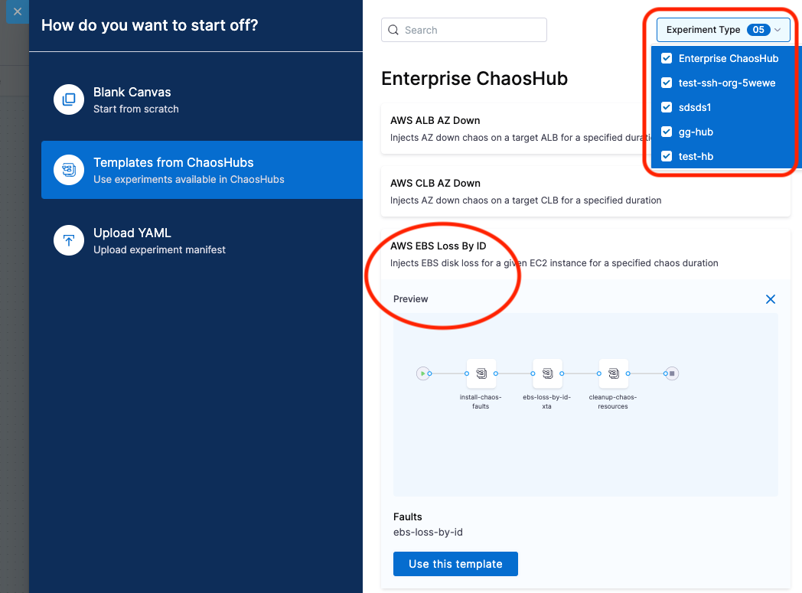
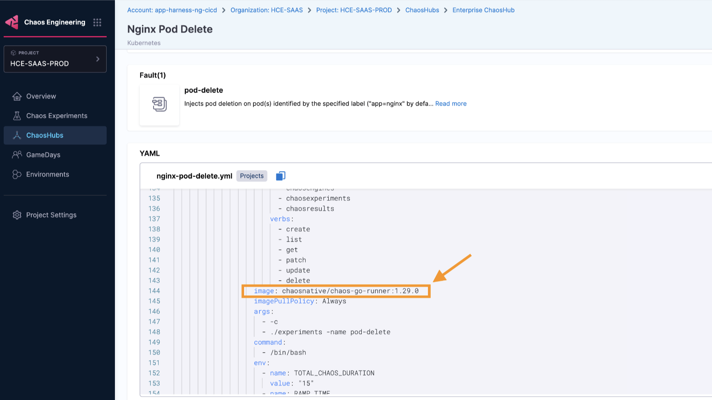
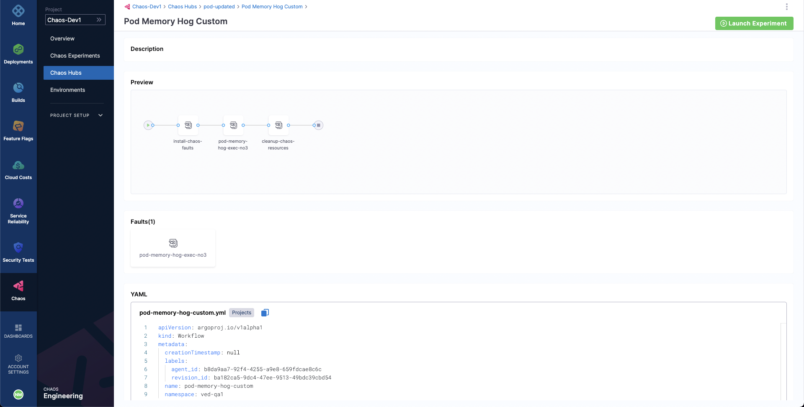
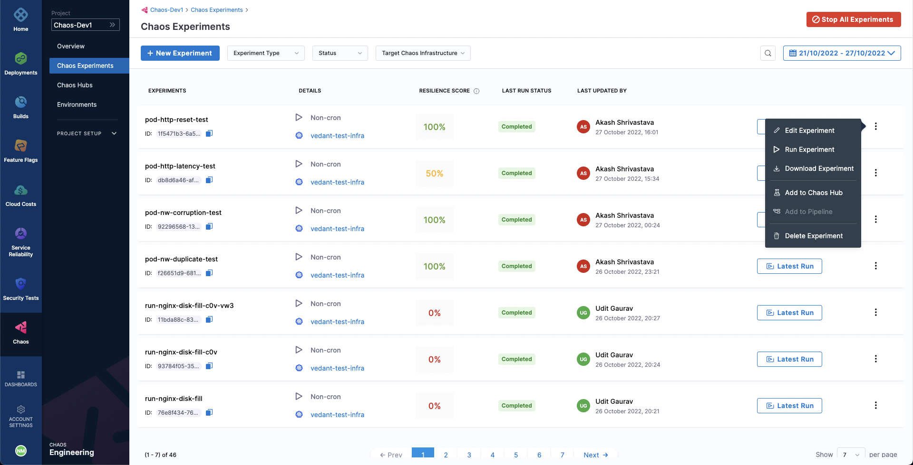
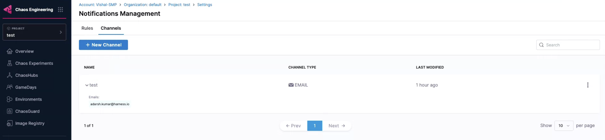
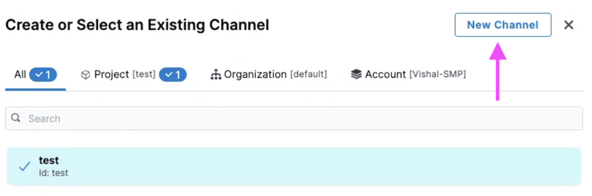

## What is a Chaos Experiment?
Harness Chaos Engineering gives you the flexibility to create elaborate chaos experiments that help create complex, real-life failure scenarios against which you can validate your applications.

A **chaos experiment** consists of chaos faults arranged in a specific order to create a failure scenario. The chaos faults target various aspects of an application, including the constituent microservices and underlying infrastructure. You can tune the parameters associated with these faults to impart the desired chaos behavior.

You can define the experiment using the Chaos Studio, which helps create new experiments using the guided UI.

:::info Resilience Score
The **resilience score** is a quantitative measure of how resilient your application is to chaos experiments. You can assign weights (1-10) to each fault based on priority, and the score is calculated as a percentage representing overall experiment success weighted by fault importance.
:::

---

## Create Chaos Experiment

You can add one or more chaos faults to a chaos experiment and execute it. Different ways of building a chaos experiment are described below:

* **[Blank Canvas](#using-blank-canvas)** - Build the experiment from scratch, adding specific faults you want
* **[Templates from ChaosHubs](#using-templates-from-chaoshubs)** - Select from pre-curated experiment templates available in ChaosHubs
* **[Upload YAML](#upload-yaml)** - Upload an experiment manifest YAML file

### Using Blank Canvas

1. On the **Experiment Builder** tab, click **Add** to add a fault to the experiment.

	

2. Select the fault you want to add to the experiment.

	

3. For each fault, tune the properties:

	* **Specify the target application (for pod-level Kubernetes faults):**
		- **App Namespace**: The namespace where your application is housed
		- **App Kind** or **App Label**: Choose between application type or associated label
			- **App Kind**: Type of target application (deployment, statefulset, daemonset, etc.)
			- **App Label**: Label associated with the target service (e.g., app=nginx)

		

	* **Tune fault parameters:** Customize chaos duration, ramp time, and fault-specific parameters

	* **Tune Fault Weightage:** Set the weight (1-10) for the fault to determine its importance for resilience score calculation

		

### Using Templates from ChaosHubs

1. Select an experiment template from a ChaosHub:
	* Choose **Experiment Type** to see available ChaosHubs
	* Select a template to preview included faults

	

:::info note
You can edit the template to add more faults or update existing ones.
:::

### Upload YAML

1. Upload an experiment manifest YAML file to create the experiment.

:::info note
You can edit the experiment to update existing faults or add more.
:::

After constructing the chaos experiment, save it:

* Click **Save** to save the experiment to the Chaos Experiments page
* Select **Add Experiment to ChaosHub** to save as a template in a selected ChaosHub

---

## Add Serial and Parallel Faults

You can add multiple faults in a single chaos experiment that is scaled efficiently during execution.

:::tip
Consider the overall impact that these faults have on the application. Your experience in production environments may differ due to lack of resources when a number of parallel faults are being executed.
:::

1. To add a fault that runs in parallel to another fault, point your mouse below an existing fault, and then select **Add**. You can follow the same process to add a serial fault.

   

:::note
For Linux, experiments with a parallel fault are currently not supported.
:::

The image below shows a single experiment that consists of serial and parallel faults:
* Faults **A**, **B**, and **C** are parallel faults. They begin execution at the same time.
* Faults **A**, **B**, **C** and faults **D** and **E** are serial. **A**, **B**, and **C** complete execution and then **D** and **E** begin execution.
* Similarly, faults **H** and **I** are serial faults, where **H** completes execution, and **I** begins.

   

---

## Analyze Experiment

You can observe the status of execution of faults during experiment runs. The screen shows the experiment pipeline on the right side, and details such as **Environment**, **Infrastructure Name**, and the runs that have passed and failed on the left side.

When the experiment completes execution, it displays the **Resilience Score**. This score describes how resilient your application is to unplanned failures.

If any of the faults fail, you can find the **Fail Step** that elaborates on the reason why the fault failed.

---

## Advanced Configuration Options

On the Experiment Builder tab, you can click **Advanced Options** to configure advanced settings when creating an experiment for a Kubernetes chaos infrastructure:

### General Options

**Node Selector**

Specify the node on which the experiment pods will be scheduled by providing the node label as a key-value pair.

- This can be used with node-level faults to avoid scheduling the experiment pod on the target node(s).
- It can also be used to limit the scheduling of experiment pods on nodes with an unsupported OS.

    

**Toleration**

Specify the tolerations that must be satisfied by a tainted node to schedule the experiment pods. For more information on taints and tolerations, refer to the [Kubernetes documentation](https://kubernetes.io/docs/concepts/scheduling-eviction/taint-and-toleration/).

- This can be used with node-level faults to avoid scheduling the experiment pod on the target node(s).
- It can also be used to limit the scheduling of the experiment pods on nodes with an unsupported OS.

    

**Annotations**

Specify the annotations to be added to the experiment pods by providing them as key-value pairs. For more information on annotations, refer to the [Kubernetes documentation](https://kubernetes.io/docs/concepts/overview/working-with-objects/annotations/).

Annotations can be used to bypass network proxies enforced by service mesh tools like Istio.

    

### Security Options

**Enable runAsUser**

Specify the user ID to start all the processes in the experiment pod containers. By default, the user ID `1000` is used.
This option allows privileged or restricted access for experiment pods.

    

**Enable runAsGroup**

Specify the group ID to start all the processes in the experiment pod containers instead of a user ID.
This option allows privileged or restricted access for experiment pods.

    

### Execute Experiment With Advanced Options

1. Select one of the advanced security options: **runAsUser** or **runAsGroup**.

2. Click **Security** tab and select/unselect one or both the options.

    

3. Click **Save**.

    

---

## Run & Schedule Experiments

After configuring your chaos experiment, you can run the experiment immediately by clicking the **Run** button, or schedule it to run at a specific time by selecting the **Schedule** tab.

### Execute Experiment Once

- To execute the experiment once, select **Non-Cron (Single run)**, click **Set Schedule**, and then select **Run**.

- To run the experiment once, and at a specific time, select the **Run Once at a specific time**, choose the date and time, click apply, and select **Set Schedule**.

    

### Execute Experiment on a Schedule

1. To schedule the experiment to run periodically, select **Cron (Recurring run)**, and set the schedule using the **Minutes**, **Hourly**, **Daily**, **Monthly** or **Yearly** options. The **Cron Expression** will be automatically generated.

2. Click **Set Schedule**.

    

---

## Edit and Update Chaos Experiment

You can edit an existing chaos experiment to update the experiment's metadata, faults, schedule, etc. This section describes three actions:
1. [Edit an experiment](#edit-a-chaos-experiment)
2. [Update old experiment manifests](#update-old-experiment-manifests)
3. [Bulk update CRON schedules](#bulk-update-cron-schedules)

### Edit a Chaos Experiment

1. On the **Chaos Experiments** page, select the **`⋮`** icon against the name of the experiment you want to edit and select **Edit Experiment**.

    

2. You can either update the changes to the same experiment and save it or create a copy of the experiment and then apply the changes to it.

    

### Update Old Experiment Manifests

When you upgrade the chaos infrastructure, you also need to update the images in the experiment manifest (YAML file) corresponding to the updated chaos infrastructure. The upgraded images should match the images in the Enterprise ChaosHub.

When you create a new experiment, the images in the experiment manifest are configured to match the images in the Enterprise ChaosHub.

**What image versions to use?**

To determine the latest version of images, navigate to Enterprise Chaos Hub, and search for **chaos-go-runner**. The value associated with **chaos-go-runner** in the manifest in Enterprise Chaos Hub is the latest version.

To update the experiment manifest, follow the steps below.

1. Select the experiment whose manifest you wish to update, and click the **Experiment Builder** tab.

    

2. The **VISUAL** is usually displayed, click the **YAML** to edit it. Click **Edit Yaml**.

    

    

3. Find **chaos-go-runner** in the manifest and replace the corresponding version with the latest version.

    

4. Once you update the images, click **Save** at the top right.

    

### Bulk Update CRON Schedules

You can update multiple CRON-scheduled chaos experiments at once. 

One important aspect is that you can **bulk update** multiple CRON schedules to a **single value**, that is, the CRON schedules you select to update will all update to a single common value. 

You **can't** map different CRON schedules to their respective values while performing a bulk update.
You can:
1. Bulk disable active schedules
2. Bulk enable inactive CRON schedules
3. Bulk stop running experiments

To reschedule/enable/disable a CRON schedule, 

1. Go to **Chaos Experiments** and select the experiments you wish to change.

2. Choose one of the following options:
    1. **Reschedule CRON**
    2. **Enable CRON**
    3. **Disable CRON**

        

3. Based on the option you chose,
    - Reschedule CRON: You can change the schedule of the experiments by changing the values, and click **Confirm**.
    - Enable CRON or Disable CRON
        - Select one of the options (enable CRON or disable CRON), and click **Confirm**.
        - You will see a confirmation message on your screen about the updated schedule. Click **Close**.

:::info note
You can bulk update (reschedule or enable/disable) not more than 20 experiments in one go.
:::

---

## Export Chaos Experiment

You can export chaos experiments for future use. While creating or running an experiment, Chaos Studio automatically saves it for future access through the **Chaos Experiments** sidebar. You can also download the experiment as a manifest file to your machine or save it in a ChaosHub.

### Download Experiment Manifest File

1. To download the manifest file for an experiment, select the **Chaos Experiments** sidebar option. You can access all the experiments that have been created or run in the past.

2. To export an experiment, select the **`⋮`** icon against the name of the experiment.
Select **Download Manifest**. This downloads the experiment file to your machine.

	

3. You can directly upload this manifest file while creating a new experiment to use it as a template for the new experiment. You can, as usual, provide the **Name**, **Infrastructure type**, and **Infrastructure** for the chaos experiment and select **Upload YAML**. You can upload the manifest file from your machine or drag and drop the file. 

	

:::info note
An efficient way to save, manage, and distribute the experiments as templates is to use ChaosHubs.
:::

### Add an Experiment to ChaosHub

1. To add an experiment to ChaosHub, select the **`⋮`** icon against the name of the experiment.

2. Select **Add to Chaos Hub**. Then, add an experiment name, optionally a description and a category tag, and choose the ChaosHub to add the experiment to from the list of added chaos hubs.

	

3. Select **Save**. Now, you should be able to see this experiment added to your chaos hub. You can access it and use it as a template for your new experiments.

	

---

## Halt and Delete Chaos Experiment

Halting the execution of a chaos experiment protects target applications from any unwanted and unforeseen consequences by immediately stopping the experiment and reverting the target resources to their initial state.

Halting a cron experiment disables it, preventing it from executing according to its cron schedule in the future.

### Halt an Experiment

1. To halt an experiment execution, select its name from the list of experiments on the **Chaos Experiments** page. Click the `🚫` icon. The experiment's status will update to `Stopped`.

	

2. If you need to halt multiple experiments simultaneously, go to the **Chaos Experiments** page and click **Stop All Experiments**. This will stop all currently executing experiments.

	

### Delete an Experiment

Deleting an experiment removes it from the **Chaos Experiments** list under the **Chaos** tab.
Deleting an experiment that is currently running will not only stop it immediately but also permanently remove it. To delete an experiment, click the **`⋮`** icon next to the experiment name and select **Delete Experiment**.

	

:::info note
- Deleting an initialized or completed experiment will permanently remove it.
- Deleting a running experiment will both stop the execution and permanently remove the experiment.
- Deleting an experiment does not delete any templates created from that experiment.
:::

### Delete Multiple Experiments

- You can delete multiple experiments by selecting it from the **Chaos Experiments** page and clicking the **Delete** button. 

	

- Confirm by clicking **Delete**.

	

---

## Alerts for Chaos Experiments

Alerts provide crucial updates about your experiment runs, keeping you informed about the start, stop, and completion of your chaos experiments based on the experiment event you have configured to receive the alerts for.

### Create and Use Alerts

You can setup alerts by [creating a channel](#create-a-channel) and [defining conditions](#create-a-condition). Once setup, you can [apply these conditions](#select-channel-for-alerts) to a rule.

:::tip
- Ensure that SMTP is configured on your account. HCE configures SMTP for you as a part of the basic setup for your application.
- To configure SMTP, ensure your account is connected to at least one delegate, regardless of the scope.
:::

### Ensure SMTP is Configured

1. To verify SMTP configuration for your account, navigate to **Administrative Settings**.

    

2. Check if **SMTP Configuration** is marked as **Configured**.

    

### Create a Channel

1. Navigate to **Chaos Engineering** module. Select **Project Settings** and then **Notifications Management**.

    

:::tip
Notification management should be configured at the project settings level within the **Chaos Engineering** module. This is because HCE supports chaos experiments as a project-level entity, making the rule a project-level entity.
:::

2. Select **Channels** and then **+ New Channel**.

    

3. Enter a **Channel Name**, select **Channel Type** (currently supports email only), and provide the associated value for channel type (email in this case). Select **Apply**.

    

This creates a new channel.

    

:::tip
Ensure you create a channel before creating a rule because a channel decides which method (email, slack, and so on) you wish to receive the alerts.
:::

### Create a Rule

1. To create a new rule, select **+ New Notification**.

    

2. Enter a **Notification Name** and select **Continue**. Select **Chaos Experiments** as **Resource Type** because HCE currently supports alerting for chaos experiments only. Click **Continue**.

    

:::tip
HCE currently supports selecting resource types as chaos experiments for both Kubernetes and Linux chaos experiments.
:::

4. You can associate a rule with one or more conditions. Select **+ Add Condition**. In the modal that appears, you can either create a condition or select one or more existing conditions. Select **Continue**.

### Create a Condition

1. Provide a **Condition Name**, select the events (such as chaos experiment started, stopped, or completed) for which you want to receive the alerts. Select **Apply**.

    

2. Review the conditions configured for your rule and click **Continue**.

### Select Channel for Alerts

1. Click **Select Channels**. Choose channel/s that you configured earlier and select **Apply Selected**. To create a new channel, select **New Channel**.

    

2. Select **Apply Selected**.

    

3. You can **Enable** or disable the rule based by selecting or deselecting the radio button. By default, it is set to **Enable on Save**. Select **Submit**.

    

:::tip
You can create multiple rules on the same chaos experiment, which will result in receiving multiple alerts (one per rule) for that experiment.
:::

### Sample Run Report

Once you've set up your email to receive alerts for completed chaos experiments (as part of [creating conditions](#create-a-condition)) and the feature flag is enabled, you'll receive a run report as an attachment. This report will include details like run information, fault details, and more.

    

:::tip
Currently, you will only receive the report if you've configured a condition to receive alerts for **Completed** chaos experiments. You can't opt-out of receiving alerts for completed experiments.
:::

### Delete a Rule

Select the rule and click **Delete**. Confirm by selecting **Delete**.

    
