import Tabs from '@theme/Tabs';
import TabItem from '@theme/TabItem';

## What is an APM Probe?
APM probe or Application Performance Monitoring Probe is used to query a resource value on a specific APM system such as Prometheus or AppDynamics and compare it to an expected value. The APM probe is currently supported only on Kubernetes, that too while using a Kubernetes Infrastructure that is driven by Harness Delegate. The APM probe uses Harness Platform connectors for securely storing the credentials of the target APM system in the Harness Security Manager or HSM.

The usage of an APM probe is exactly the same as the other probes where the probe is added in a chaos experiment in one of the probe modes such as Continuous, Edge, SOT or EOT. The probe when successfully executed will result in either SUCCESS or FAILED state and this state contributes to the overall resilience score of the chaos experiment.

When will you use it?
APM probes are used when your application is being monitored by an APM system. The chaos experiment injects controlled faults either into an application or the associated infrastructure and the resilience of the system is observed by running multiple APM probes. The APM probe can also be used in combination with other probes such as Command or Http.

## Supported APM probe types

| APM Probe Type | Kubernetes HD | Kubenetes | Linux | Windows |
|---------------|--------------|-----------|-------|---------|
| Prometheus | YES | NO | NO | NO |
| AppDynamics | YES | NO | NO | NO |
| Splunk Observability | YES | NO | NO | NO |
| Dynatrace | YES | NO | NO | NO |
| New Relic | YES | NO | NO | NO |
| GCP Cloud Monitoring | YES | NO | NO | NO |

:::info note
- Kubernetes HD means the Kubernetes infrastructure that is driven by Harness Delegate.
:::

---

## Configure APM Probes

<Tabs>
  <TabItem value="prometheus" label="Prometheus" default>

Prometheus probe allows you to run Prometheus queries and match the resulting output against specific conditions. You can define metrics-based SLOs in a declarative way and determine the experiment verdict based on their success. The probe runs the query on a Prometheus server defined by the endpoint and checks whether the output satisfies the specified criteria. The outcome of a PromQL query (that is provided) is used for probe validation.

#### Prerequisites
To use the Prometheus APM probe, you need:

* A running Prometheus server
* Access to the Prometheus API endpoint from the kubernetes execution plane
* Proper configuration of your application to expose metrics to Prometheus

#### Interactive Setup Guide

Follow along with this interactive guide to learn how to configure Prometheus probe:

<DocVideo src="https://app.tango.us/app/embed/87f20060-9449-4ac1-84ef-e69eefa35e87?skipCover=false&defaultListView=false&skipBranding=false&makeViewOnly=false&hideAuthorAndDetails=true" title="Create Prometheus APM Probe" />

#### Steps to configure

1. In Probes & Actions section under chaos module, click on **New Probe** button

    

2. Select the **APM Probe**
3. Provide the name of the probe and select **Prometheus** under APM Type

    

4. Under Prometheus connector select connector

5. In Connector settings, you can either choose an existing connector or click **New Connector**

    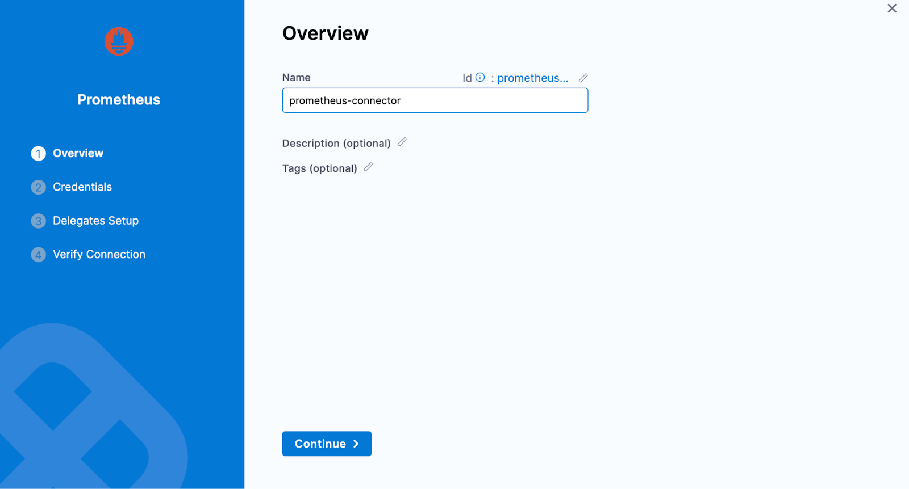

6. Provide the credentials of the Prometheus

    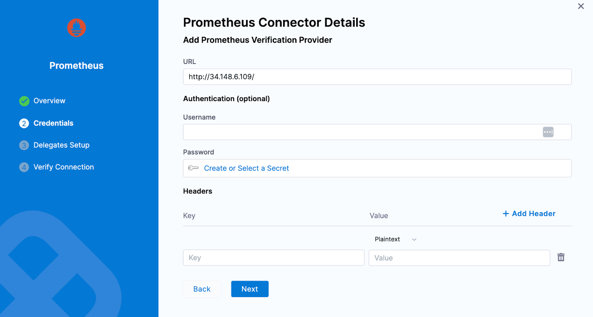

7. Select the delegate and verify the connection and click on **Finish**

    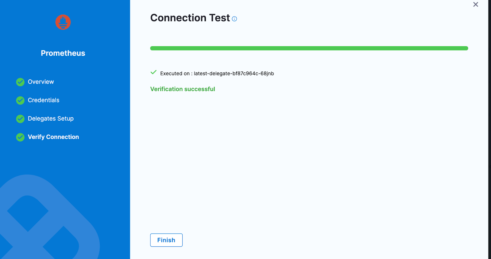

8. Now connector is created and selected, click on **Configure Details**

    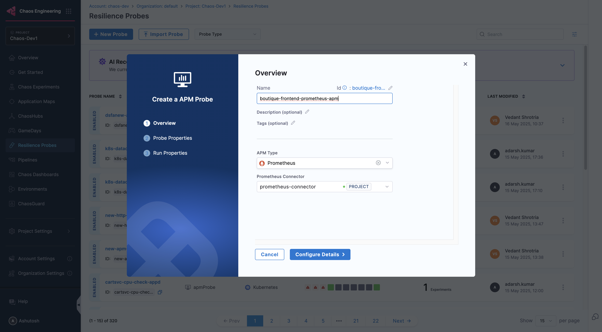

9. Under Probe Properties pass the value of required parameters
   * **TLS Config**:
     * It offers a mechanism to validate TLS certifications for the Prometheus server. You can supply the `cacert` or the client certificate and client key to perform the validation. Alternatively, you have the option to enable the `insecureSkipVerify` check to bypass certificate validation.
     * For more details, refer to [Prometheus TLS configuration documentation](https://prometheus.io/docs/prometheus/latest/configuration/configuration/#tls_config).
     * **CA File**: The `caFile` holds the file path of the CA certificates utilized for server TLS verification
     * **Cert File**: The `certFile` holds the file path of the client certificates utilized for TLS verification
     * **Key File**: The `keyFile` holds the file path of the client key utilized for TLS verification
     * **Insecure Skip Verify**: The `insecureSkipVerify` setting skips the TLS certificates checks
   * **Query**:
     * The query contains the PromQL query to extract out the desired Prometheus metrics via running it on the given Prometheus endpoint
     * Please Note that all the double quotes need to be parsed in the provided query.
     * **Example**: `avg_over_time(probe_duration_seconds{job=\"prometheus-blackbox-exporter\",instance=\"frontend.boutique.svc.cluster.local:80\"}[60s:1s])*1000`
     * For more details, refer to [Prometheus PromQL documentation](https://prometheus.io/docs/prometheus/latest/querying/basics/)

    

10. Provide the comparison criteria under Prometheus Data Comparison

    

11. Provide the Run Properties

    

12. Then click on **Create Probe**

  </TabItem>
  <TabItem value="appdynamics" label="AppDynamics">

The AppDynamics probe allows you to query AppDynamics metrics and compare the results against specified criteria.

#### Prerequisites
To use the AppDynamics probe, you need:

* An active AppDynamics account
* Access to the AppDynamics API from the kubernetes execution plane
* Authentication credentials (either basic auth or OAuth token)

#### Interactive Setup Guide

Follow along with this interactive guide to learn how to configure AppDynamics probe:

<DocVideo src="https://app.tango.us/app/embed/8a20f18d-a78a-4d2f-ac8c-5aef92a4243e?skipCover=false&defaultListView=false&skipBranding=false&makeViewOnly=false&hideAuthorAndDetails=true" title="Create AppDynamics APM Probe" />

#### Steps to configure

1. In Probes & Actions section under chaos module, click on **New Probe** button

    

2. Select the **APM Probe**

3. Provide the name of the probe and select **AppDynamics** under APM Type

    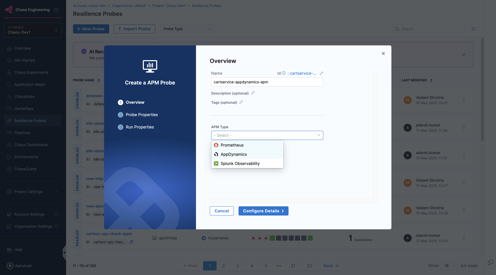
    
4. Under AppDynamics connector select connector

5. In Connector settings, you can either choose an existing connector or click **New Connector**

    

6. Provide the credentials of the appdynamics controller

    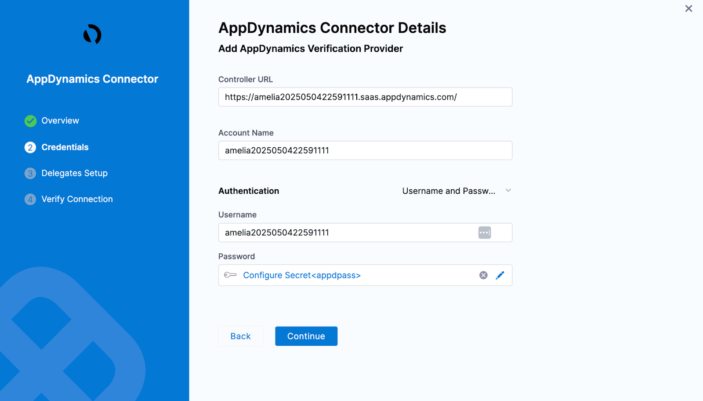

   :::info note
   If you select **API Client** as the authentication type, ensure that the API client has at minimum the **Applications & Dashboards Viewer (Default)** role assigned.
   :::

7. Select the delegate and verify the connection and click on **Finish**

    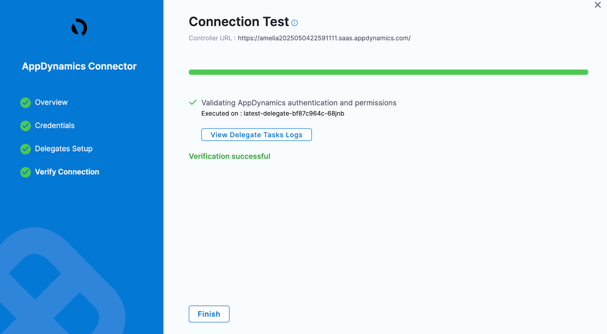

8. Now connector is created and selected, click on **Configure Details**

    

9. Under Probe Properties, Pass the value of **AppDynamics Metric Full Path** and **Lookback Window**

    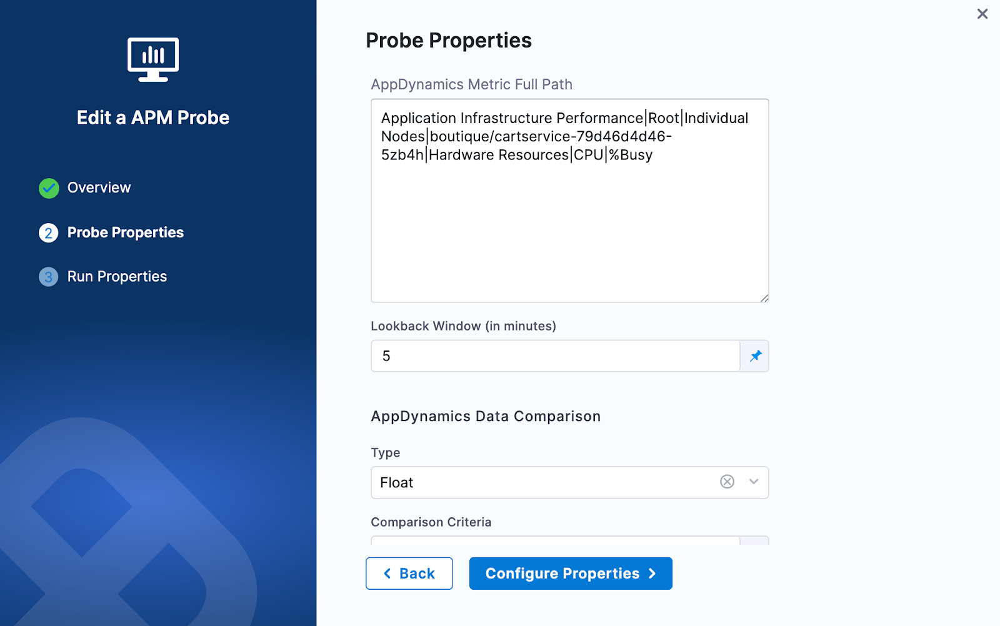

   * **AppDynamics Metric Full Path**:
     * A metric full path in AppDynamics is the complete hierarchical string that uniquely identifies a specific metric within an application for use in dashboards, alerts, and API queries
     * You can get the Metric Full Path from the Browse Metrics section in AppDynamics controller. For more details, refer to [AppDynamics docs](https://docs.appdynamics.com/appd/23.x/latest/en/appdynamics-essentials/metrics-and-graphs/metric-browser).
     * **Examples**:
       * `Application Infrastructure Performance|Root|Individual Nodes|boutique/adservice-54d59c5594-gggb9|Hardware Resources|CPU|%Busy`
       * `Application Infrastructure Performance|Root|Individual Nodes|boutique/adservice-54d59c5594-gggb9|Hardware Resources|Memory|Used (MB)`

      

   * **LookBack Window (In Minutes)**:
     * The lookback window refers to the time range from a specified number of minutes ago up to the current moment, over which data is aggregated

10. Provide the comparison criteria under AppDynamics Data Comparison

    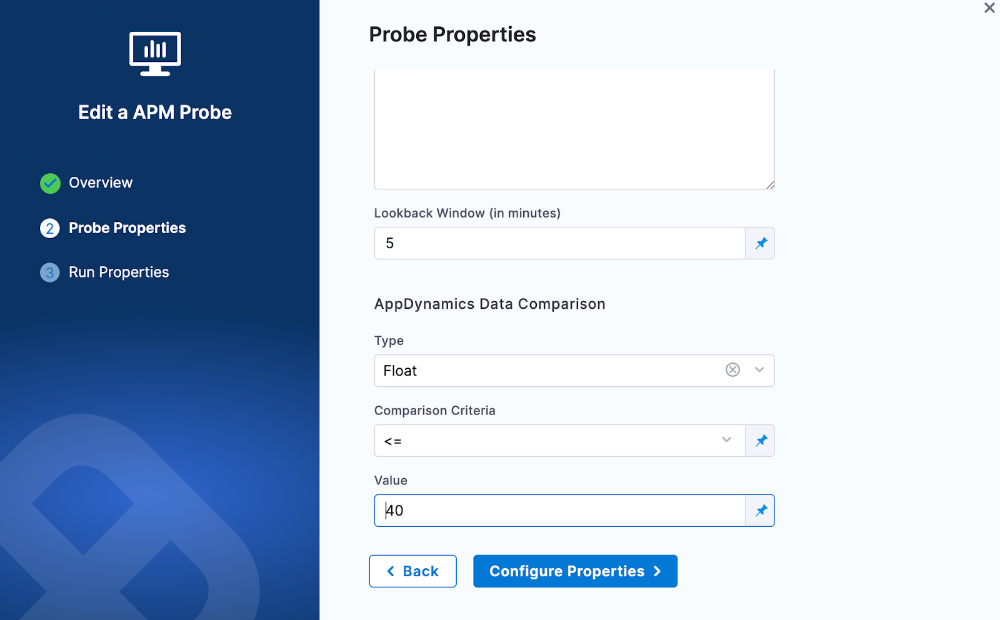

11. Provide the Run Properties

    

12. Then click on **Create Probe**

  </TabItem>
  <TabItem value="splunk" label="Splunk">

The Splunk Observability probe allows you to query Splunk Observability(Signalfx) metrics and compare the results against specified criteria.

#### Prerequisites
To use the Splunk Observability probe, you need:

* An active Splunk Observability(signalfx) account
* Access to the Splunk Observability API from the kubernetes execution plane
* An API token for authentication

#### Interactive Setup Guide

Follow along with this interactive guide to learn how to configure Splunk Observability probe:

<DocVideo src="https://app.tango.us/app/embed/e1f8d801-e55a-4e1d-a831-75b1d1a48142?skipCover=false&defaultListView=false&skipBranding=false&makeViewOnly=false&hideAuthorAndDetails=true" title="Create Splunk Observability APM Probe" />

#### Steps to configure

1. In Probes & Actions section under chaos module, click on **New Probe** button

    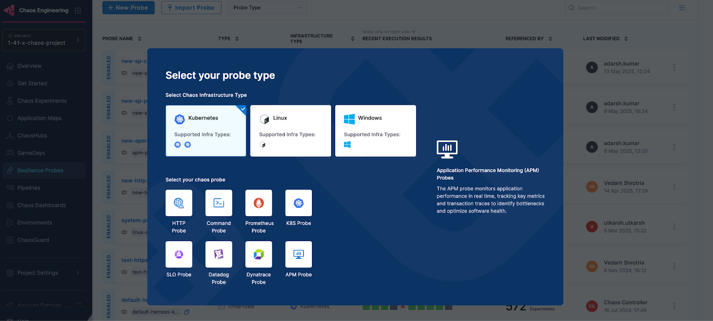

2. Select the **APM Probe**
3. Provide the name of the probe and select **Splunk Observability** under APM Type

    

4. Under Splunk Observability connector select connector
5. In Connector settings, you can either choose an existing connector or click **New Connector**

    

6. Provide the credentials of the Splunk Observability

    

7. Select the delegate and verify the connection and click on Finish

    

8. Now connector is created and selected, click on Configure Details

    

9. Under Probe Properties, Pass the value of Splunk Observability Query and Lookback Window
   * **Splunk Observability Query**:
     * The Splunk Observability Query input is a string that specifies the search criteria for the metric time series (MTS) you want to retrieve. It follows a specific syntax that allows you to search for metrics, dimensions, properties, and tags
     * **Example query**: `sf_metric:cpu.utilization AND host.name:gke-default-pool-667be17c-t588.c.test.internal`
     * For more details refer to query section in [Splunk Observability doc](https://dev.splunk.com/observability/reference/api/retrieve_timeserieswindow/latest)
   * **LookBack Window (In Minutes)**:
     * The lookback window refers to the time range from a specified number of minutes ago up to the current moment, over which data is aggregated

    

10. Provide the comparison criteria under Splunk Observability Data Comparison

    

11. Provide the Run Properties

    

12. Then click on **Create Probe**

  </TabItem>
  <TabItem value="dynatrace" label="Dynatrace">

Dynatrace probe allows you to query Dynatrace metrics and compare the results against specified criteria. You can define metrics-based SLOs in a declarative way and determine the experiment verdict based on their success.

#### Prerequisites
To use the Dynatrace probe, you need:

* An active Dynatrace account
* Access to the Dynatrace API from the kubernetes execution plane
* A Dynatrace API token with `metrics.read` scope

#### Steps to configure

1. In Probes & Actions section under chaos module, click on **New Probe** button

2. Select the **APM Probe**

3. Provide the name of the probe and select **Dynatrace** under APM Type

    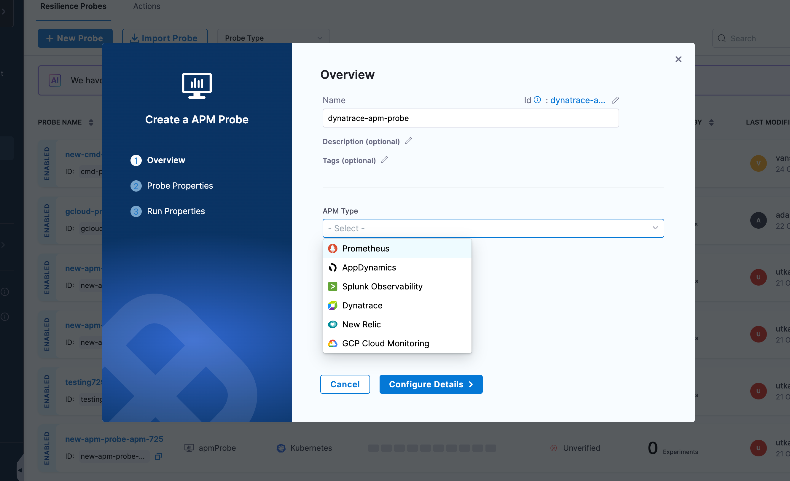

4. Under Dynatrace connector, click on **Select a Connector**

5. In Connector settings, you can either choose an existing connector or click **+ New Connector**

    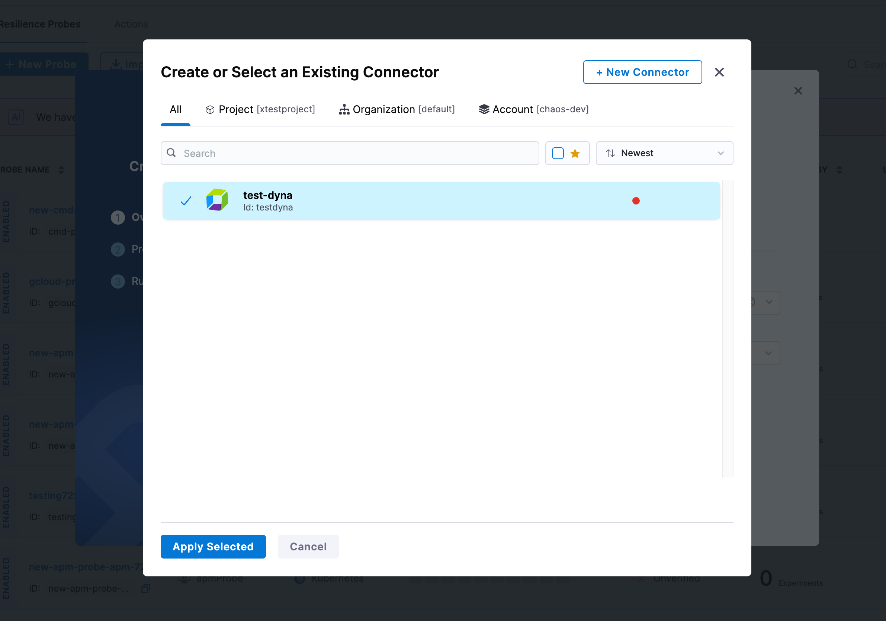

6. Provide the connector details:
   * **Name**: Enter a name for your Dynatrace connector
   * **Description** (optional): Add a description for the connector
   * **Tags** (optional): Add tags for better organization

7. Configure the Dynatrace connector credentials:
   * **URL**: Enter your Dynatrace environment URL
     * **Example**: `https://your-environment-id.live.dynatrace.com` or `https://your-managed-domain/e/your-environment-id`
   * **API Token**: Click on **Create or Select a Secret** to provide your Dynatrace API token
     * The API token must have `metrics.read` scope
     * For more details on creating API tokens, refer to [Dynatrace API tokens documentation](https://www.dynatrace.com/support/help/dynatrace-api/basics/dynatrace-api-authentication)

8. Select the delegate and verify the connection, then click on **Finish**

9. Once the connector is created and selected, click on **Configure Details**

10. Under Probe Properties, provide the required parameters:
    * **Metrics Selector**: Enter the Dynatrace metrics selector query to retrieve the desired metrics
      * Metrics selector is used to specify which metrics to query from Dynatrace
      * **Example**: `builtin:service.response.time:avg:filter(eq("dt.entity.service","SERVICE-1234567890"))`
      * For more details, refer to [Dynatrace Metrics API documentation](https://www.dynatrace.com/support/help/dynatrace-api/environment-api/metric-v2/get-all-metrics)
    * **Entity Selector**: Specify the entity selector to filter the metrics by specific entities
      * Entity selector is used to filter metrics based on entity properties
      * **Example**: `type("SERVICE"),tag("environment:production")`
      * For more details, refer to [Dynatrace Entity Selector documentation](https://www.dynatrace.com/support/help/dynatrace-api/environment-api/entity-v2/entity-selector)
    * **Lookback Window (in minutes)**: Specify the time range in minutes to look back for metrics
      * The lookback window refers to the time range from a specified number of minutes ago up to the current moment

11. Provide the comparison criteria under Dynatrace Data Comparison:
    * **Type**: Select the data type for comparison (e.g., Float, Int)
    * **Comparison Criteria**: Select the comparison operator (e.g., `>=`, `<=`, `==`, `!=`, `>`, `<`)
    * **Value**: Enter the expected value to compare against the metric result

12. Provide the Run Properties:
    * **Timeout**: Set the timeout duration for the probe execution (e.g., 10s)
    * **Interval**: Set the interval between probe executions (e.g., 2s)
    * **Attempt**: Number of attempts for the probe (e.g., 1)
    * **Polling Interval**: Time between successive probe polls (e.g., 30s)
    * **Initial Delay**: Delay before the first probe execution (e.g., 5s)
    * **Verbosity**: Set the verbosity level for probe logs
    * **Stop On Failure** (Optional): Toggle to stop the experiment if the probe fails

13. Then click on **Create Probe**

  </TabItem>
  <TabItem value="newrelic" label="New Relic">

New Relic probe allows you to query New Relic metrics and compare the results against specified criteria. You can define metrics-based SLOs in a declarative way and determine the experiment verdict based on their success.

#### Prerequisites
To use the New Relic probe, you need:

* An active New Relic account
* Access to the New Relic NerdGraph API from the kubernetes execution plane
* A New Relic User API key for authentication
* Proper configuration of your application to send metrics to New Relic

#### Steps to configure

1. In Probes & Actions section under chaos module, click on **New Probe** button

2. Select the **APM Probe**

3. Provide the name of the probe and select **New Relic** under APM Type

    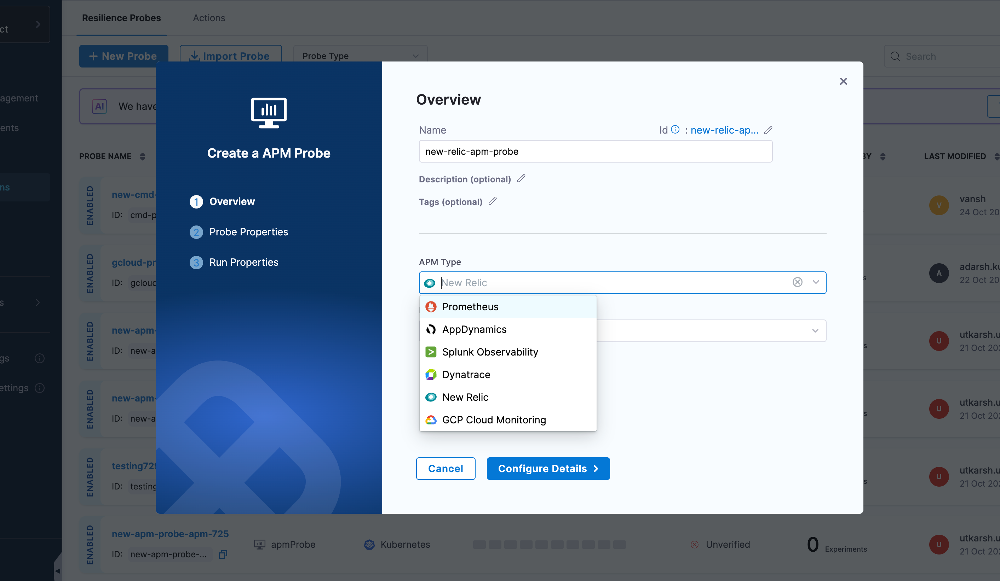

4. Under New Relic connector, click on **Select a Connector**

5. In Connector settings, you can either choose an existing connector or click **+ New Connector**

    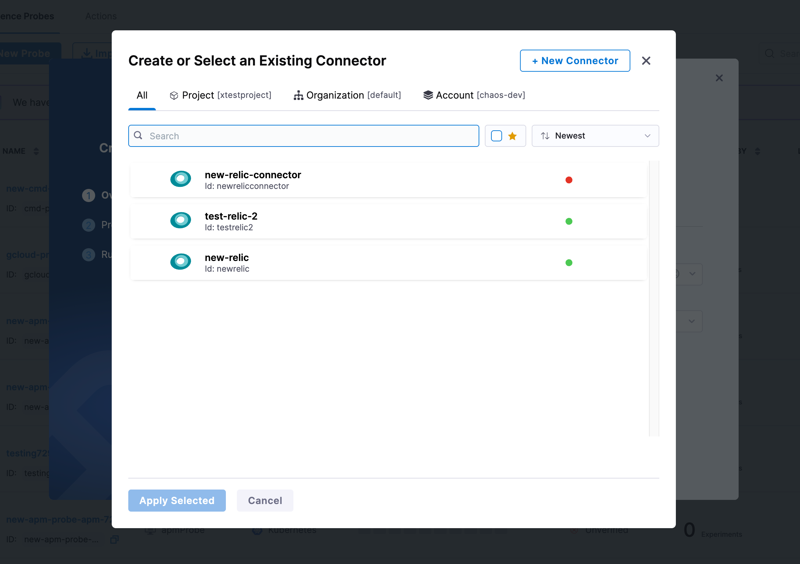

6. Provide the connector details:
   * **Name**: Enter a name for your New Relic connector
   * **Description** (optional): Add a description for the connector
   * **Tags** (optional): Add tags for better organization

7. Configure the New Relic connector credentials:
   * **New Relic URL**: Select the NerdGraph API endpoint based on your account region:
     * `https://api.newrelic.com/graphql` (US region)
     * `https://api.eu.newrelic.com/graphql` (EU region)
   
   :::info note
   Only the NerdGraph API is supported for New Relic integration.
   :::

   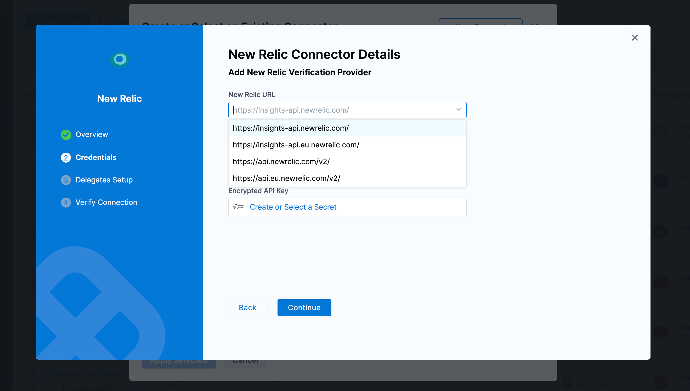

   * **New Relic Account ID**: Enter your New Relic account ID
     * You can find your account ID in the New Relic UI or in your account URL
   * **Encrypted API Key**: Click on **Create or Select a Secret** to provide your New Relic User API key
     * You must use a User key (not a License key) for NerdGraph API authentication
     * For more details on API keys, refer to [New Relic API keys documentation](https://docs.newrelic.com/docs/apis/intro-apis/new-relic-api-keys/)

8. Select the delegate and verify the connection, then click on **Finish**

9. Once the connector is created and selected, click on **Configure Details**

10. Under Probe Properties, provide the required parameters:
    * **New Relic Query**: Enter your New Relic Query Language (NRQL) query to retrieve the desired metrics
      * NRQL is New Relic's SQL-like query language for querying data
      * **Example**: `SELECT average(duration) FROM Transaction WHERE appName = 'your-app-name' SINCE 5 minutes ago`
      * For more details, refer to [New Relic NRQL documentation](https://docs.newrelic.com/docs/query-your-data/nrql-new-relic-query-language/get-started/introduction-nrql-new-relics-query-language/)
    * **New Relic Query Metric**: Specify the metric name to retrieve from the query results
      * This is the specific metric field you want to extract from the NRQL query response
      * **Example**: `average.duration` - if your query uses `SELECT average(duration)`, the metric would be `average.duration`

11. Provide the comparison criteria under New Relic Data Comparison:
    * **Type**: Select the data type for comparison (e.g., Float, Int)
    * **Comparison Criteria**: Select the comparison operator (e.g., `>=`, `<=`, `==`, `!=`, `>`, `<`)
    * **Value**: Enter the expected value to compare against the metric result

12. Provide the Run Properties:
    * **Timeout**: Set the timeout duration for the probe execution (e.g., 10s)
    * **Interval**: Set the interval between probe executions (e.g., 2s)
    * **Attempt**: Number of attempts for the probe (e.g., 1)
    * **Polling Interval**: Time between successive probe polls (e.g., 30s)
    * **Initial Delay**: Delay before the first probe execution (e.g., 5s)
    * **Verbosity**: Set the verbosity level for probe logs
    * **Stop On Failure** (Optional): Toggle to stop the experiment if the probe fails

13. Then click on **Create Probe**

  </TabItem>
  <TabItem value="gcp" label="GCP Cloud Monitoring">

GCP Cloud Monitoring probe allows you to query Google Cloud Platform monitoring metrics using PromQL and compare the results against specified criteria. You can define metrics-based SLOs in a declarative way and determine the experiment verdict based on their success.

#### Prerequisites
To use the GCP Cloud Monitoring probe, you need:

* An active GCP account with Cloud Monitoring enabled
* Access to the GCP Cloud Monitoring API from the kubernetes execution plane
* GCP service account credentials with appropriate permissions (either using Chaos Infra IAM or GCP Service Account Key)

#### Steps to configure

1. In Probes & Actions section under chaos module, click on **New Probe** button

2. Select the **APM Probe**

3. Provide the name of the probe and select **GCP Cloud Monitoring** under APM Type

    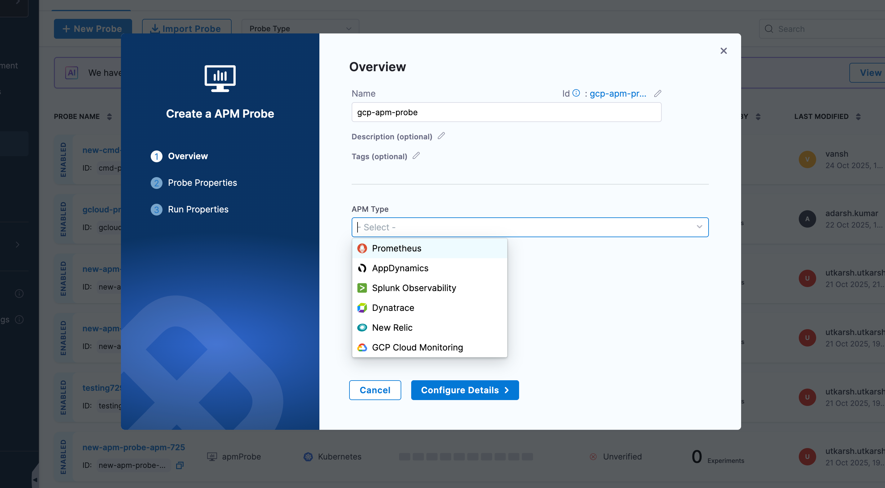

4. Choose your authentication method:
   * **Use Chaos Infra IAM**: Uses the service account and workload identity already configured for your chaos infrastructure to authenticate with GCP Cloud Monitoring
   * **Use GCP Service Account Key**: Authenticates using a specific GCP service account key stored in Harness Secret Manager\

   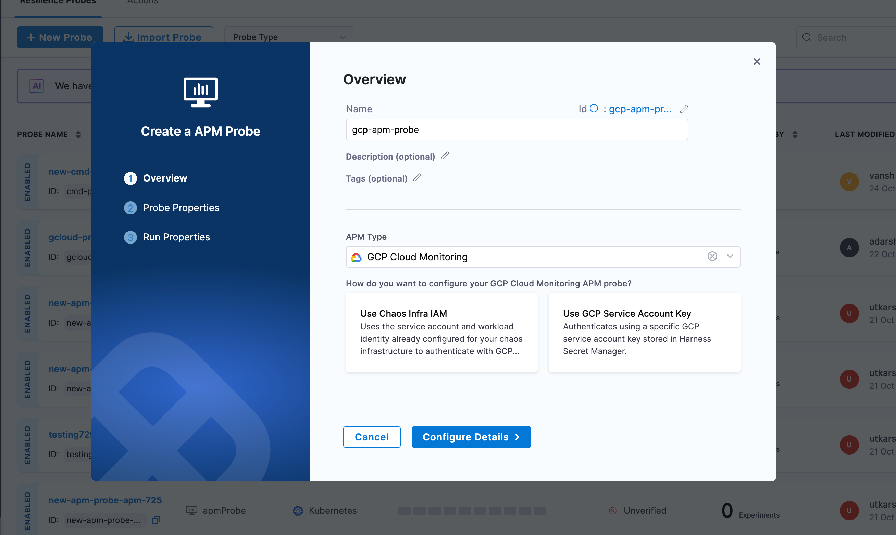

5. If you selected **Use GCP Service Account Key**:
   * Click on **Create or Select a Secret** to provide your GCP Service Account Key
   * The service account must have the `monitoring.timeSeries.list` permission
   * For more details on creating service account keys, refer to [GCP Service Account Keys documentation](https://cloud.google.com/iam/docs/creating-managing-service-account-keys)

6. Click on **Configure Details**

7. Under Probe Properties, provide the required parameters:
   * **Project ID**: Enter your GCP project ID
     * You can find your project ID in the GCP Console or in your project URL
     * **Example**: `my-gcp-project-123456`
   * **Query**: Enter your PromQL query to retrieve the desired metrics from GCP Cloud Monitoring
     * GCP Cloud Monitoring supports PromQL for querying metrics
     * **Example**: `avg_over_time(compute.googleapis.com/instance/cpu/utilization{instance_name="my-instance"}[5m])`
     * For more details, refer to [GCP Cloud Monitoring PromQL documentation](https://cloud.google.com/monitoring/promql)

8. Provide the comparison criteria under GCP Cloud Monitoring Data Comparison:
   * **Type**: Select the data type for comparison (e.g., Float, Int)
   * **Comparison Criteria**: Select the comparison operator (e.g., `>=`, `<=`, `==`, `!=`, `>`, `<`)
   * **Value**: Enter the expected value to compare against the metric result

9. Provide the Run Properties:
   * **Timeout**: Set the timeout duration for the probe execution (e.g., 10s)
   * **Interval**: Set the interval between probe executions (e.g., 2s)
   * **Attempt**: Number of attempts for the probe (e.g., 1)
   * **Polling Interval**: Time between successive probe polls (e.g., 30s)
   * **Initial Delay**: Delay before the first probe execution (e.g., 5s)
   * **Verbosity**: Set the verbosity level for probe logs
   * **Stop On Failure** (Optional): Toggle to stop the experiment if the probe fails

10. Then click on **Create Probe**

  </TabItem>
</Tabs>
