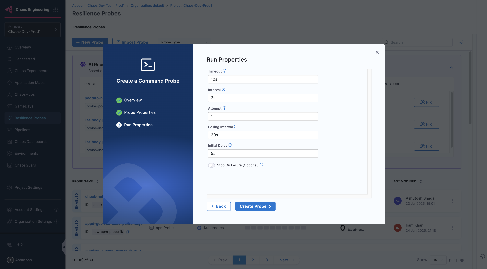

This topic describes the [definition](#definition) and [schema](#schema) of the command probe. It also describes how to tune the probe in two modes: [inline mode](#inline-mode) and [source mode](#source-mode).

The command probe allows you to run Bash commands and match the output as part of the entry or exit criteria. The intent behind this probe is to implement a non-standard and imperative way to express the hypothesis. For example, you can check for specific data within a database, parse the value out of a JSON blob that is dumped into a certain path, or check for the existence of a particular string in the service logs.

:::info YAML only feature
By default, this probe can be defined in inline mode from the user interface, where the command is run from within the experiment image. It can also be run in source mode, where the command execution is carried out from within a new pod whose image is specified. Inline mode is preferred for simple shell commands, and source mode is preferred when application-specific binaries are required.
:::

## Probe definition

You can define the probe at **.spec.experiments[].spec.probe** path inside the chaos engine.

```yaml
kind: Workflow
apiVersion: argoproj.io/v1alpha1
spec:
  templates:
    - inputs:
        artifacts:
          - raw:
              data: |
                apiVersion: litmuschaos.io/v1alpha1
                kind: ChaosEngine
                spec:
                  experiments:
                    - spec:
                        probe:
                          ####################################
                          Probes are defined here
                          ####################################
```

:::tip
The command probe expects you to provide a shell command to implement checks that are highly specific to the application use case.
:::

## Schema

Listed below is the probe schema for the command probe with properties shared across all the probes and properties unique to the command probe.

<table>
  <tr>
   <th><strong>Field</strong> </th>
   <th><strong>Description</strong> </th>
   <th><strong>Type</strong> </th>
   <th><strong>Range</strong> </th>
   <th><strong>Notes</strong> </th>
  </tr>
  <tr>
   <td>name </td>
   <td>Flag that holds the name of the probe </td>
   <td>Mandatory </td>
   <td>N/A <code>type: string</code> </td>
   <td>The <code>name</code> holds the name of the probe. It can be set based on the use-case </td>
  </tr>
  <tr>
   <td>type </td>
   <td>Flag to hold the type of the probe </td>
   <td>Mandatory </td>
   <td><code>httpProbe, k8sProbe, cmdProbe, promProbe, and datadogProbe</code> </td>
   <td>The <code>type</code> supports five types of probes: httpProbe, k8sProbe, cmdProbe, promProbe, and datadogProbe. </td>
  </tr>
  <tr>
   <td>mode </td>
   <td>Flag to hold the mode of the probe </td>
   <td>Mandatory </td>
   <td><code>SOT, EOT, Edge, Continuous, OnChaos</code> </td>
   <td>The <code>mode</code> supports five modes of probes: SOT, EOT, Edge, Continuous, and OnChaos. Datadog probe supports EOT mode only. </td>
  </tr>
  <tr>
   <td>command </td>
   <td>Flag to hold the command for the cmdProbe</td>
   <td>Mandatory</td>
   <td>N/A <code>type: string</code></td>
   <td>The <code>command</code> contains the shell command, which should be run as part of cmdProbe</td>
  </tr>
</table>

#### Source

<table>
  <tr>
   <th><strong>Field</strong> </th>
   <th><strong>Description</strong></th>
   <th><strong>Type</strong> </th>
   <th><strong>Range</strong> </th>
   <th><strong>Notes</strong> </th>
  </tr>
  <tr>
   <td>image </td>
   <td>Flag to hold the image for the cmdProbe </td>
   <td>Mandatory </td>
   <td>any source docker image </td>
   <td>The <code>image</code> provides the source image which can be used to launch a external pod where the command execution is carried out. </td>
  </tr>
  <tr>
   <td>hostNetwork</td>
   <td>Flag to allow or deny the <code>image</code> access to the node network namespace </td>
   <td>Optional </td>
   <td><code>true, false</code> </td>
   <td>The <code>hostNetwork</code> provides a possibility to allow the pod executing the cmdProbe access to the network of the node he is running on. For more details, go to the <a href="https://kubernetes.io/docs/concepts/policy/pod-security-policy/#host-namespaces">official Kubernetes documentation</a>. </td>
  </tr>
  <tr>
   <td>inheritInputs </td>
   <td>Flag for inheriting experiment pod attributes such as ENV, volumes, and volumeMounts into the probe pod </td>
   <td>Optional </td>
   <td><code>true, false</code> </td>
   <td>Default is <code>false</code> i.e. the experiment pod attributes won't be inherited by the probe pod by default </td>
  </tr>
  <tr>
   <td>args </td>
   <td>Arguments to be used for the source probe </td>
   <td>Optional </td>
   <td><code>type: string</code> </td>
   <td>List of arguments to be used along with the probe command </td>
  </tr>
  <tr>
   <td>env </td>
   <td>Environment variables to be used for the source probe pod </td>
   <td>Optional </td>
   <td><code>type: string</code> </td>
   <td>List of environment variables to be used probe pod container </td>
  </tr>
  <tr>
   <td>labels </td>
   <td>Labels for the source probe pod </td>
   <td>Optional </td>
   <td><code>type: string</code> </td>
   <td>Labels to be added to the source probe pod </td>
  </tr>
  <tr>
   <td>annotations </td>
   <td>Annotations for the source probe pod </td>
   <td>Optional </td>
   <td><code>type: string</code> </td>
   <td>Annotations to be added to the source probe pod </td>
  </tr>
  <tr>
   <td>command</td>
   <td>Command to be executed using the source probe image </td>
   <td>Optional </td>
   <td><code>type: string</code> </td>
   <td>Command to be executed using the source probe image, which can be provided as a list</td>
  </tr>
  <tr>
   <td>imagePullPolicy </td>
   <td>Image Pull Policy to be used for the source pod image </td>
   <td>Optional </td>
   <td><code>type: string</code> </td>
   <td>Image Pull Policy to be used for the source pod image, supports <code>Always</code>, <code>IfNotPresent</code>, and <code>Never</code> </td>
  </tr>
  <tr>
   <td>privileged </td>
   <td>Privileged execution permissions for the probe image </td>
   <td>Optional </td>
   <td><code>true, false</code> </td>
   <td>Privileged execution permissions for the probe image, supports a boolean value </td>
  </tr>
  <tr>
   <td>nodeSelector </td>
   <td>Label(s) of the node(s) to be used for deploying the source probe pod </td>
   <td>Optional </td>
   <td><code>type: string</code> </td>
   <td>Key-Value label(s) of the node(s) to be used for deploying the source probe pod </td>
  </tr>
  <tr>
   <td>volumes </td>
   <td>Volumes to be mounted to the source probe pod </td>
   <td>Optional </td>
   <td>N/A </td>
   <td>Depending on the type of the volume, additional properties need to be provided </td>
  </tr>
  <tr>
   <td>volumesMount </td>
   <td>Volume mount paths for the corresponding source pod volumes </td>
   <td>Optional </td>
   <td><code>type: string</code> </td>
   <td>List of volume mount paths for the corresponding source pod volumes </td>
  </tr>
  <tr>
   <td>imagePullSecrets </td>
   <td>Image pull secrets for the source pod image </td>
   <td>Optional </td>
   <td><code>type: string</code> </td>
   <td>List of image pull secrets for the source pod image </td>
  </tr>
</table>

#### Comparator

<table>
  <tr>
   <td><strong>Field</strong> </td>
   <td><strong>Description</strong> </td>
   <td><strong>Type</strong> </td>
   <td><strong>Range</strong> </td>
   <td><strong>Notes</strong> </td>
  </tr>
  <tr>
   <td>type </td>
   <td>Flag to hold type of the data used for comparison </td>
   <td>Mandatory </td>
   <td><code>string, int, float</code> </td>
   <td>The <code>type</code> contains type of data, which should be compared as part of comparison operation. </td>
  </tr>
  <tr>
   <td>criteria </td>
   <td>Flag to hold criteria for the comparison </td>
   <td>Mandatory </td>
   <td>It supports <code>{`>=, <=, ==, >, <, !=, oneOf, between`}</code> for int and float type. And <code>{`equal, notEqual, contains, matches, notMatches, oneOf`}</code> for string type. </td>
   <td>The <code>criteria</code> contains criteria of the comparison, which should be fulfill as part of comparison operation. </td>
  </tr>
  <tr>
   <td>value </td>
   <td>Flag to hold value for the comparison </td>
   <td>Mandatory </td>
   <td>N/A <code>type: string</code> </td>
   <td>The <code>value</code> contains value of the comparison, which should follow the given criteria as part of comparison operation. </td>
  </tr>
</table>

#### Run properties

<table>
  <tr>
   <td><strong>Field</strong> </td>
   <td><strong>Description</strong> </td>
   <td><strong>Type</strong> </td>
   <td><strong>Range</strong> </td>
   <td><strong>Notes</strong> </td>
  </tr>
  <tr>
   <td>probeTimeout </td>
   <td>Flag to hold the timeout of the probe </td>
   <td>Mandatory </td>
   <td>N/A <code>type: string</code> </td>
   <td>The <code>probeTimeout</code> represents the time limit for the probe to execute the specified check and return the expected data </td>
  </tr>
  <tr>
   <td>attempt </td>
   <td>Flag to hold the attempt of the probe </td>
   <td>Mandatory </td>
   <td>N/A <code>type: integer</code> </td>
   <td>The <code>attempt</code> contains the number of times a check is run upon failure in the previous attempts before declaring the probe status as failed. </td>
  </tr>
  <tr>
   <td>interval </td>
   <td>Flag to hold the interval of the probe </td>
   <td>Mandatory </td>
   <td>N/A <code>type: string</code> </td>
   <td>The <code>interval</code> contains the interval for which probes waits between subsequent retries </td>
  </tr>
  <tr>
   <td>probePollingInterval </td>
   <td>Flag to hold the polling interval for the probes (applicable for all modes) </td>
   <td>Optional </td>
   <td>N/A <code>type: string</code> </td>
   <td>The <code>probePollingInterval</code> contains the time interval for which continuous and onchaos probe should be sleep after each iteration </td>
  </tr>
  <tr>
   <td>initialDelaySeconds </td>
   <td>Flag to hold the initial delay interval for the probes </td>
   <td>Optional </td>
   <td>N/A <code>type: integer</code> </td>
   <td>The <code>initialDelaySeconds</code> represents the initial waiting time interval for the probes. </td>
  </tr>
  <tr>
   <td>stopOnFailure </td>
   <td>Flags to hold the stop or continue the experiment on probe failure </td>
   <td>Optional </td>
   <td>N/A <code>type: boolean</code> </td>
   <td>The <code>stopOnFailure</code> can be set to true/false to stop or continue the experiment execution after probe fails </td>
  </tr>
</table>

## Definition

A sample definition of the probe is given below.

```yaml
probe:
  - name: "check-database-integrity"
    type: "cmdProbe"
    cmdProbe/inputs:
      command: "<command>"
      comparator:
        type: "string" # supports: string, int, float
        criteria: "contains" #supports >=,<=,>,<,==,!= for int and float, and contains, equal, notEqual, matches, notMatches, oneOf for string values
        value: "<value-for-criteria-match>"
      source: # omit this tag to "inline" the probe
        image: "<repo>/<tag>"
        hostNetwork: false
    mode: "Edge"
    runProperties:
      probeTimeout: 5
      interval: 5
      retry: 1
      initialDelaySeconds: 5
```

#### Inline mode

In the inline mode, the command probe is executed directly within the experiment pod. This mode is recommended for executing straightforward shell commands. It is the default mode and can be tuned by leaving out the 'source' field.

Use the following example to tune this:

```yaml
# execute the command inside the experiment pod itself
# cases where command doesn't need any extra binaries, which is not available in the experiment image
apiVersion: litmuschaos.io/v1alpha1
kind: ChaosEngine
metadata:
  name: engine-nginx
spec:
  engineState: "active"
  appinfo:
    appns: "default"
    applabel: "app=nginx"
    appkind: "deployment"
  chaosServiceAccount: litmus-admin
  experiments:
  - name: pod-delete
    spec:
      probe:
      - name: "check-database-integrity"
        type: "cmdProbe"
        cmdProbe/inputs:
          # command which needs to run in cmdProbe
          command: "echo 'hello world'"
          comparator:
            # output type for the above command
            # supports: string, int, float
            type: "string"
            # criteria which should be followed by the actual output and the expected output
            #supports [>=, <=, >, <, ==, !=] for int and float
            # supports [contains, equal, notEqual, matches, notMatches, oneOf] for string values
            criteria: "contains"
            # expected value, which should follow the specified criteria
            value: "hello"
        mode: "Edge"
        runProperties:
          probeTimeout: 5s
          interval: 2s
          attempt: 1
```

#### Source Mode

In source mode, the command is executed within a newly created pod, allowing for the specification of its image. This mode is useful when application-specific binaries are needed.

Use the following example to tune this:

```yaml
# it launches the external pod with the source image and run the command inside the same pod
# cases where command needs an extra binaries which is not available in the experiment image
apiVersion: litmuschaos.io/v1alpha1
kind: ChaosEngine
metadata:
  name: engine-nginx
spec:
  engineState: "active"
  appinfo:
    appns: "default"
    applabel: "app=nginx"
    appkind: "deployment"
  chaosServiceAccount: litmus-admin
  experiments:
  - name: pod-delete
    spec:
      probe:
      - name: "check-database-integrity"
        type: "cmdProbe"
        cmdProbe/inputs:
          # command which needs to run in cmdProbe
          command: "<command>"
          comparator:
            # output type for the above command
            # supports: string, int, float
            type: "string"
            # criteria which should be followed by the actual output and the expected output
            #supports [>=, <=, >, <, ==, !=, oneOf, between] for int and float
            # supports [contains, equal, notEqual, matches, notMatches, oneOf] for string values
            criteria: "contains"
            # expected value, which should follow the specified criteria
            value: "<value-for-criteria-match>"
          # source for the cmdProbe
          source:
            image: "<source-image>"
            imagePullPolicy: Always
            privileged: true
            hostNetwork: false
        mode: "Edge"
        runProperties:
          probeTimeout: 5s
          interval: 2s
          attempt: 1
```

---


- /docs/chaos-engineering/features/probes/cmd-probe/cmd-probe-usage
- /docs/chaos-engineering/features/resilience-probes/cmd-probe/cmd-probe-usage
- /docs/chaos-engineering/use-harness-ce/probes/cmd-probe-usage
---

This topic guides you on how to use the **command probe** inline and how to configure source parameter with the command probe. You can follow the same steps for other resilience probes.

## Configure Command Probe

You can configure a probe using the YAML manifest or from the UI. When you use the UI to configure a probe, the probe attributes are minified in the corresponding YAML, and are referred using the **probeID**.

In this example, you will specify details of the command probe from the UI.

1. In the **Probe Details** modal, enter a command in the **Command** field.

    

2. Enter the **Type**, **Comparison criteria**, and the **Value**. Click **Configure Properties**. Provide other values like **Timeout**, **Interval**, **Attempt**, **Polling Interval**, and **Verbosity**. Click **Setup Probe**.

    

Go to [sample YAML inline](/docs/chaos-engineering/guides/probes/command-probes/#inline-mode) to tune a resilience probe from the manifest.

#### Configure Command probe with source parameter

1. Enter the **Type**, **Comparison criteria**, **Value**. Toggle to switch on the **Source** mode. Select **Setup probe**.

    


:::tip
Alongside the **source** parameter, you can provide other specifications (for example, `imagePullPolicy`, custom image, environment variables, and so on). You can reference values from the ConfigMap and secret too.
:::

Go to [sample YAML with source parameter](/docs/chaos-engineering/guides/probes/command-probes/#source-mode) to tune a resilience probe with source field configuration from the manifest.

---

## Extract Data from New Relic

This topic guides you through steps to use the **command probe** in **source mode** to extract and validate the data from the APM tool New Relic.

1. Create a binary file that stores the logic to extract data from New Relic. In this example, we will create the logic such that this file should extract the minimum, maximum, and mean values from the API response.
2. Dockerize the binary. This image contains the logic to query the New Relic GraphQL API and extract the minimum, maximum, and mean values from the API response.
3. [Create a new command probe](/docs/chaos-engineering/guides/probes/#create-a-resilience-probe), add the necessary details, and select **Configure Properties**.

4. Add the necessary details, and select **Configure Details**.

    

5. Specify the command as **./main**. This command runs the dockerized binary that contains the logic to extract data from New Relic.

6. Select the type as **Float** in the **type** sub-field of **Data Comparison** field, because the data extracted from New Relic is expected to be a float value. Specify the **Comparison Criteria** and the expected value. Enable the **Source** button to allow using custom images, environment variables, and secrets.

    

7. Once the **Source** mode is enabled, a YAML text editor appears on the UI. Specify all the details for the source probe that are required to fetch the data from New Relic.
Pass the following parameters as environment variables:

- **NRQL_QUERY** : The NRQL query that is to be fetched from New Relic.
- **NRQL_ACCOUNT** : The account ID of the New Relic account.
- **NRQL_QUERY_METRICS** : The metrics that will be evaluated. The provided **NRQL** query can include multiple metrics.
- **NRQL_API_KEY** : The API key used to query New Relic.
- **NRQL_EVALUATION_TYPE** : The evaluation type, which could be min, max, or mean.

Below is the example configuration where the **NRQL_API_KEY** environment variable is referred from a Kubernetes secret. Ensure that the Kubernetes secret is present in the same namespace where chaos infrastructure is running.

```
image: docker.io/aady12/newrelic-p:3.2
env:
 - name: NRQL_QUERY
   value: SELECT (average(net.rxBytesPerSecond) / 1000) AS `Received KBps`, (average(net.txBytesPerSecond) / 1000) AS `Transmitted KBps`, average(net.errorsPerSecond) AS `Errors / sec` FROM K8sPodSample WHERE (entityGuid = 'NDQ1Mzg5NXxJTkZSQXxOQXwxMjg5MjUwNjUxOTg2MDI1OTA1') TIMESERIES AUTO
 - name: NRQL_ACCOUNT
   value: "12345"
 - name: NRQL_API_KEY
    valueFrom:
      secretKeyRef:
        name: newrelic-sec
        key: NEWRELIC_KEY
 - name: NRQL_QUERY_METRICS
   value: Received KBps
 - name: NRQL_EVALUATION_TYPE
   value: max
```

8. Attach the probe created in the experiment and validate the metrics from New Relic.

---

## Command Probe in Windows Infra

This topic describes how to use the **Windows command probe** to execute Windows-specific commands and PowerShell scripts as part of chaos experiments targeting Windows environments. The Windows command probe extends the standard command probe functionality to support Windows Command Prompt (cmd) and PowerShell execution contexts.

In this guide, we'll walk you through setting up a Windows command probe that checks the system hostname during a Windows CPU stress experiment, demonstrating how to validate system responsiveness under load.

#### Prerequisites

- [Setup Windows chaos infrastructure](/docs/chaos-engineering/guides/infrastructures/types/legacy-infra/windows)
- [Command Probe](/docs/chaos-engineering/guides/probes/command-probes/)
- [Create a resilience probe](/docs/chaos-engineering/guides/probes/#create-a-resilience-probe)
- [Windows chaos faults](/docs/chaos-engineering/faults/chaos-faults/windows/)

#### Steps to configure Windows command probe

1. Navigate to **Resilience Probe** in the left navigation pane, select **Windows** as your target infrastructure type, and then select **Command Probe**.

    

2. Enter a name for your command probe in the **Name** field.

    

3. Enter the **Command**, **Type**, **Comparison criteria**, and the **Value**. Click **Configure Properties**.

    

4. Provide other values like **Timeout**, **Interval**, **Attempt**, **Polling Interval**, and **Verbosity**. Click **Create Probe**.

    

5. Your Windows command probe is now ready to be attached to chaos experiments. You can monitor probe execution results during experiment runs to validate system behavior.

    
