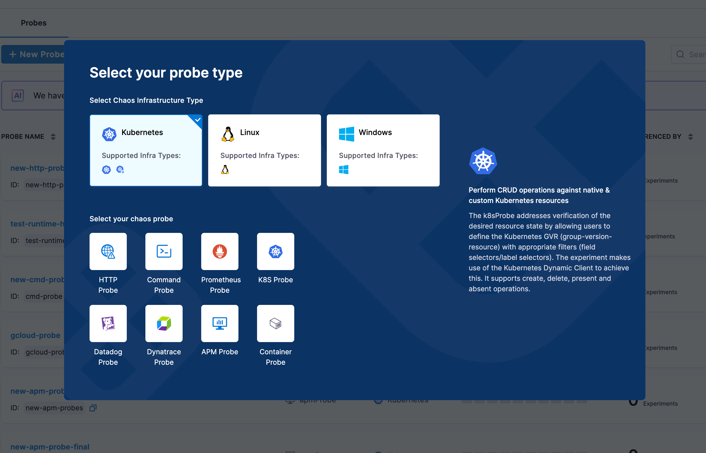
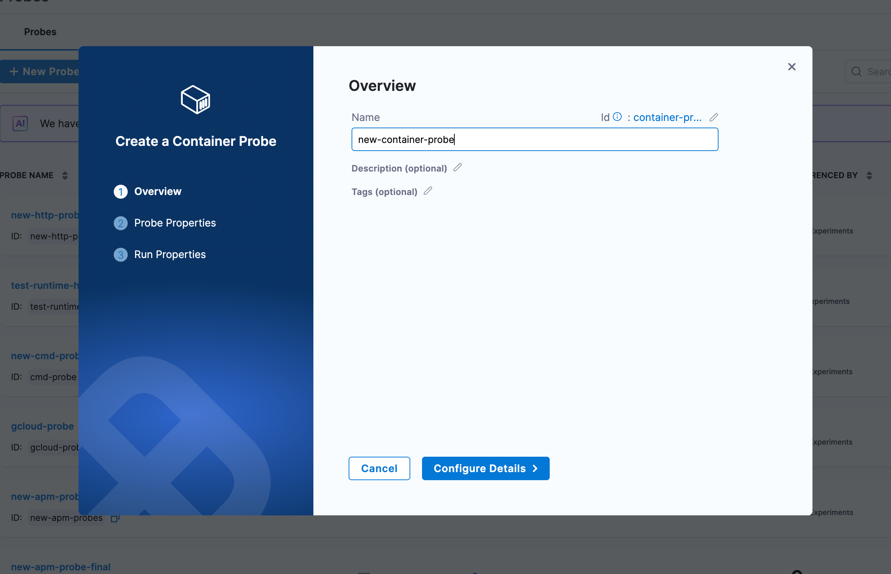

## What is a Container Probe?

Container probe allows you to execute commands inside a container and validate the output. It is useful for validating application state, checking file contents, or verifying environment variables within containerized applications. The Container probe is currently supported only on Kubernetes infrastructure that is driven by Harness Delegate.

The usage of a Container probe is exactly the same as other probes where the probe is added in a chaos experiment in one of the probe modes such as Continuous, Edge, SOT or EOT. The probe when successfully executed will result in either SUCCESS or FAILED state and this state contributes to the overall resilience score of the chaos experiment.

When will you use it?
Container probes are used when you need to validate application state by executing commands inside containers, check file contents, verify environment variables, or validate that specific processes are running. The Container probe can also be used in combination with other probes such as HTTP, Command, or K8S probes.

## Supported Infrastructure Types

| Infrastructure Type | Supported |
|---------------------|-----------|
| Kubernetes HD | YES |
| Kubernetes | NO |
| Linux | NO |
| Windows | NO |

:::info note
- Kubernetes HD means the Kubernetes infrastructure that is driven by Harness Delegate.
:::

---

## Configure Container Probe

#### Prerequisites
To use the Container probe, you need:

* A Kubernetes cluster with Harness Delegate installed
* Access to the target container where commands will be executed
* Appropriate RBAC permissions to execute commands in pods/containers
* The container image must be available and accessible from the cluster

#### Steps to configure

1. In the **Probes & Actions** section under the chaos module, click on **+ New Probe** button

2. Select **Container Probe** from the probe type selection dialog

3. Provide the name of the probe and optional description and tags

4. Click on **Configure Details** to proceed to the next step

5. Under **Probe Properties**, configure the following:
   * **Container Image**: Specify the container image to use (e.g., `bitnami/kubectl:latest`, `busybox:latest`, `alpine:latest`)
   * **Command**: Specify the command to execute inside the container as an array (e.g., `/bin/sh`, `-c`)
   * **Arguments**: Provide the actual command or script to execute (e.g., `echo "Hello World"`)
   * **Environment Variables** (optional): Add environment variables as key-value pairs
   * **Namespace**: Specify the Kubernetes namespace (default: `default`)
   * **Image Pull Policy**: Define when to pull the image (`IfNotPresent`, `Always`, `Never`)

6. Configure **Advanced Configuration** (optional):
   * **Service Account Name**: Kubernetes service account to use
   * **Image Pull Secrets**: Secrets for private registries
   * **Labels** and **Annotations**: Custom metadata for the probe container
   * **Node Selector**: Node selection constraints
   * **Tolerations**: Allow scheduling on nodes with matching taints
   * **Node Affinity**: Required or preferred node affinity rules
   * **Resource Limits**: Set memory and CPU limits (e.g., `512Mi`, `500m`)
   * **Resource Requests**: Set memory and CPU requests (e.g., `256Mi`, `100m`)

7. Configure **Volumes** (optional):
   * Add volumes to mount into the probe container with volume name, mount path, and volume source

8. Configure **Volume Mounts** (optional):
   * Specify additional volume mounts with name, mount path, and optional sub path

9. Configure **Security Configuration** (optional):
   * **Host Network**, **HostPID**, **Host IPC**: Use host namespaces
   * **Allow Privilege Escalation**: Allow gaining more privileges
   * **Read Only Root Filesystem**: Mount root filesystem as read-only
   * **Privileged**: Run in privileged mode
   * **Run As Non Root**: Ensure non-root execution
   * **Run as user** and **Run as group**: Specify user and group IDs
   * **FS Group**: Filesystem group ID for volume ownership

10. Provide the comparison criteria under **Data Comparison**:
    * **Type**: Select data type (`String`, `Int`, `Float`)
    * **Comparison Criteria**: Select operator (`matches`, `==`, `!=`, `>`, `&lt;`, `>=`, `&lt;=`)
    * **Value**: Enter the expected value to compare against

11. Configure **Run Properties**:
    * **Timeout**: Maximum time for probe execution (e.g., `10s`)
    * **Interval**: Time between successive executions (e.g., `2s`)
    * **Attempt**: Number of retry attempts (e.g., `1`)
    * **Polling Interval**: Time between retries (e.g., `30s`)
    * **Initial Delay**: Delay before first execution (e.g., `5s`)
    * **Verbosity**: Log detail level
    * **Stop On Failure**: Stop experiment if probe fails

12. Click on **Create Probe** to save the container probe configuration

## Next Steps

- Learn about [Probe Modes](/docs/chaos-engineering/guides/probes#probe-modes) to understand when probes execute
- Explore [Other Probe Types](/docs/chaos-engineering/guides/probe) for different validation scenarios
- Create [Chaos Experiments](/docs/chaos-engineering/guides/experiments) with Container probes
