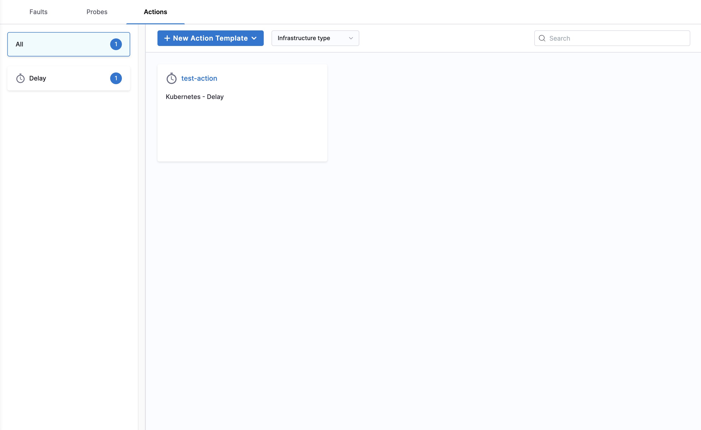
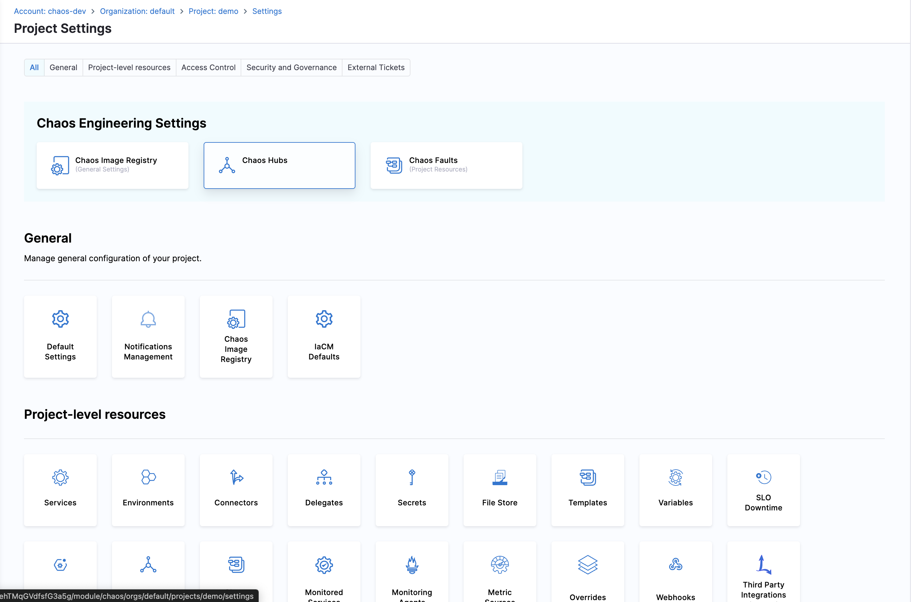
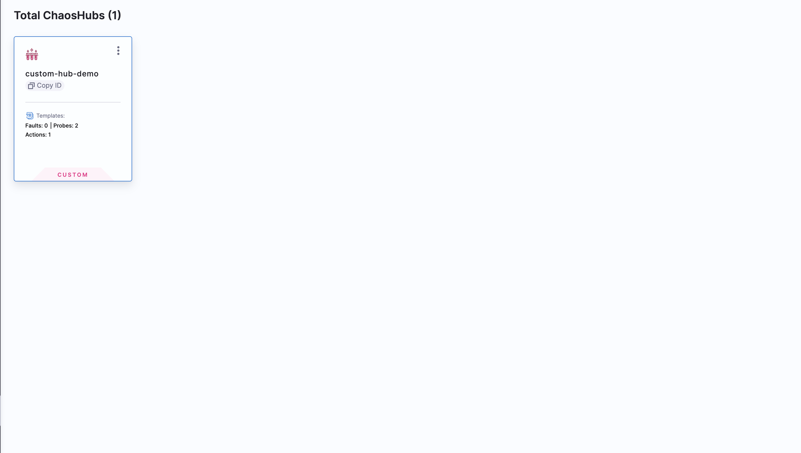
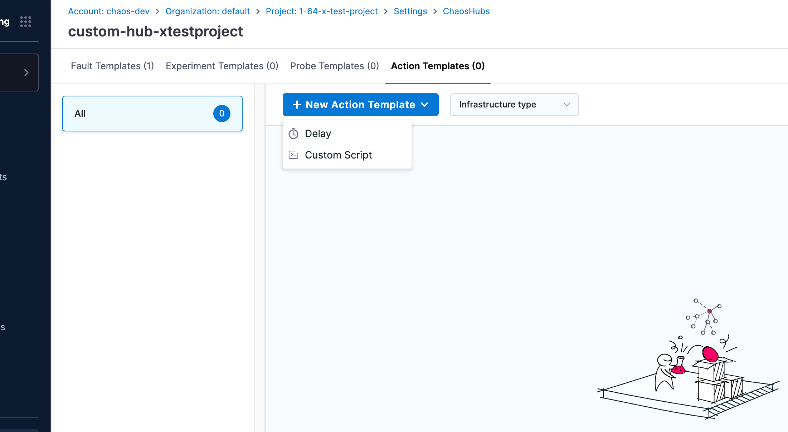
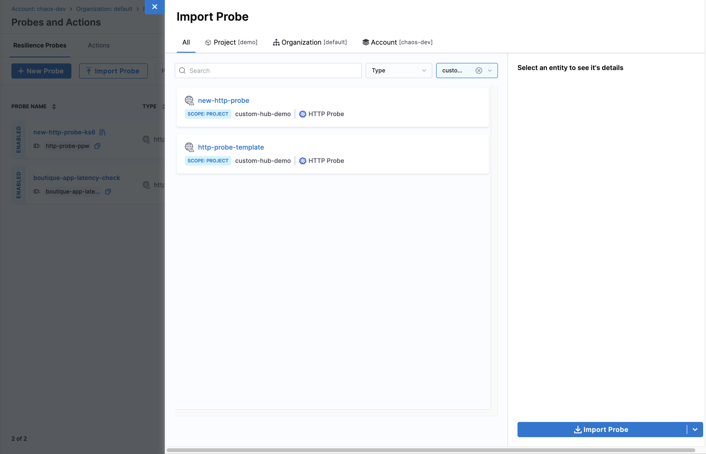
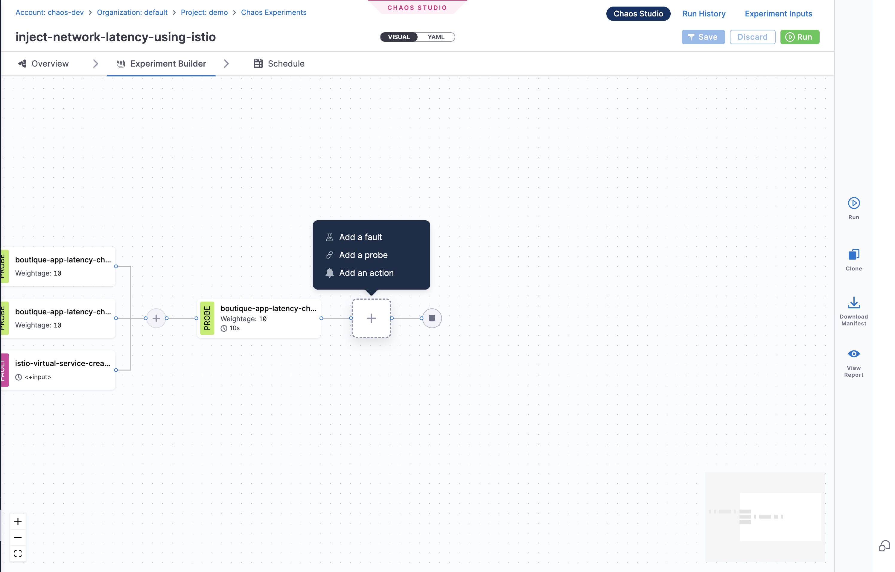

**Action Templates** provide reusable workflow actions for experiment orchestration.

## Creating Action Templates

1. Navigate to **ChaosHubs** in your **Project Settings**

    

2. Choose the **ChaosHub** you want to create action template in.

    

3. Navigate to **Action Templates** and click on **New Action Template**.

4. Choose between the **Delay** or **Custom Script** action template, and start creating the template.

    

5. Now to use the Action template in your project, navigate to **Probes & Actions** and go to **Actions** tab. Then click **Import Action**

    

6. Start using the Action template in your experiments

    
