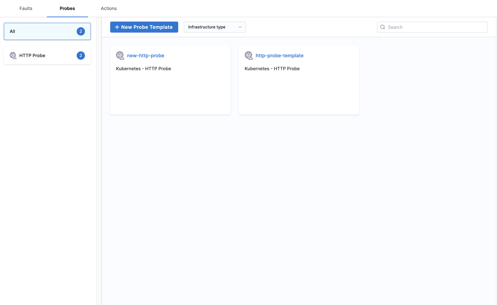

# Action Templates

**Action Templates** provide reusable workflow actions for experiment orchestration.

## Creating Action Templates

1. Navigate to **ChaosHubs** in your **Project Settings**

    

2. Choose the **ChaosHub** you want to create templates in.

    

3. Start creating **Action** templates.

    

4. Import the templates into your project to make them available for use

    

5. Start using the templates in your experiments

    

## Next Steps

- [Understand Actions](/docs/chaos-engineering/guides/actions/)
- [Create your first experiment using templates](/docs/chaos-engineering/guides/chaos-experiments/create-experiments)
