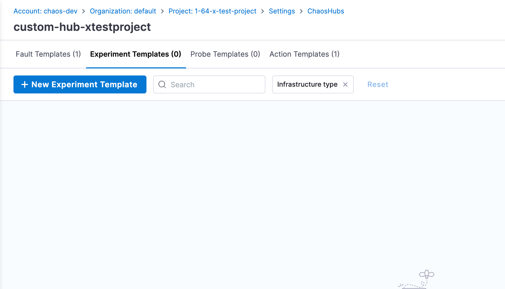
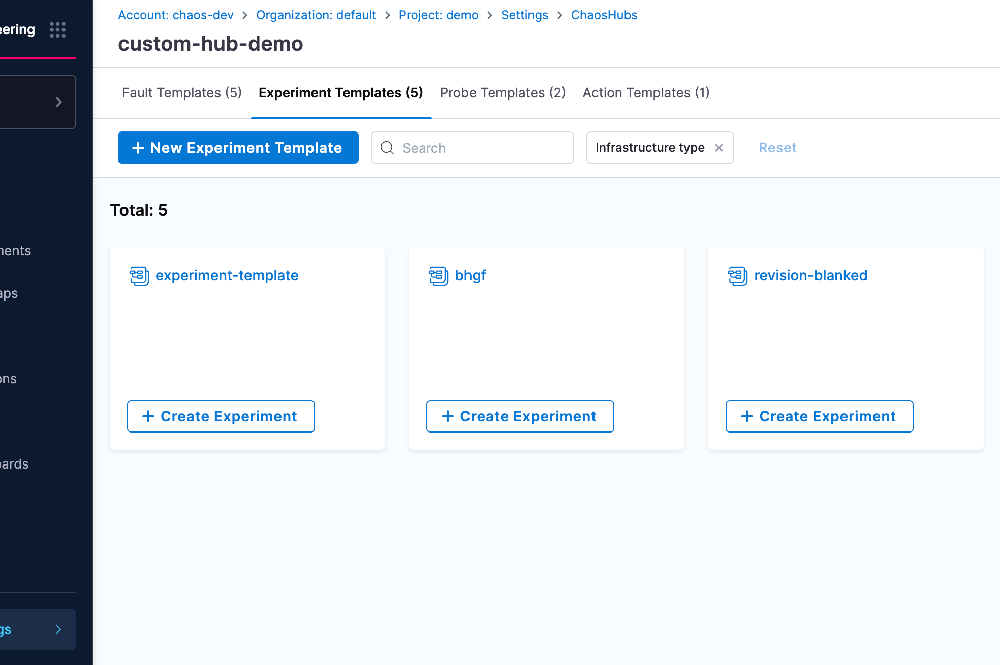
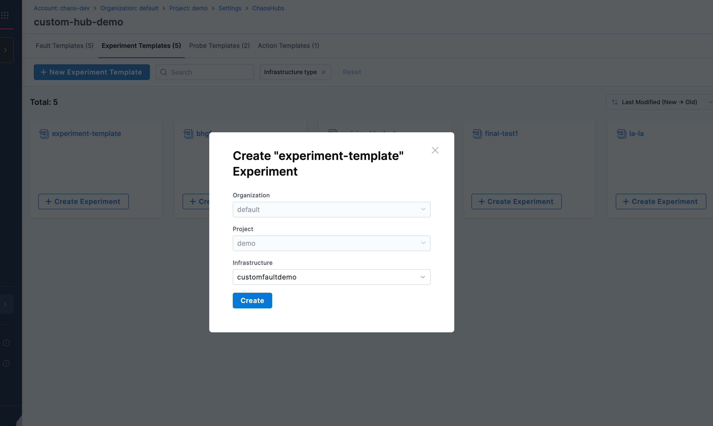

**Experiment Templates** allow you to create reusable experiment templates.

## Creating Experiment Templates

1. Navigate to **ChaosHubs** in your **Project Settings**

    

2. Choose the **ChaosHub** you want to create Experiment template in.

    

3. Navigate to **Experiment Templates** and click on **New Experiment Template** and start creating the template.

4. Now to use the Experiment template in your project, go back to the **ChaosHub** you created the template in.

5. Choose the **Experiment Template** you created and click **Create Experiment**.

    

6. Select your **Infrastructure**, in the next screen and click **Create**.

    

7. That's it. Now, you can start building your experiment using the template you created.

