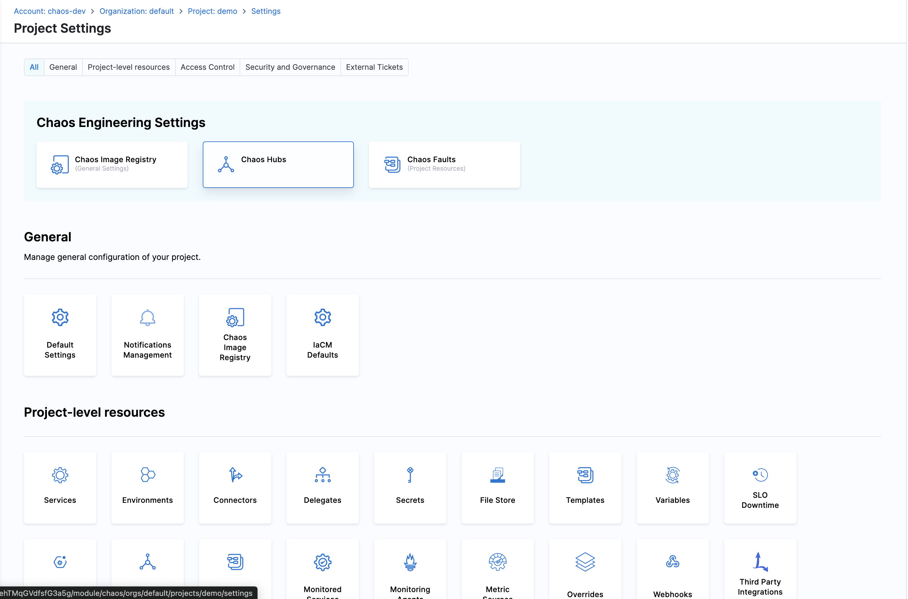

**Experiment Templates** allow you to create reusable experiment templates that can be shared and used across multiple projects.

## Creating Experiment Templates

1. Navigate to **ChaosHubs** in your **Project Settings**

    

2. Choose the **ChaosHub** you want to create Experiment template in.

    

3. Navigate to **Experiment Templates** and click on **New Experiment Template** and start creating the template.

## Using Experiment Templates

You can use experiment templates in two ways:

### Option 1: From ChaosHub

1. Go back to the **ChaosHub** you created the template in.

2. Choose the **Experiment Template** you created and click **Create Experiment**.

    

3. Select your **Infrastructure**, in the next screen and click **Create**.

    

4. That's it. Now, you can start building your experiment using the template you created.

### Option 2: From Experiments Page

1. Navigate to **Chaos Experiments** page in your project.

2. Click **New Experiment** and select **Create from template** option.

    

3. In the **Select an Experiment Template** modal, browse through available templates. You can filter templates by scope using the tabs (**All**, **Project**, **Organization**, **Account**) and apply additional filters like **Infrastructure type**, **Tag(s)**, or **ChaosHub**.

    

4. Select the experiment template you want to use and click **Create Experiment**.

5. In the creation dialog, provide the experiment details:
   - **Name**: Enter a name for your experiment
   - **Description** (optional): Add a description
   - **Tags** (optional): Add tags for organization
   - **Organization** and **Project**: Select the appropriate values
   - **Infrastructure**: Select a Chaos Infrastructure

    

6. Click **Create** to create the experiment from the template.

