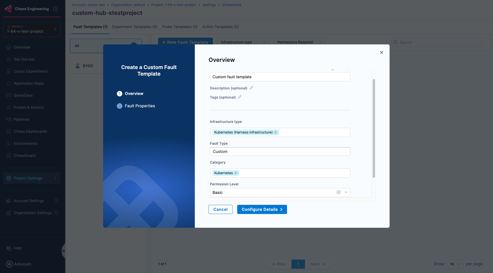
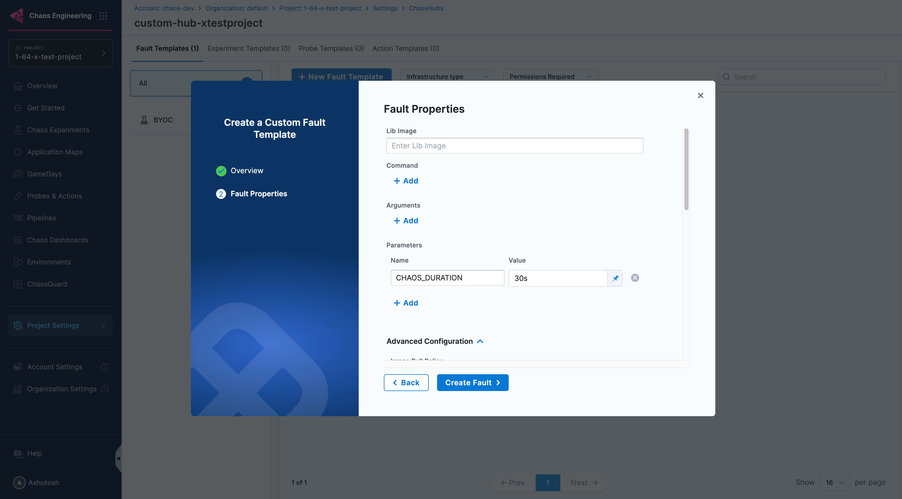
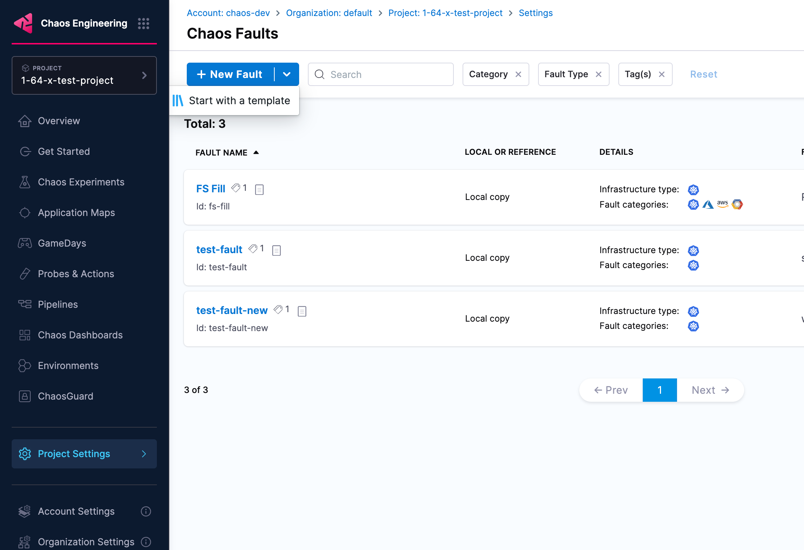

**Fault Templates** allow you to create reusable custom fault templates that can be shared and used across multiple experiments.

## Creating Fault Templates

1. Navigate to **ChaosHubs** in your **Project Settings**

    

2. Choose the **ChaosHub** you want to create fault template in.

    

3. Click on **New Fault Template** and enter the required details and click **Configure Details**.

    

4. In the next screen enter the **Lib Image** and  more advanced properties, then click **Create Fault**.

    

5. That's it. Your fault template is created. Now go back to **Project Settings** for your project and open **Chaos Faults**, then click on **Custom Faults** at the top right.

6. From the dropdown arrow next to **New Fault** and select **Start with a template**, to start using the template you created.

    

