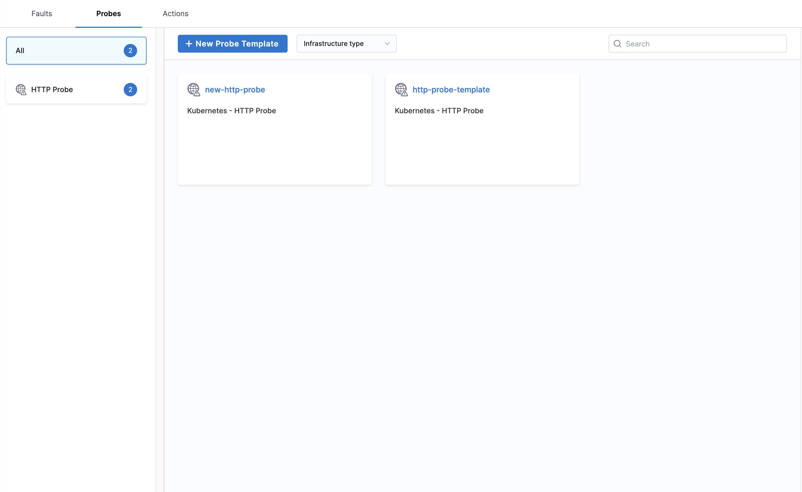

**Probe Templates** allow you to create reusable validation and monitoring configurations that can be shared across multiple experiments to verify system behavior and resilience.

## Creating Probe Templates

1. Navigate to **ChaosHubs** in your **Project Settings**

    

2. Choose the **ChaosHub** you want to create Probe template in.

    

3. Start creating **Probe** templates.

    

4. Import the templates into your project to make them available for use

    

5. Start using the probe templates in your experiments

    
