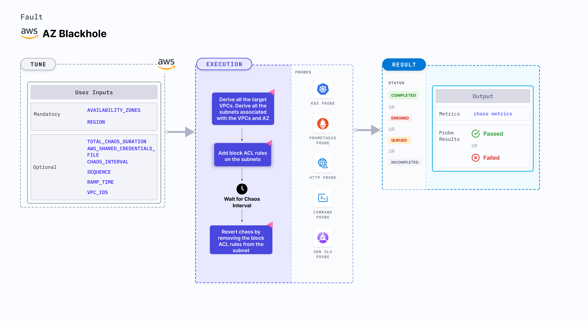

AZ blackhole is an AWS fault that causes network blackhole by isolating traffic in specific availability zones across an entire region. You can control the blast radius by providing targeted VPC IDs for the AZ failure.
This fault helps evaluates how well your applications and services handle the loss of network connectivity across the availability zone ensuring that failover mechanisms and redundancy strategies function as expected.



## Use cases

AZ blackhole:
- Checks how the applications and services handle the loss of network connectivity in specific zones.
- Determines the effects of network isolation on critical business processes by simulating major network disruptions, helping teams to identify weak links and improve overall system robustness.
- Tests and refine disaster recovery plans by simulating AZ-level blackholes, ensuring that your infrastructure can efficiently reroute traffic and maintain operational continuity during large-scale outages.

### Prerequisites
- Kubernetes >= 1.17
- Ensure you have the required AWS permissions to induce a network blackhole in the specified availability zone within the region..
- Ensure that the specified VPC (if provided) includes the target availability zone.
- The Kubernetes secret should have AWS access configuration (key) in the `CHAOS_NAMESPACE`. Below is a sample secret file.
  ```yaml
  apiVersion: v1
  kind: Secret
  metadata:
    name: cloud-secret
  type: Opaque
  stringData:
    cloud_config.yml: |-
      # Add the cloud AWS credentials respectively
      [default]
      aws_access_key_id = XXXXXXXXXXXXXXXXXXX
      aws_secret_access_key = XXXXXXXXXXXXXXX
  ```

:::tip
Harness CE recommends that you use the same secret name, that is, `cloud-secret`. Otherwise, you will need to update the `AWS_SHARED_CREDENTIALS_FILE` environment variable in the fault template with the new secret name and you won't be able to use the default health check probes.
:::

Below is an example AWS policy to execute the fault.

```json
{
  "Version": "2012-10-17",
  "Statement": [
    {
      "Effect": "Allow",
      "Action": [
        "ec2:DescribeVpcs",
        "ec2:DescribeSubnets",
        "ec2:DescribeNetworkAcls",
        "ec2:CreateNetworkAcl",
        "ec2:ReplaceNetworkAclAssociation",
        "ec2:DeleteNetworkAcl",
        "ec2:CreateNetworkAclEntry",
        "ec2:ModifyNetworkAclEntry"
      ],
      "Resource": "*"
    },
    {
      "Effect": "Allow",
      "Action": [
        "ec2:DescribeInstances",
        "ec2:DescribeSecurityGroups",
        "ec2:DescribeNetworkInterfaces",
        "ec2:DescribeAvailabilityZones"
      ],
      "Resource": "*"
    }
  ]
}

```

:::info note
- Go to [superset permission/policy](/docs/chaos-engineering/faults/chaos-faults/aws/security-configurations/policy-for-all-aws-faults) to execute all AWS faults.
- Go to [common attributes](/docs/chaos-engineering/faults/chaos-faults/common-tunables-for-all-faults) and [AWS-specific tunables](/docs/chaos-engineering/faults/chaos-faults/aws/aws-fault-tunables) to tune the common tunables for all faults and AWS-specific tunables.
- Go to [AWS named profile for chaos](/docs/chaos-engineering/faults/chaos-faults/aws/security-configurations/aws-switch-profile) to use a different profile for AWS faults.
:::

### Mandatory Tunables

   <table>
      <tr>
        <th> Tunable </th>
        <th> Description </th>
        <th> Notes </th>
      </tr>
      <tr>
        <td> AVAILABILITY_ZONES </td>
        <td> Provide the availability zones to cause the network blackhole. </td>
        <td> For example, <code>us-east-1a</code>. For more information, go to <a href="#availability-zones"> availability zones.</a></td>
      </tr>
      <tr>
        <td> REGION </td>
        <td> Region name for the target volumes. </td>
        <td> For example, <code>us-east-1</code>. </td>
      </tr>
    </table>

### Optional Tunables
   <table>
      <tr>
        <th> Tunable </th>
        <th> Description </th>
        <th> Notes </th>
      </tr>
      <tr>
        <td> TOTAL_CHAOS_DURATION </td>
        <td> Duration to insert chaos (in seconds). </td>
        <td> Default: 30 s. For more information, go to <a href="/docs/chaos-engineering/faults/chaos-faults/common-tunables-for-all-faults#duration-of-the-chaos"> duration of the chaos. </a></td>
      </tr>
      <tr>
        <td> VPC_IDS </td>
        <td> Provide the VPC IDs to limit the impact, ensuring the AZ blackhole targets only those specific networks. </td>
        <td> For example: "vpc-89765,vpc-78687". For more information, go to <a href="#vpc-ids"> vpc ids.</a></td>
      </tr>
      <tr>
        <td> AWS_SHARED_CREDENTIALS_FILE </td>
        <td> Path to the AWS secret credentials. </td>
        <td> Default: <code>/tmp/cloud_config.yml</code>. </td>
      </tr>
      <tr>
        <td> CHAOS_INTERVAL </td>
        <td> Duration between the attachment and detachment of the volumes (in seconds). </td>
        <td> Default: 30 s. For more information, go to <a href="https://developer.harness.io/docs/chaos-engineering/faults/chaos-faults/common-tunables-for-all-faults#chaos-interval"> chaos interval.</a></td>
      </tr>
      <tr>
        <td> SEQUENCE </td>
        <td> Sequence of chaos execution for multiple volumes. </td>
        <td> Default: parallel. Supports serial and parallel. For more information, go to <a href="/docs/chaos-engineering/faults/chaos-faults/common-tunables-for-all-faults#sequence-of-chaos-execution"> sequence of chaos execution.</a></td>
      </tr>
      <tr>
        <td> RAMP_TIME </td>
        <td> Period to wait before and after injecting chaos (in seconds). </td>
        <td> For example, 30 s. For more information, go to <a href="/docs/chaos-engineering/faults/chaos-faults/common-tunables-for-all-faults#ramp-time"> ramp time. </a></td>
      </tr>
    </table>

### Availability Zones

Comma-separated list of the target availability zones under blackhole attach. Tune it by using the `AVAILABILITY_ZONES` environment variable.

The following YAML snippet illustrates the use of this environment variable:

[embedmd]:# (./static/manifests/az-blackhole/availability-zones.yaml yaml)
```yaml
# contains az blackhole for given az
apiVersion: litmuschaos.io/v1alpha1
kind: ChaosEngine
metadata:
  name: engine-nginx
spec:
  engineState: "active"
  chaosServiceAccount: litmus-admin
  experiments:
  - name: az-blackhole
    spec:
      components:
        env:
        # target availability zones for the chaos
        - name: AVAILABILITY_ZONES
          value: 'us-east-1a,us-east-1b'
        # region for chaos
        - name: REGION
          value: 'us-east-1'
```

### VPC IDS

Comma-separated list of the VPC IDs to limit the impact. Tune it by using the `VPC_IDS` environment variable.

The following YAML snippet illustrates the use of this environment variable:

[embedmd]:# (./static/manifests/az-blackhole/vpc-ids.yaml yaml)
```yaml
# contains vpc ids for given az
apiVersion: litmuschaos.io/v1alpha1
kind: ChaosEngine
metadata:
  name: engine-nginx
spec:
  engineState: "active"
  chaosServiceAccount: litmus-admin
  experiments:
  - name: az-blackhole
    spec:
      components:
        env:
        # target vpc ids for the chaos
        - name: VPC_IDS
          value: 'vpc-21312481928410,vpc-78926378028471'
        # target availability zones for the chaos
        - name: AVAILABILITY_ZONES
          value: 'us-east-1a,us-east-1b'
        # region for chaos
        - name: REGION
          value: 'us-east-1'
```
