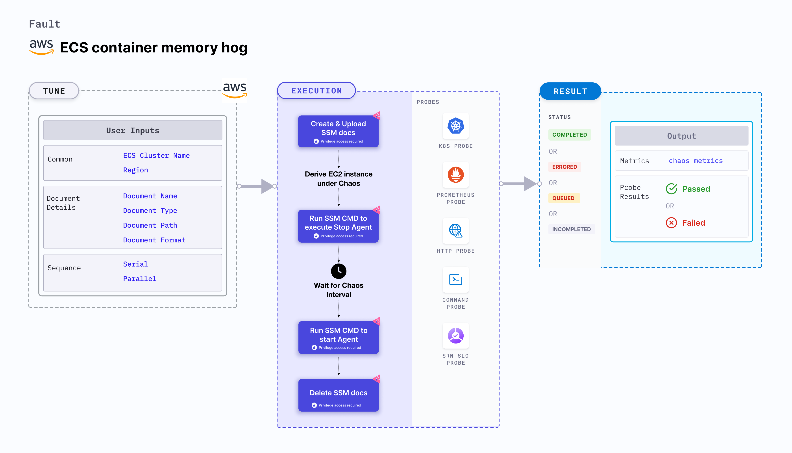

ECS container memory hog disrupts the state of infrastructure resources. It induces stress on the AWS ECS container using Amazon SSM Run command, which is carried out using SSM docs which is in-built into the fault.
- It causes memory stress on the containers of the ECS task using the given `CLUSTER_NAME` environment variable for a specific duration.
- To select the Task Under Chaos (TUC), use the service name associated with the task. If you provide the service name along with the cluster name, all the tasks associated with the given service will be selected as chaos targets.
- It tests the ECS task sanity (service availability) and recovery of the task containers subject to memory stress.
- This experiment induces chaos within a container and depends on an EC2 instance. Typically, these are prefixed with ["ECS container"](/docs/chaos-engineering/use-harness-ce/chaos-faults/aws/ec2-and-serverless-faults#ec2-backed-faults) and involve direct interaction with the EC2 instances hosting the ECS containers.




## Use cases

Memory usage inside containers is subject to constraints. If the limits are specified, exceeding them can result in termination of the container (due to OOMKill of the primary process, often pid 1).
The container is restarted, depending on the policy specified.
When there are no limits on the memory consumption of containers, containers on the instance can be killed based on their oom_score, which extends to all the task containers running on the instance. This results in a bigger blast radius.
This fault launches a stress process within the target container, that causes the primary process in the container to have constraints based on resources or eat up the available system memory on the instance when limits on resources are not specified.


### Prerequisites
- Kubernetes >= 1.17
- ECS container metadata is enabled (disabled by default). To enable it, refer to this [docs](https://docs.aws.amazon.com/AmazonECS/latest/developerguide/container-metadata.html). If your task is running from before, you may need to restart it to get the metadata directory.
- You and the ECS cluster instances have a role with the required AWS access to perform the SSM and ECS operations. Refer to [systems manager docs](https://docs.aws.amazon.com/systems-manager/latest/userguide/setup-launch-managed-instance.html).
- Create a Kubernetes secret that has the AWS access configuration(key) in the `CHAOS_NAMESPACE`. Below is a sample secret file:

```yaml
apiVersion: v1
kind: Secret
metadata:
  name: cloud-secret
type: Opaque
stringData:
  cloud_config.yml: |-
    # Add the cloud AWS credentials respectively
    [default]
    aws_access_key_id = XXXXXXXXXXXXXXXXXXX
    aws_secret_access_key = XXXXXXXXXXXXXXX
```

:::tip
HCE recommends that you use the same secret name, that is, `cloud-secret`. Otherwise, you will need to update the `AWS_SHARED_CREDENTIALS_FILE` environment variable in the fault template with the new secret name and you won't be able to use the default health check probes.
:::

Below is an example AWS policy to execute the fault.

```json
{
    "Version": "2012-10-17",
    "Statement": [
        {
            "Sid": "VisualEditor0",
            "Effect": "Allow",
            "Action": [
                "ecs:UpdateContainerInstancesState",
                "ecs:RegisterContainerInstance",
                "ecs:ListContainerInstances",
                "ecs:DeregisterContainerInstance",
                "ecs:DescribeContainerInstances",
                "ecs:ListTasks",
                "ecs:DescribeClusters"

            ],
            "Resource": "*"
        },
        {
            "Effect": "Allow",
            "Action": [
                "ssm:GetDocument",
                "ssm:DescribeDocument",
                "ssm:GetParameter",
                "ssm:GetParameters",
                "ssm:SendCommand",
                "ssm:CancelCommand",
                "ssm:CreateDocument",
                "ssm:DeleteDocument",
                "ssm:GetCommandInvocation",
                "ssm:UpdateInstanceInformation",
                "ssm:DescribeInstanceInformation"
            ],
            "Resource": "*"
        },
        {
            "Effect": "Allow",
            "Action": [
                "ec2messages:AcknowledgeMessage",
                "ec2messages:DeleteMessage",
                "ec2messages:FailMessage",
                "ec2messages:GetEndpoint",
                "ec2messages:GetMessages",
                "ec2messages:SendReply"
            ],
            "Resource": "*"
        },
        {
            "Effect": "Allow",
            "Action": [
                "ec2:DescribeInstances"
            ],
            "Resource": [
                "*"
            ]
        }
    ]
}
```

:::info note
- The ECS container instance should be in a healthy state.
- Refer to the [superset permission/policy](/docs/chaos-engineering/use-harness-ce/chaos-faults/aws/security-configurations/policy-for-all-aws-faults) to execute all AWS faults.
- Refer to [AWS Named Profile For Chaos](/docs/chaos-engineering/use-harness-ce/chaos-faults/aws/security-configurations/aws-switch-profile) to know how to use a different profile for AWS faults.
- Refer to the [common attributes](/docs/chaos-engineering/use-harness-ce/chaos-faults/common-tunables-for-all-faults) and [AWS-specific tunables](/docs/chaos-engineering/use-harness-ce/chaos-faults/aws/aws-fault-tunables) to tune the common tunables for all faults and aws specific tunables.
:::

### Mandatory tunables
   <table>
        <tr>
        <th> Variables </th>
        <th> Description </th>
        <th> Notes </th>
        </tr>
        <tr>
        <td> CLUSTER_NAME </td>
        <td> Name of the target ECS cluster.</td>
        <td> For example, <code>cluster-1</code>. </td>
        </tr>
        <tr>
        <td> REGION </td>
        <td> Region name of the target ECS cluster.</td>
        <td> For example, <code>us-east-1</code>. </td>
        </tr>
    </table>

### Optional tunables
  <table>
      <tr>
        <th> Variables </th>
        <th> Description </th>
        <th> Notes </th>
      </tr>
      <tr>
        <td> TOTAL_CHAOS_DURATION </td>
        <td> Duration that you specify, through which chaos is injected into the target resource (in seconds). </td>
        <td> Default: 30 s. For more information, go to <a href="/docs/chaos-engineering/use-harness-ce/chaos-faults/common-tunables-for-all-faults#duration-of-the-chaos"> duration of the chaos. </a></td>
      </tr>
      <tr>
        <td> CHAOS_INTERVAL </td>
        <td> The interval between successive instance terminations (in seconds).</td>
        <td> Default: 30 s. For more information, go to <a href="/docs/chaos-engineering/use-harness-ce/chaos-faults/common-tunables-for-all-faults#chaos-interval"> chaos interval.</a></td>
      </tr>
      <tr>
          <td> SERVICE_NAME </td>
          <td> Target ECS service name. </td>
          <td> For example, <code>app-svc</code>. For more information, go to <a href="#ecs-service-name"> ECS service name.</a></td>
        </tr>
      <tr>
        <td> AWS_SHARED_CREDENTIALS_FILE </td>
        <td> Path to the AWS secret credentials.</td>
      <td> Default: <code>/tmp/cloud_config.yml</code>. </td>
      </tr>
      <tr>
        <td> NUMBER_OF_WORKERS </td>
        <td> Number of workers on which stress is applied.</td>
        <td> For more information, go to <a href="#number-of-workers"> number of workers.</a></td>
      </tr>
      <tr>
        <td> MEMORY_CONSUMPTION </td>
        <td> Memory consumed (in mebibytes).</td>
        <td> Default: 100. For more information, go to <a href="#memory-consumption"> memory consumed in mebibytes.</a></td>
      </tr>
      <tr>
        <td> MEMORY_PERCENTAGE </td>
        <td> Memory consumed (in percentage).	</td>
        <td> Default: 0. For more information, go to <a href="#memory-percentage"> memory consumed in percentage.</a></td>
      </tr>
      <tr>
        <td> SEQUENCE </td>
        <td> Sequence of chaos execution for multiple instances.</td>
        <td> Default: parallel. Supports serial and parallel. For more information, go to <a href="/docs/chaos-engineering/use-harness-ce/chaos-faults/common-tunables-for-all-faults#sequence-of-chaos-execution"> sequence of chaos execution.</a></td>
      </tr>
      <tr>
        <td> RAMP_TIME </td>
        <td> Period to wait before and after injecting chaos (in seconds).  </td>
        <td> For example, 30 s. For more information, go to <a href="/docs/chaos-engineering/use-harness-ce/chaos-faults/common-tunables-for-all-faults#ramp-time"> ramp time. </a></td>
      </tr>
    </table>

### Memory percentage
Memory consumed by the target container (in terms of percentage) for a duration specified by `TOTAL_CHAOS_DURATION` environment variable. Tune it by using the `MEMORY_PERCENTAGE` environment variable.

The following YAML snippet illustrates the use of this environment variable:

[embedmd]:# (./static/manifests/ecs-stress-chaos/memory-percentage.yaml yaml)
```yaml
# define the memory percentage in MB
apiVersion: litmuschaos.io/v1alpha1
kind: ChaosEngine
metadata:
  name: engine-nginx
spec:
  engineState: "active"
  annotationCheck: "false"
  chaosServiceAccount: litmus-admin
  experiments:
  - name: ecs-container-memory-hog
    spec:
      components:
        env:
        # memory percentage value
        - name: MEMORY_PERCENTAGE
          value: '100' #in MB
        - name: TOTAL_CHAOS_DURATION
          value: '60'
```

### Memory consumption
Memory consumed by the target container (in terms of mebi bytes) for a duration specified by `TOTAL_CHAOS_DURATION` environment variable. Tune it by using the `MEMORY_CONSUMPTION` environment variable.

The following YAML snippet illustrates the use of this environment variable:

[embedmd]:# (./static/manifests/ecs-stress-chaos/memory-consumption.yaml yaml)
```yaml
# define the memory consumption in MB
apiVersion: litmuschaos.io/v1alpha1
kind: ChaosEngine
metadata:
  name: engine-nginx
spec:
  engineState: "active"
  annotationCheck: "false"
  chaosServiceAccount: litmus-admin
  experiments:
  - name: ecs-container-memory-hog
    spec:
      components:
        env:
        # memory consumption value
        - name: MEMORY_CONSUMPTION
          value: '500' #in MB
        - name: TOTAL_CHAOS_DURATION
          value: '60'
```


### Workers for stress
The number of workers on which you apply stress. Tune it by using the `NUMBER_OF_WORKERS` environment variable.

The following YAML snippet illustrates the use of this environment variable:

[embedmd]:# (./static/manifests/ecs-stress-chaos/memory-number-of-worker.yaml yaml)
```yaml
# number of workers used for the stress
apiVersion: litmuschaos.io/v1alpha1
kind: ChaosEngine
metadata:
  name: engine-nginx
spec:
  engineState: "active"
  annotationCheck: "false"
  chaosServiceAccount: litmus-admin
  experiments:
  - name: ecs-container-memory-hog
    spec:
      components:
        env:
        # number of workers for stress
        - name: NUMBER_OF_WORKERS
          value: '1'
        - name: TOTAL_CHAOS_DURATION
          value: '60'
```

### ECS service name

Service name whose tasks are stopped. Tune it by using the `SERVICE_NAME` environment variable.

The following YAML snippet illustrates the use of this environment variable:

[embedmd]:# (./static/manifests/ecs-stress-chaos/service-name.yaml yaml)
```yaml
# stop the tasks of an ECS cluster
apiVersion: litmuschaos.io/v1alpha1
kind: ChaosEngine
metadata:
  name: engine-nginx
spec:
  engineState: "active"
  annotationCheck: "false"
  chaosServiceAccount: litmus-admin
  experiments:
  - name: ecs-task-stop
    spec:
      components:
        env:
        # provide the name of ECS cluster
        - name: CLUSTER_NAME
          value: 'demo'
        - name: SERVICE_NAME
          vale: 'test-svc'
        - name: REGION
          value: 'us-east-1'
        - name: TOTAL_CHAOS_DURATION
          VALUE: '60'
```