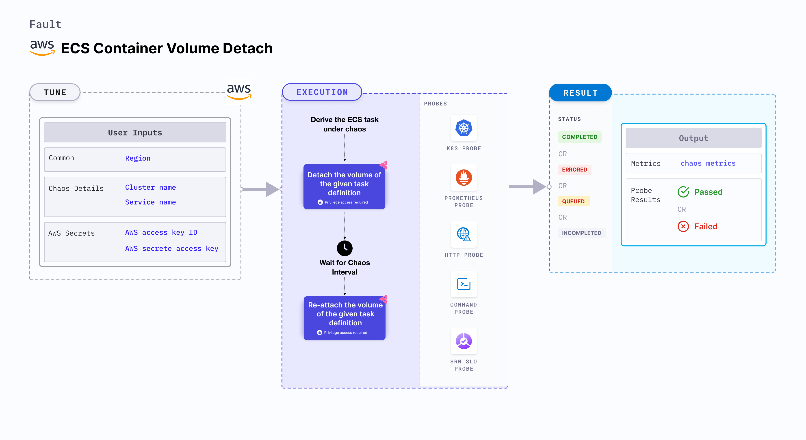

ECS container volume detach provides a mechanism to detach and remove volumes associated with ECS task containers in an Amazon ECS (Elastic Container Service) task.
This experiment primarily involves ECS Fargate and doesn't depend on EC2 instances. [They](/docs/chaos-engineering/faults/chaos-faults/aws/ec2-and-serverless-faults#serverless-faults) focus on altering the state or resources of ECS containers without direct container interaction.



## Use cases
ECS container volume detach:
- Allows you to test and validate the behavior of your ECS tasks when volumes are detached. You can verify the resilience and performance of your application during volume detachment scenarios, ensuring that the containers continue to function as expected.
- By detaching volumes, you can safely remove the volume associations from the containers without deleting the volumes themselves.
- By detaching unnecessary volumes, you can optimize the resource utilization within your ECS tasks. This helps to free up storage space and minimize any potential performance impact associated with unused volumes.

### Prerequisites
- Kubernetes >= 1.17
- ECS cluster running with the desired tasks and containers and familiarity with ECS service update and deployment concepts.
- Create a Kubernetes secret that has the AWS access configuration(key) in the `CHAOS_NAMESPACE`. Below is a sample secret file:

```yaml
apiVersion: v1
kind: Secret
metadata:
  name: cloud-secret
type: Opaque
stringData:
  cloud_config.yml: |-
    # Add the cloud AWS credentials respectively
    [default]
    aws_access_key_id = XXXXXXXXXXXXXXXXXXX
    aws_secret_access_key = XXXXXXXXXXXXXXX
```

:::tip
HCE recommends that you use the same secret name, that is, `cloud-secret`. Otherwise, you will need to update the `AWS_SHARED_CREDENTIALS_FILE` environment variable in the fault template with the new secret name and you won't be able to use the default health check probes.
:::

Below is an example AWS policy to execute the fault.

```json
{
    "Version": "2012-10-17",
    "Statement": [
        {
            "Effect": "Allow",
            "Action": [
                "ecs:DescribeTasks",
                "ecs:DescribeServices",
                "ecs:DescribeTaskDefinition",
                "ecs:RegisterTaskDefinition",
                "ecs:UpdateService",
                "ecs:ListTasks",
                "ecs:DeregisterTaskDefinition"
            ],
            "Resource": "*"
        },
        {
            "Effect": "Allow",
            "Action": [
                "iam:PassRole"
            ],
            "Resource": "*"
        }
    ]
}
```

:::info note
- Refer to [AWS named profile for chaos](/docs/chaos-engineering/faults/chaos-faults/aws/security-configurations/aws-switch-profile) to know how to use a different profile for AWS faults.
- The ECS containers should be in a healthy state before and after introducing chaos.
Refer to the [common attributes](/docs/chaos-engineering/faults/chaos-faults/common-tunables-for-all-faults) and [AWS-specific tunables](/docs/chaos-engineering/faults/chaos-faults/aws/aws-fault-tunables) to tune the common tunables for all faults and AWS-specific tunables.
- Refer to the [superset permission/policy](/docs/chaos-engineering/faults/chaos-faults/aws/security-configurations/policy-for-all-aws-faults) to execute all AWS faults.
:::

### Mandatory tunables
   <table>
        <tr>
          <th> Tunable </th>
          <th> Description </th>
          <th> Notes </th>
        </tr>
        <tr>
          <td> CLUSTER_NAME </td>
          <td> Name of the target ECS cluster </td>
          <td> For example, <code>cluster-1</code>. For more information, go to <a href="#ecs-container-volume-detach"> cluster name.</a></td>
        </tr>
        <tr>
          <td> SERVICE_NAME </td>
          <td> Name of the ECS service under chaos </td>
          <td> For example, <code>nginx-svc</code>. For more information, go to <a href="#ecs-container-volume-detach"> service name.</a></td>
        </tr>
        <tr>
          <td> REGION </td>
          <td> Region name of the target ECS cluster</td>
          <td> For example, <code>us-east-1</code>. </td>
        </tr>
    </table>

### Optional tunables
  <table>
      <tr>
        <th> Tunable </th>
        <th> Description </th>
        <th> Notes </th>
      </tr>
      <tr>
        <td> TOTAL_CHAOS_DURATION </td>
        <td> Duration that you specify, through which chaos is injected into the target resource (in seconds) </td>
        <td> Default: 30 s. For more information, go to <a href="/docs/chaos-engineering/faults/chaos-faults/common-tunables-for-all-faults#duration-of-the-chaos"> duration of the chaos. </a></td>
      </tr>
      <tr>
        <td> TASK_REPLICA_AFFECTED_PERC </td>
        <td> Percentage of total tasks that are targeted. </td>
        <td> Default: 100. For more information, go to <a href="#ecs-task-replica-affected-percentage"> ECS task replica affected percentage.</a></td>
      </tr>
      <tr>
        <td> CHAOS_INTERVAL </td>
        <td> Interval between successive instance terminations (in seconds)</td>
        <td> Default: 30 s. For more information, go to <a href="/docs/chaos-engineering/faults/chaos-faults/common-tunables-for-all-faults#chaos-interval"> chaos interval.</a></td>
      </tr>
      <tr>
        <td> AWS_SHARED_CREDENTIALS_FILE </td>
        <td> Path to the AWS secret credentials</td>
        <td> Defaults to <code>/tmp/cloud_config.yml</code>. </td>
      </tr>
      <tr>
        <td> RAMP_TIME </td>
        <td> Period to wait before and after injecting chaos (in seconds)  </td>
        <td> For example, 30 s. For more information, go to <a href="/docs/chaos-engineering/faults/chaos-faults/common-tunables-for-all-faults#ramp-time"> ramp time. </a></td>
      </tr>
    </table>


### ECS container volume detach

ECS container volume chaos will detach the volumes for specified chaos duration. Tune it by using the `SERVICE_NAME` and `CLUSTER_NAME` environment variable.

The following YAML snippet illustrates the use of this environment variable:

[embedmd]:# (./static/manifests/ecs-container-volume-detach/volume-detach.yaml yaml)
```yaml
# Set container image for the target ECS task
apiVersion: litmuschaos.io/v1alpha1
kind: ChaosEngine
metadata:
  name: aws-nginx
spec:
  engineState: "active"
  annotationCheck: "false"
  chaosServiceAccount: litmus-admin
  experiments:
  - name: ecs-container-volume-detach
    spec:
      components:
        env:
        - name: CLUSTER_NAME
          value: 'test-cluster'
        - name: SERVICE_NAME
          value: 'test-service'
        - name: REGION
          value: 'us-east-2'
        - name: TOTAL_CHAOS_DURATION
          VALUE: '60'
```

### ECS task replica affected percentage

Number of tasks to target (in percentage). Tune it by using the `TASK_REPLICA_AFFECTED_PERC` environment variable.

The following YAML snippet illustrates the use of this environment variable:

[embedmd]:# (./static/manifests/ecs-container-volume-detach/task-replica-affected-perc.yaml yaml)
```yaml
# stop the tasks of an ECS cluster
apiVersion: litmuschaos.io/v1alpha1
kind: ChaosEngine
metadata:
  name: engine-nginx
spec:
  engineState: "active"
  annotationCheck: "false"
  chaosServiceAccount: litmus-admin
  experiments:
  - name: ecs-task-stop
    spec:
      components:
        env:
        # provide the name of ECS cluster
        - name: CLUSTER_NAME
          value: 'demo'
        - name: SERVICE_NAME
          vale: 'test-svc'
        - name: TASK_REPLICA_AFFECTED_PERC
          vale: '100'
        - name: REGION
          value: 'us-east-1'
        - name: TOTAL_CHAOS_DURATION
          VALUE: '60'
```
