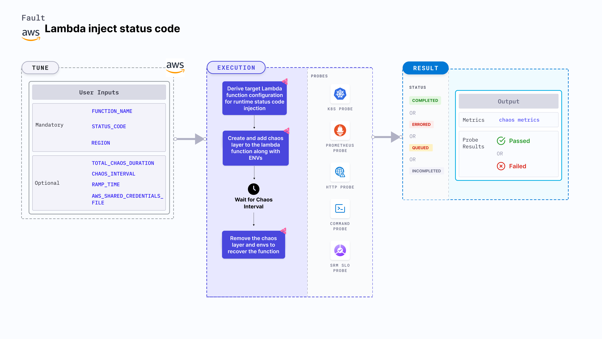

Lambda inject status code is an AWS fault that simulates runtime erroneous HTTP status codes in Lambda function responses, allowing you to evaluate how your systems handle unexpected status responses.
This helps you to proactively validate your function's resilience against unexpected status code, ensuring uninterrupted service delivery under such situations.



## Use cases
Lambda inject status code:
- Assesses how downstream services react when receiving non-standard or error HTTP status codes, ensuring that error-handling logic and fallback mechanisms are effective.
- Tests the robustness of client applications and APIs when they encounter unexpected status codes, allowing for early detection of integration issues.
- Evaluates and fine-tune retry policies and error logging strategies by simulating intermittent faulty responses in a controlled manner.

### Prerequisites
- Kubernetes >= 1.17
- Access to operate AWS Lambda service.
- Lambda function must be up and running.
- Kubernetes secret must have the AWS access configuration(key) in the `CHAOS_NAMESPACE`. A secret file looks like this:
  ```yaml
  apiVersion: v1
  kind: Secret
  metadata:
    name: cloud-secret
  type: Opaque
  stringData:
    cloud_config.yml: |-
      # Add the cloud AWS credentials respectively
      [default]
      aws_access_key_id = XXXXXXXXXXXXXXXXXXX
      aws_secret_access_key = XXXXXXXXXXXXXXX
  ```

:::tip
HCE recommends that you use the same secret name, that is, `cloud-secret`. Otherwise, you will need to update the `AWS_SHARED_CREDENTIALS_FILE` environment variable in the fault template with the new secret name and you won't be able to use the default health check probes.
:::

Below is an example AWS policy to execute the fault.

```json
{
    "Version": "2012-10-17",
    "Statement": [
        {
            "Effect": "Allow",
            "Action": [
                "lambda:UpdateFunctionConfiguration",
                "lambda:GetFunctionConcurrency",
                "lambda:GetFunction",
                "lambda:DeleteFunctionConcurrency",
                "lambda:PutFunctionConcurrency"
            ],
            "Resource": "*"
        }
    ]
}
```

:::info note
- Go to [superset permission/policy](/docs/chaos-engineering/faults/chaos-faults/aws/security-configurations/policy-for-all-aws-faults) to execute all AWS faults.
- Go to [common attributes](/docs/chaos-engineering/faults/chaos-faults/common-tunables-for-all-faults) and [AWS-specific tunables](/docs/chaos-engineering/faults/chaos-faults/aws/aws-fault-tunables) to tune the common tunables for all faults and AWS-specific tunables.
- Go to [AWS named profile for chaos](/docs/chaos-engineering/faults/chaos-faults/aws/security-configurations/aws-switch-profile) to use a different profile for AWS faults.
:::

### Mandatory Tunables
   <table>
      <tr>
        <th> Tunable </th>
        <th> Description </th>
        <th> Notes </th>
      </tr>
      <tr>
        <td> FUNCTION_NAME </td>
        <td> Function name of the target Lambda function. It support single function name.</td>
        <td> For example, <code>test-function</code> </td>
      </tr>
      <tr>
        <td> STATUS_CODE </td>
        <td> Provide the invalid status code that you want to get in response.</td>
        <td> For example "503". For more information, go to <a href="#status-code"> status code.</a></td>
      </tr>
      <tr>
        <td> REGION </td>
        <td> The region name of the target lambda function</td>
        <td> For example, <code>us-east-2</code> </td>
      </tr>
    </table>

### Optional Tunables
  <table>
      <tr>
        <th> Tunable </th>
        <th> Description </th>
        <th> Notes </th>
      </tr>
      <tr>
        <td> TOTAL_CHAOS_DURATION </td>
        <td> Duration that you specify, through which chaos is injected into the target resource (in seconds). </td>
        <td> Default: 30 s. For more information, go to <a href="/docs/chaos-engineering/faults/chaos-faults/common-tunables-for-all-faults#duration-of-the-chaos"> duration of the chaos. </a></td>
      </tr>
      <tr>
        <td> AWS_SHARED_CREDENTIALS_FILE </td>
        <td> Path to the AWS secret credentials. </td>
        <td> Default: <code>/tmp/cloud_config.yml</code>. </td>
      </tr>
      <tr>
        <td> CHAOS_INTERVAL </td>
        <td> The interval (in seconds) between successive instance termination.</td>
        <td> Default: 30 s. For more information, go to <a href="/docs/chaos-engineering/faults/chaos-faults/common-tunables-for-all-faults#chaos-interval"> chaos interval.</a></td>
      </tr>
      <tr>
        <td> RAMP_TIME </td>
        <td> Period to wait before and after injection of chaos in seconds </td>
        <td> For example, 30 s. For more information, go to <a href="/docs/chaos-engineering/faults/chaos-faults/common-tunables-for-all-faults#ramp-time"> ramp time. </a> </td>
      </tr>
    </table>


### Status Code

Provide the Lambda function status code to cause invalid status code in the lambda function response. Tune it by using `STATUS_CODE` environment variable.

The following YAML snippet illustrates the use of this environment variable:

[embedmd]:# (./static/manifests/lambda-inject-status-code/status-code.yaml yaml)
```yaml
# contains the invalid status code for the lambda function response
apiVersion: litmuschaos.io/v1alpha1
kind: ChaosEngine
metadata:
  name: engine-nginx
spec:
  engineState: "active"
  chaosServiceAccount: litmus-admin
  experiments:
  - name: lambda-inject-status-code
    spec:
      components:
        env:
        # provide the status code for function response
        - name: STATUS_CODE
          value: '503'
        - name: FUNCTION_NAME
          value: 'chaos-function'
```
