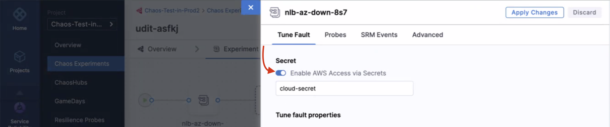

The assume role method provides a simplified approach for setting up cross-account access for chaos experiments. This method eliminates the need to configure OIDC providers in each target account and removes the requirement for service account annotations when switching between roles.


### Step 1: Create an IAM role and policy in each AWS target account

Create an IAM role in each target account that will be assumed by the source account's service account.

1. Navigate to the AWS IAM console in your target account.
2. Create a new IAM role with the following configuration:
   - **Trusted entity type**: Custom trust policy
   - **Use case**: For cross-account access from your source account

3. Create or attach a policy that grants the necessary permissions for chaos experiments. You can use the [AWS superset policy](/docs/chaos-engineering/faults/chaos-faults/aws/security-configurations/policy-for-all-aws-faults) as a reference for comprehensive permissions.

4. Note the ARN of the created role - you'll need this for the trust relationship configuration.

### Step 2: Configure trust relationship for cross-account access

Configure the trust relationship in the target account's IAM role to allow the source account's IAM role to assume it.

1. **In each target account**: Edit the trust relationship for the IAM role you created in Step 1.

   Navigate to **AWS IAM > *ROLE_NAME* > Trust relationships** tab and update the trust policy:

   ```json
   {
       "Version": "2012-10-17",
       "Statement": [
           {
               "Effect": "Allow",
               "Principal": {
                   "AWS": "arn:aws:iam::<SOURCE_ACCOUNT_ID>:role/<SOURCE_ACCOUNT_IAM_ROLE>"
               },
               "Action": "sts:AssumeRole",
               "Condition": {}
           }
       ]
   }
   ```

### Step 3: Configure experiments to use assume role

When creating chaos experiments that target resources in different accounts, you can specify the target account's role ARN directly in the Harness Chaos Dashboard.

1. In the Harness Chaos Dashboard, navigate to your experiment configuration.
2. In the fault configuration panel, locate the **Assume Role ARN** field.
3. Enter the ARN of the target account role you created in Step 1:
   ```
   arn:aws:iam::<TARGET_ACCOUNT_ID>:role/<TARGET_ROLE_NAME>
   ```
4. The chaos infrastructure will automatically assume this role when executing the experiment against resources in the target account.

## Enable AWS access using secrets from experiment definitions

When you create a new AWS chaos experiment using the assume role method, you can choose to enable or disable AWS access. The assume role functionality works seamlessly with the experiment configuration.


