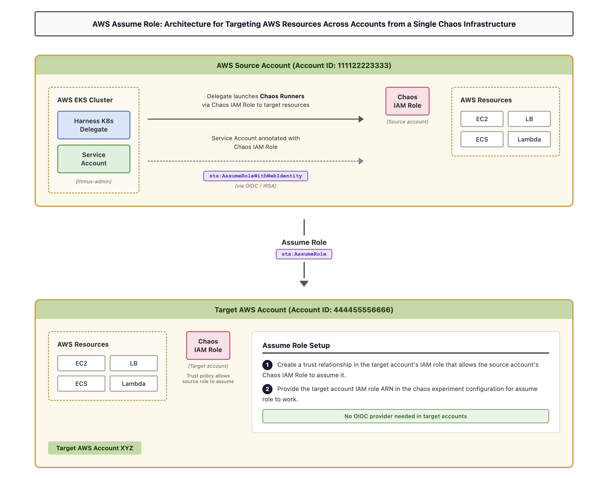
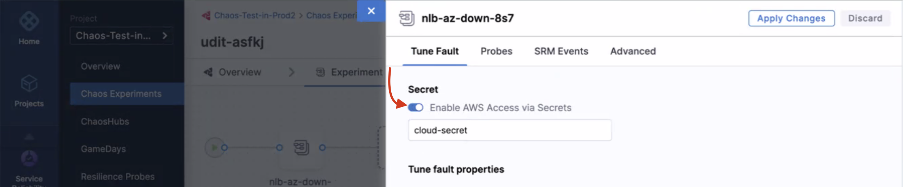

The AWS Assume Role method provides a simplified approach for setting up cross-account access for chaos experiments. Unlike the OIDC method, the Assume Role method **does not require you to create OIDC providers in each target account**. Instead, it uses [chained AssumeRole operations](https://docs.aws.amazon.com/eks/latest/userguide/cross-account-access.html) — the source account's IAM role (which already has IRSA/OIDC credentials from the EKS cluster) assumes IAM roles in the target accounts using `sts:AssumeRole`.

This is especially useful when:
- You want to avoid the overhead of creating and managing OIDC identity providers in every target account.
- You need to target AWS resources across multiple accounts from a single chaos infrastructure.
- You prefer a simpler trust relationship setup using IAM role-to-role trust rather than OIDC federation in target accounts.

## Architecture

The following diagram illustrates how the Assume Role method works:



**How it works:**

1. The **Harness K8s Delegate** in the AWS EKS cluster (source account) launches **Chaos Runners** to conduct chaos experiments against AWS resources (EC2, LB, ECS, Lambda) in the source account.
2. The **Service Account** in the EKS cluster is annotated with the **Chaos IAM Role** in the source account. The service account obtains credentials for this role via IRSA (OIDC federation with the EKS cluster).
3. To target resources in a different AWS account, the Chaos IAM Role in the source account **assumes** the Chaos IAM Role in the target account using `sts:AssumeRole`.
4. This is enabled by configuring a **trust relationship** in the target account's IAM role that allows the source account's IAM role to assume it.
5. You provide the **target account IAM role ARN** in the chaos experiment configuration for assume role to work.

## Account terminology

* **AWS source account:** The AWS account where your EKS cluster and chaos infrastructure are installed. This account hosts the Harness K8s Delegate that launches chaos runners. An OIDC provider is configured in this account for IRSA.

* **Target accounts:** AWS accounts where you'll run experiments against resources (EC2, LB, ECS, Lambda, etc.) to intentionally disrupt them. You can have many target accounts. **No OIDC provider is needed in target accounts**, only an IAM role trust relationship.

* **The experiment service account:** A Kubernetes service account (default: `litmus-admin`) in the EKS cluster that is annotated with the source account's Chaos IAM Role.

## Prerequisites

- Your execution plane must be installed on an Amazon EKS cluster.
- An [OIDC provider must be configured for your EKS cluster](https://docs.aws.amazon.com/eks/latest/userguide/enable-iam-roles-for-service-accounts.html) in the source account. This is a standard IRSA prerequisite. If you have already set up IRSA for your chaos infrastructure, this is already done.
- An IAM role in the source account (Chaos IAM Role) with the following trust policy that allows the EKS cluster's OIDC provider to issue credentials:

  ```json
  {
      "Version": "2012-10-17",
      "Statement": [
          {
              "Effect": "Allow",
              "Principal": {
                  "Federated": "arn:aws:iam::<SOURCE_ACCOUNT_ID>:oidc-provider/oidc.eks.<REGION>.amazonaws.com/id/<OIDC_PROVIDER_ID>"
              },
              "Action": "sts:AssumeRoleWithWebIdentity",
              "Condition": {
                  "StringEquals": {
                      "oidc.eks.<REGION>.amazonaws.com/id/<OIDC_PROVIDER_ID>:aud": "sts.amazonaws.com"
                  }
              }
          }
      ]
  }
  ```

- The experiment service account must be annotated with this IAM role:

  ```bash
  kubectl annotate serviceaccount -n <experiment_service_account_namespace> <experiment_service_account_name> \
  eks.amazonaws.com/role-arn=arn:aws:iam::<SOURCE_ACCOUNT_ID>:role/<SOURCE_CHAOS_IAM_ROLE>
  ```

:::note
- The default name for the experiment service account is `litmus-admin` and the namespace for chaos infrastructure is `HCE`, however, you can use different names.
- If you have already completed the IRSA (OIDC method) setup for your source account, these prerequisites are already met. You only need to follow the steps below to configure cross-account access.
:::

## Step 1: Grant the source account role permission to assume target roles

Attach a permission policy to the source account's Chaos IAM Role that allows it to call `sts:AssumeRole` on the target account roles.

1. Navigate to the AWS IAM console in your **source account**.
2. Find the Chaos IAM Role that the experiment service account is annotated with.
3. Attach the following inline policy (or add to an existing policy) to allow assuming roles in target accounts:

   ```json
   {
       "Version": "2012-10-17",
       "Statement": [
           {
               "Effect": "Allow",
               "Action": "sts:AssumeRole",
               "Resource": [
                   "arn:aws:iam::<TARGET_ACCOUNT_ID_1>:role/<TARGET_ROLE_NAME_1>",
                   "arn:aws:iam::<TARGET_ACCOUNT_ID_2>:role/<TARGET_ROLE_NAME_2>"
               ]
           }
       ]
   }
   ```

4. Additionally, attach any policies needed for chaos experiments against resources in the source account itself. You can use the [AWS superset policy](/docs/chaos-engineering/faults/chaos-faults/aws/security-configurations/policy-for-all-aws-faults) as a reference.

## Step 2: Create an IAM role and policy in each AWS target account

Create an IAM role in each target account that will be assumed by the source account's IAM role.

1. Navigate to the AWS IAM console in your **target account**.
2. Create a new IAM role with the following configuration:
   - **Trusted entity type**: Custom trust policy (configured in Step 3 below)

3. Create or attach a policy that grants the necessary permissions for chaos experiments on the target account's resources. You can use the [AWS superset policy](/docs/chaos-engineering/faults/chaos-faults/aws/security-configurations/policy-for-all-aws-faults) as a reference for comprehensive permissions.

4. Note the ARN of the created role. You'll need this for the trust relationship configuration and experiment setup.

## Step 3: Configure the trust relationship in target accounts

Configure the trust relationship in the target account's IAM role to allow the source account's IAM role to assume it. This step **does not require an OIDC provider in the target account**. It uses a standard IAM role-to-role trust.

1. **In each target account**: Edit the trust relationship for the IAM role you created in Step 2.

   Navigate to **AWS IAM** > ***ROLE_NAME*** > **Trust relationships** tab and update the trust policy:

   ```json
   {
       "Version": "2012-10-17",
       "Statement": [
           {
               "Effect": "Allow",
               "Principal": {
                   "AWS": "arn:aws:iam::<SOURCE_ACCOUNT_ID>:role/<SOURCE_CHAOS_IAM_ROLE>"
               },
               "Action": "sts:AssumeRole"
           }
       ]
   }
   ```

   Where:
   - `<SOURCE_ACCOUNT_ID>`: The AWS account ID of your source account (where the EKS cluster and chaos infrastructure are installed).
   - `<SOURCE_CHAOS_IAM_ROLE>`: The name of the IAM role in the source account that the experiment service account is annotated with.

:::info
For [least privilege](https://docs.aws.amazon.com/IAM/latest/UserGuide/best-practices.html#grant-least-privilege), always specify the exact role ARN in the `Principal` field (for example, `arn:aws:iam::111122223333:role/chaos-source-role`) rather than using the account root (`arn:aws:iam::111122223333:root`). Using the account root would allow **any** IAM principal in the source account to assume this role.
:::

2. Repeat for each target account.

## Step 4: Configure experiments to use assume role

When creating chaos experiments that target resources in different accounts, specify the target account's role ARN directly in the chaos experiment configuration.

1. In the Harness Chaos Dashboard, navigate to your experiment configuration.
2. In the fault configuration panel, locate the **Assume Role ARN** field.
3. Enter the ARN of the target account role you created in Step 2:
   ```
   arn:aws:iam::<TARGET_ACCOUNT_ID>:role/<TARGET_ROLE_NAME>
   ```
4. The chaos infrastructure will automatically assume this role when executing the experiment against resources in the target account.

## Remove all secret references from experiment definitions

When you create a new AWS chaos experiment using the assume role method, you do not need to provide AWS access key secrets. The assume role functionality works seamlessly with the IAM role configuration.


