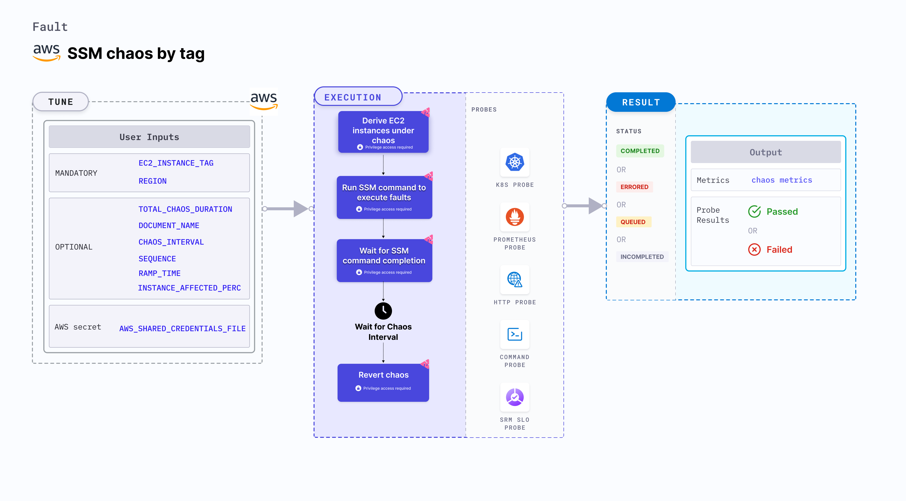

AWS SSM chaos by tag induces chaos on AWS EC2 instances using the Amazon SSM Run Command.
- It is executed using the SSM document that defines the actions which the systems manager can perform on your managed instances (that have SSM agent installed).
- This SSM document is uploaded beforehand to AWS, whose name is referenced in the faults.
- It helps execute custom chaos (like stress, network, disk or IO) on AWS EC2 instances for a specific duration using the given tag(s).



## Use cases
AWS SSM chaos by tag:
- Tests the resilience of an application that uses custom SSM document as input to execute chaos on EC2 instances.
- Triggers the provided SSM document provided as an input to other AWS chaos.
- After chaos, this fault cleans up the SSM document provided as an input to the EC2 instance.

### Prerequisites
- Kubernetes >= 1.17
- The SSM document should be available in AWS.
- EC2 service update and deployment concepts.
- Authentication is done using [IRSA](/docs/chaos-engineering/use-harness-ce/chaos-faults/aws/security-configurations/aws-iam-integration#set-up-your-target-accounts-for-irsa) or secret. For secret-based authentication, create a Kubernetes secret that has the AWS access configuration(key) in the `CHAOS_NAMESPACE`. Below is a sample secret file:

```yaml
apiVersion: v1
kind: Secret
metadata:
  name: cloud-secret
type: Opaque
stringData:
  cloud_config.yml: |-
    # Add the cloud AWS credentials respectively
    [default]
    aws_access_key_id = XXXXXXXXXXXXXXXXXXX
    aws_secret_access_key = XXXXXXXXXXXXXXX
```

:::tip
HCE recommends that you use the same secret name, that is, `cloud-secret`. Otherwise, you will need to update the `AWS_SHARED_CREDENTIALS_FILE` environment variable in the fault template with the new secret name and you won't be able to use the default health check probes.
:::

Below is an example AWS policy to execute the fault.

```json
{
    "Version": "2012-10-17",
    "Statement": [
        {
            "Effect": "Allow",
            "Action": [
                "ec2:DescribeInstances"
            ],
            "Resource": "*"
        },
        {
            "Effect": "Allow",
            "Action": [
                "ssm:DescribeInstanceInformation",
                "ssm:SendCommand",
                "ssm:GetCommandInvocation",
                "ssm:CancelCommand"
            ],
            "Resource": "*"
        }
    ]
}
```

:::info note
- Refer to [AWS named profile for chaos](/docs/chaos-engineering/use-harness-ce/chaos-faults/aws/security-configurations/aws-switch-profile) to use a different profile for AWS faults.
- The EC2 instance should be in a healthy state before and after introducing chaos.
- Refer to the [common attributes](/docs/chaos-engineering/use-harness-ce/chaos-faults/common-tunables-for-all-faults) and [AWS-specific tunables](/docs/chaos-engineering/use-harness-ce/chaos-faults/aws/aws-fault-tunables) to tune the common tunables for all faults and AWS-specific tunables.
- Refer to the [superset permission/policy](/docs/chaos-engineering/use-harness-ce/chaos-faults/aws/security-configurations/policy-for-all-aws-faults) to execute all AWS faults.
:::

### Mandatory tunables
  <table>
        <tr>
          <th> Tunable </th>
          <th> Description </th>
          <th> Notes </th>
        </tr>
        <tr>
        <td> EC2_INSTANCE_TAG </td>
        <td> Instance tag of the target EC2 instance. <a href="#ssm-chaos-by-tag-on-multiple-instances">Multiple tags </a> can also be provided as a comma(,) separated values.</td>
        <td> Provide them as "key:value". For more information, go to <a href="#ssm-chaos-by-tag"> EC2 instance tag.</a></td>
      </tr>
        <tr>
          <td> REGION </td>
          <td> Region name of the target ECS cluster</td>
          <td> For example, <code>us-east-1</code>. </td>
        </tr>
    </table>

### Optional tunables
  <table>
      <tr>
        <th> Tunable </th>
        <th> Description </th>
        <th> Notes </th>
      </tr>
      <tr>
        <td> TOTAL_CHAOS_DURATION </td>
        <td> Duration that you specify, through which chaos is injected into the target resource (in seconds). </td>
        <td> Default: 30s. For more information, go to <a href="/docs/chaos-engineering/use-harness-ce/chaos-faults/common-tunables-for-all-faults#duration-of-the-chaos"> duration of the chaos. </a></td>
      </tr>
      <tr>
        <td> CHAOS_INTERVAL </td>
        <td> Interval between successive instance terminations (in seconds).</td>
        <td> Default: 30s. For more information, go to <a href="/docs/chaos-engineering/use-harness-ce/chaos-faults/common-tunables-for-all-faults#chaos-interval"> chaos interval.</a></td>
      </tr>
      <tr>
        <td> AWS_SHARED_CREDENTIALS_FILE </td>
        <td> Path to the AWS secret credentials.</td>
        <td> Defaults to <code>/tmp/cloud_config.yml</code>. </td>
      </tr>
      <tr>
        <td> DOCUMENT_NAME </td>
        <td> Name of the SSM docs that is added to AWS.</td>
        <td> Create or upload this document to AWS before providing the document as an input to any AWS chaos fault.</td>
      </tr>
      <tr>
        <td> POLICY_NAME </td>
        <td> Specific policy used in an SSM document (or command), which defines the action to be executed on the target instances.</td>
        <td> You can provide multiple names as comma-separated values.</td>
      </tr>
      <tr>
        <td> SEQUENCE </td>
        <td> It defines a sequence of chaos execution for multiple instances. </td>
        <td> Default: parallel. Supports serial and parallel. For more information, go to <a href="/docs/chaos-engineering/use-harness-ce/chaos-faults/common-tunables-for-all-faults#sequence-of-chaos-execution"> sequence of chaos execution.</a></td>
      </tr>
      <tr>
        <td> INSTANCE_AFFECTED_PERC </td>
        <td> Percentage of total EC2 instances to target. Provide numeric values only. </td>
        <td> Defaults to 0 (corresponds to 1 instance). For more information, go to <a href="#stop-multiple-instances-of-tag"> instance affected percentage.</a></td>
      </tr>
      <tr>
        <td> RAMP_TIME </td>
        <td> Period to wait before and after injecting chaos (in seconds).  </td>
        <td> For example, 30 s. For more information, go to <a href="/docs/chaos-engineering/use-harness-ce/chaos-faults/common-tunables-for-all-faults#ramp-time"> ramp time. </a></td>
      </tr>
    </table>

### SSM chaos by tag

Instance tag of the target EC2 instance. Multiple tags can also be provided as a comma-separated values. Provide them in the **key:value** format. Tune it by using the `EC2_INSTANCE_TAG` tag.

The following YAML snippet illustrates the use of this environment variable:

[embedmd]:# (./static/manifests/ssm-chaos-by-tag/instance-tag.yaml yaml)
```yaml
# target the EC2 instances with matching tag
apiVersion: litmuschaos.io/v1alpha1
kind: ChaosEngine
metadata:
  name: engine-nginx
spec:
  engineState: "active"
  chaosServiceAccount: litmus-admin
  experiments:
  - name: ssm-chaos-by-tag
    spec:
      components:
        env:
        # tag of the EC2 instance
        - name: EC2_INSTANCE_TAG
          value: 'key:value'
        # region for the EC2 instance
        - name: REGION
          value: 'us-east-1'
```

### SSM chaos by tag on multiple instances

Percentage of EC2 instances to target, based on the `EC2_INSTANCE_TAG` tag and `REGION` region. Tune it by using the `INSTANCE_AFFECTED_PERC` environment variable.

The following YAML snippet illustrates the use of this environment variable:

[embedmd]:# (./static/manifests/smm-chaos-by-tag/instance-affected-percentage.yaml yaml)
```yaml
# percentage of EC2 instances, needs to terminate with provided tags
apiVersion: litmuschaos.io/v1alpha1
kind: ChaosEngine
metadata:
  name: engine-nginx
spec:
  engineState: "active"
  chaosServiceAccount: litmus-admin
  experiments:
  - name: ssm-chaos-by-tag
    spec:
      components:
        env:
        # percentage of EC2 instance filtered by tags
        - name: INSTANCE_AFFECTED_PERC
          value: '100'
        # tag of the EC2 instance
        - name: EC2_INSTANCE_TAG
          value: 'key:value'
        # region for the EC2 instance
        - name: REGION
          value: 'us-east-1'
```