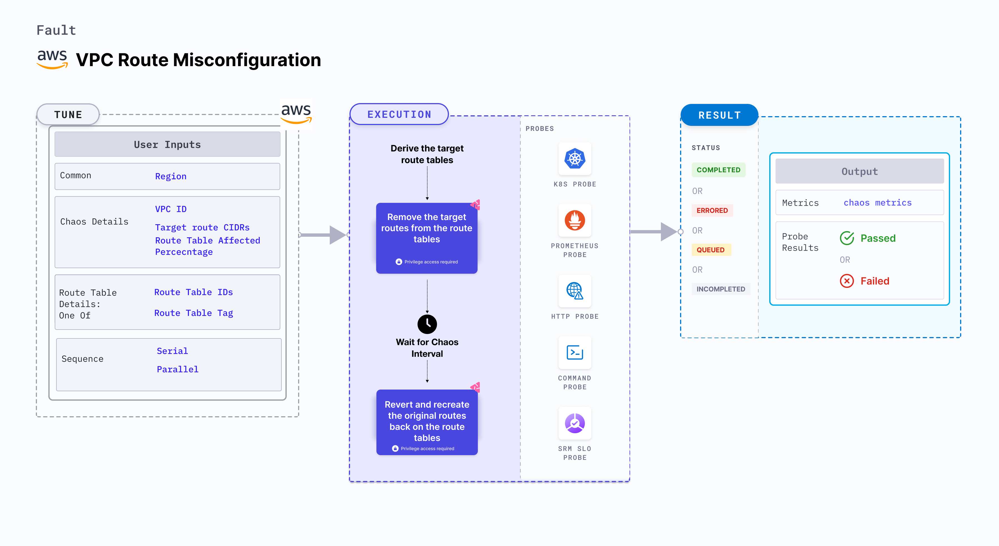

VPC Route Misconfiguration is a chaos fault designed to simulate network disruptions across an AWS region by intentionally misconfiguring VPC route tables routes. It works by temporarily removing one or more target CIDR routes from the VPC route tables, creating a scenario where network connectivity is impacted. During the defined chaos duration, the system allows observation and monitoring of the effects caused by the misconfiguration. After the chaos period ends, the fault automatically restores the original route configuration to ensure normal operations are resumed without manual intervention.

:::tip
Note: It safely ignores local routes and supports multiple CIDRs via a single run.
:::




## Use cases

VPC Route Misconfiguration:

VPC Route Misconfiguration can mimics the following chaos scenarios:

- Misconfigured changes to VPC route tables
- Accidental deletion of external or internal routes
- Loss of connectivity to critical components such as Transit Gateway (TGW), NAT Gateway (NATGW), or VPC Peering connections


### Prerequisites
- Kubernetes >= 1.17
- Ensure you have the required AWS permissions to induce a network blackhole in the specified availability zone within the region..
- Ensure that the specified VPC (if provided) includes the target availability zone.
- The Kubernetes secret should have AWS access configuration (key) in the `CHAOS_NAMESPACE`. Below is a sample secret file.
  ```yaml
  apiVersion: v1
  kind: Secret
  metadata:
    name: cloud-secret
  type: Opaque
  stringData:
    cloud_config.yml: |-
      # Add the cloud AWS credentials respectively
      [default]
      aws_access_key_id = XXXXXXXXXXXXXXXXXXX
      aws_secret_access_key = XXXXXXXXXXXXXXX
  ```

:::tip
Harness CE recommends that you use the same secret name, that is, `cloud-secret`. Otherwise, you will need to update the `AWS_SHARED_CREDENTIALS_FILE` environment variable in the fault template with the new secret name and you won't be able to use the default health check probes.
:::

Below is an example AWS policy to execute the fault.

```json
{
  "Version": "2012-10-17",
  "Statement": [
    {
      "Effect": "Allow",
      "Action": [
        "ec2:DescribeRouteTables",
        "ec2:DescribeVpcs",
        "ec2:DeleteRoute",
        "ec2:CreateRoute"
      ],
      "Resource": "*"
    }
  ]
}
```

:::info note
- Go to [superset permission/policy](/docs/chaos-engineering/use-harness-ce/chaos-faults/aws/security-configurations/policy-for-all-aws-faults) to execute all AWS faults.
- Go to [common attributes](/docs/chaos-engineering/use-harness-ce/chaos-faults/common-tunables-for-all-faults) and [AWS-specific tunables](/docs/chaos-engineering/use-harness-ce/chaos-faults/aws/aws-fault-tunables) to tune the common tunables for all faults and AWS-specific tunables.
- Go to [AWS named profile for chaos](/docs/chaos-engineering/use-harness-ce/chaos-faults/aws/security-configurations/aws-switch-profile) to use a different profile for AWS faults.
:::

### Mandatory Tunables

<table>
  <thead>
    <tr>
      <th>Tunable</th>
      <th>Description</th>
      <th>Notes</th>
    </tr>
  </thead>
  <tbody>
    <tr>
      <td>VPC_ID</td>
      <td>Specify the ID of the VPC whose route tables will be targeted for connection interruption.</td>
      <td>Example: <code>vpc-213214</code>. For more information, see <a href="#vpc-id">VPC_ID</a>.</td>
    </tr>
    <tr>
      <td>TARGET_ROUTE_CIDRS</td>
      <td>Provide the target route CIDR blocks as a comma-separated list.</td>
      <td>Example: <code>10.0.0.1/12,0.0.0.0/24</code>. For more information, see <a href="#target-route-cidrs">TARGET_ROUTE_CIDRS</a>.</td>
    </tr>
    <tr>
      <td>TARGET_ROUTE_TABLE_IDS</td>
      <td>Specify the IDs of the route tables associated with the given VPC. You must provide either the route table IDs or a tag.</td>
      <td>Example: <code>rtb-123,rtb-456</code>. For more information, see <a href="#route-table-ids">TARGET_ROUTE_TABLE_IDS</a>.</td>
    </tr>
    <tr>
      <td>TARGET_ROUTE_TABLE_TAG</td>
      <td>Provide the tag key-value pair used to identify the target route tables within the VPC. It is in the format <code>key=value</code> (for example, 'team=devops'). You must provide either the route table IDs or a tag.</td>
      <td>Example: <code>type=chaos</code>. For more information, see <a href="#route-table-tag">TARGET_ROUTE_TABLE_TAG</a>.</td>
    </tr>
    <tr>
      <td>REGION</td>
      <td>Specify the AWS Region where the target VPC and route tables reside.</td>
      <td>Example: <code>us-east-1</code>.</td>
    </tr>
  </tbody>
</table>

### Optional Tunables
   <table>
      <tr>
        <th> Tunable </th>
        <th> Description </th>
        <th> Notes </th>
      </tr>
      <tr>
        <td> TOTAL_CHAOS_DURATION </td>
        <td> Duration to insert chaos (in seconds). </td>
        <td> Default: 30 s. For more information, go to <a href="/docs/chaos-engineering/use-harness-ce/chaos-faults/common-tunables-for-all-faults#duration-of-the-chaos"> duration of the chaos. </a></td>
      </tr>
      <tr>
        <td> CHAOS_INTERVAL </td>
        <td> Interval between successive instance terminations (in seconds).</td>
        <td> Default: 30s. For more information, go to <a href="/docs/chaos-engineering/use-harness-ce/chaos-faults/common-tunables-for-all-faults#chaos-interval"> chaos interval.</a></td>
      </tr>
      <tr>
        <td> AWS_SHARED_CREDENTIALS_FILE </td>
        <td> Path to the AWS secret credentials. </td>
        <td> Default: <code>/tmp/cloud_config.yml</code>. </td>
      </tr>
      <tr>
        <td> CHAOS_INTERVAL </td>
        <td> Duration between the attachment and detachment of the volumes (in seconds). </td>
        <td> Default: 30 s. For more information, go to <a href="https://developer.harness.io/docs/chaos-engineering/use-harness-ce/chaos-faults/common-tunables-for-all-faults#chaos-interval"> chaos interval.</a></td>
      </tr>
      <tr>
        <td> SEQUENCE </td>
        <td> Sequence of chaos execution for multiple volumes. </td>
        <td> Default: parallel. Supports serial and parallel. For more information, go to <a href="/docs/chaos-engineering/use-harness-ce/chaos-faults/common-tunables-for-all-faults#sequence-of-chaos-execution"> sequence of chaos execution.</a></td>
      </tr>
      <tr>
        <td> RAMP_TIME </td>
        <td> Period to wait before and after injecting chaos (in seconds). </td>
        <td> For example, 30 s. For more information, go to <a href="/docs/chaos-engineering/use-harness-ce/chaos-faults/common-tunables-for-all-faults#ramp-time"> ramp time. </a></td>
      </tr>
    </table>


### VPC ID

Specify the ID of the VPC whose route tables will be targeted for connection interruption. Tune it by using the `VPC_ID` environment variable.

The following YAML snippet illustrates the use of this environment variable:

[embedmd]:# (./static/manifests/vpc-route-misconfiguration/vpc-id.yaml yaml)
```yaml
# contains vpc ids for given region
apiVersion: litmuschaos.io/v1alpha1
kind: ChaosEngine
metadata:
  name: engine-nginx
spec:
  engineState: "active"
  chaosServiceAccount: litmus-admin
  experiments:
  - name: vpc-route-misconfiguration
    spec:
      components:
        env:
        # target vpc id for the chaos
        - name: VPC_ID
          value: 'vpc-21312481928410'
        - name: TARGET_ROUTE_CIDRS
          value: '0.0.0.0/0'
```

### Target route CIDRs

Comma-separated list of the target routes CIDR under for the given route tables. Tune it by using the `TARGET_ROUTE_CIDRS` environment variable.

The following YAML snippet illustrates the use of this environment variable:

[embedmd]:# (./static/manifests/vpc-route-misconfiguration/target-route-cidrs.yaml yaml)
```yaml
# contains route table cidr for given region
apiVersion: litmuschaos.io/v1alpha1
kind: ChaosEngine
metadata:
  name: engine-nginx
spec:
  engineState: "active"
  chaosServiceAccount: litmus-admin
  experiments:
  - name: vpc-route-misconfiguration
    spec:
      components:
        env:
        # target route table cidr for the chaos
        - name: TARGET_ROUTE_CIDRS
          value: '10.1.0.0/16,0.0.0.0/0'
        - name: TARGET_ROUTE_TABLE_IDS
          value: 'rtb-212'
        - name: VPC_ID
          value: 'vpc-21312'
```

### Route Table IDs

Comma-separated list of the target route table Ids that are associated with the given VPC. Tune it by using the `TARGET_ROUTE_TABLE_IDS` environment variable.

The following YAML snippet illustrates the use of this environment variable:

[embedmd]:# (./static/manifests/vpc-route-misconfiguration/route-table-ids.yaml yaml)
```yaml
# contains route tables by id for given region
apiVersion: litmuschaos.io/v1alpha1
kind: ChaosEngine
metadata:
  name: engine-nginx
spec:
  engineState: "active"
  chaosServiceAccount: litmus-admin
  experiments:
  - name: vpc-route-misconfiguration
    spec:
      components:
        env:
        # target route tables by id for the chaos
        - name: TARGET_ROUTE_TABLE_IDS
          value: 'rtb-23213'
        - name: VPC_ID
          value: 'vpc-21312'
```

### Route Table Tag

Specify the tag to filter the target route tables associated with the given VPC. Tune it by using the `TARGET_ROUTE_TABLE_TAG` environment variable.

The following YAML snippet illustrates the use of this environment variable:

[embedmd]:# (./static/manifests/vpc-route-misconfiguration/route-table-tag.yaml yaml)
```yaml
# contains route tables by tag for given region
apiVersion: litmuschaos.io/v1alpha1
kind: ChaosEngine
metadata:
  name: engine-nginx
spec:
  engineState: "active"
  chaosServiceAccount: litmus-admin
  experiments:
  - name: vpc-route-misconfiguration
    spec:
      components:
        env:
        # target route tables by tag for the chaos
        - name: TARGET_ROUTE_TABLE_TAG
          value: 'type=chaos'
        - name: VPC_ID
          value: 'vpc-21312'
```
