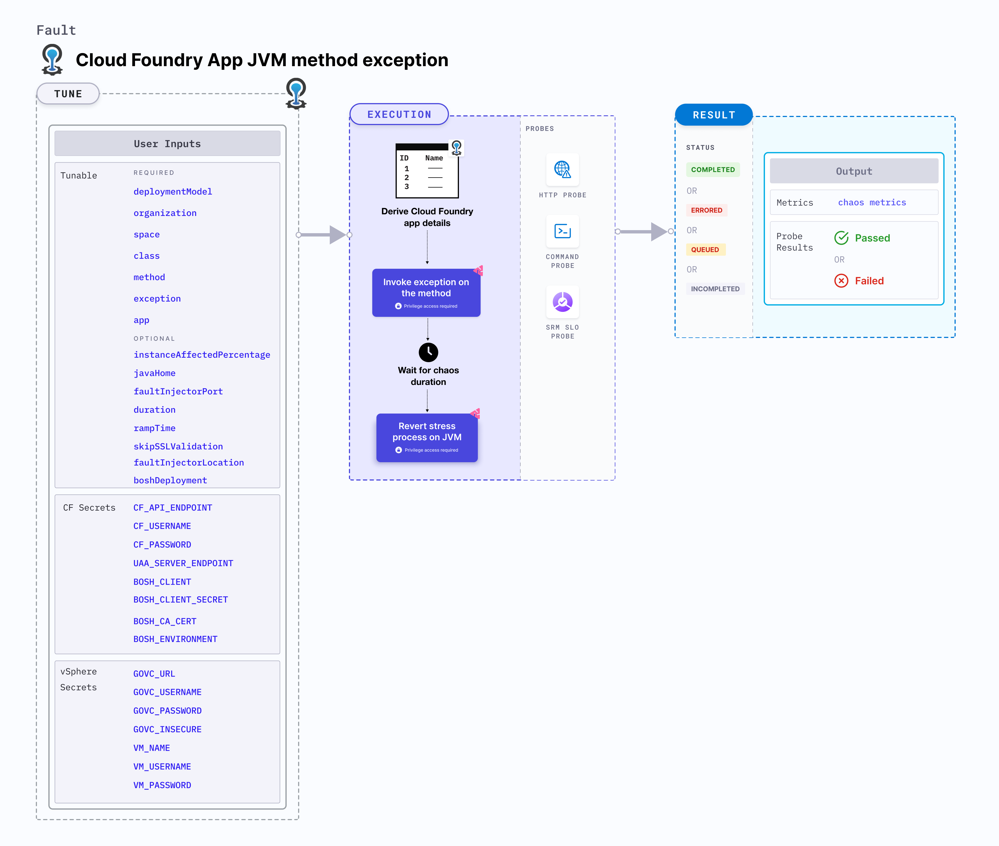

import CFAndBOSHSecrets from './shared/cf-and-bosh-secrets.md';
import VSphereSecrets from './shared/vsphere-secrets.md';

CF app JVM method exception causes a Java based Cloud Foundry app's method to throw a given exception.



## Use cases
CF app JVM method exception:
- Verifies an application's ability to recover gracefully from unexpected exceptions.
- Uncovers issues in error handling logic during development.
- Simulates real-world errors to strengthen the application's ability to handle them.
- Helps gain confidence in the application's ability to function during potential failures.
- Evaluates how exceptions impact resource allocation and de-allocation strategies.

### Mandatory tunables
<table>
  <tr>
    <th>Tunable</th>
    <th>Description</th>
    <th>Notes</th>
  </tr>
  <tr>
    <td>organization</td>
    <td>Organization where the target app resides.</td>
    <td>For example, <code>dev-org</code>.</td>
  </tr>
  <tr>
    <td>space</td>
    <td>Space where the target app resides.</td>
    <td>The space must reside within the given organization. For example, <code>dev-space</code>.</td>
  </tr>
  <tr>
    <td>app</td>
    <td>The app in which chaos will be injected.</td>
    <td>The app must reside within the given organization and space. For example, <code>cf-app</code>.</td>
  </tr>
  <tr>
    <td>class</td>
    <td>The target Java class where the method lies. It should be provided in the format: <code>package-name.class-name</code></td>
    <td>For example, <code>Inventory</code></td>
  </tr>
  <tr>
    <td>method</td>
    <td>The target Java class method.</td>
    <td>For example, <code>AddToInventory</code></td>
  </tr>
  <tr>
    <td>exception</td>
    <td>The exception which will be thrown by the method.</td>
    <td>For example, <code>NullPointerException("Something went wrong, NullPointerException!")</code></td>
  </tr>
  <tr>
    <td> deploymentModel </td>
    <td> The deployment model used for setting up the fault injector. It supports <code>model-1</code> and <code>model-2</code>. Model-1 assumes that the fault-injector exists within a diego cell VM whereas Model-2 assumes that the fault-injector exists within a jumpbox VM.</td>
    <td> Supports <code>model-1</code> and <code>model-2</code>. For more information, go to <a href="#deployment-model"> Deployment Model</a>. </td>
  </tr>
</table>

### Optional tunables
<table>
  <tr>
    <th>Tunable</th>
    <th>Description</th>
    <th>Notes</th>
  </tr>
  <tr>
    <td> javaHome </td>
		<td> Value of the <code>JAVA_HOME</code> environment variable.</td>
		<td> Not required if the Java binary file path is added to the Linux <code>PATH</code> env or <code>JAVA_HOME</code> env is added to the Linux <code>PATH</code> env. </td>
  </tr>
  <tr>
		<td> instanceAffectedPercentage </td>
		<td> Percentage of total number of app instances that will be targeted. </td>
		<td> Default: 0 (1 instance). For more information, go to <a href="#instance-affected-percentage"> instance affected percentage</a>. </td>
	</tr>
    <tr>
		<td> faultInjectorPort </td>
		<td> Local server port used by the fault-injector utility. </td>
		<td> Default: <code>50320</code>. If the default port is unavailable, a random port in the range of <code>50320-51320</code> is selected. For more information, go to <a href="#fault-injector-port"> fault injector port</a>. </td>
	</tr>
	<tr>
		<td> duration </td>
		<td> Duration through which chaos is injected into the target resource (in seconds). </td>
		<td> Default: 30s. For more information, go to <a href="/docs/chaos-engineering/use-harness-ce/chaos-faults/common-tunables-for-all-faults#duration-of-the-chaos"> chaos duration</a>. </td>
	</tr>
	<tr>
		<td> skipSSLValidation </td>
		<td> Skip SSL validation while invoking CF APIs. </td>
		<td> Supports <code>true</code> and <code>false</code>. Default: <code>false</code>. For more information, go to <a href="#skip-ssl-validation"> skip SSL validation</a>. </td>
	</tr>
	<tr>
		<td> rampTime </td>
		<td> Period to wait before and after injecting chaos (in seconds). </td>
		<td> Defaults to 0. </td>
	</tr>
  <tr>
    <td> boshDeployment </td>
    <td> The bosh deployment under which the CF components are being managed. </td>
    <td> It can be obtained using the BOSH CLI command <code>bosh deployments</code>. For more information, go to <a href="#bosh-deployment"> BOSH deployment</a>. </td>
  </tr>
  <tr>
    <td> faultInjectorLocation </td>
    <td> Location of the fault injector with respect to the cloud foundry vms. </td>
    <td> Supports <code>local</code> and <code>vSphere</code>. For more information, go to <a href="#fault-injector-location"> Fault Injector Location</a>. </td>
  </tr>
</table>

<CFAndBOSHSecrets />

<VSphereSecrets />

### Class
The `class` input specifies the Java class whose method will be targeted. Provide it as: `package-name.class-name`.

The following YAML snippet illustrates the use of this input:

[embedmd]:# (./static/manifests/cf-app-jvm-method-exception/class.yaml yaml)
```yaml
# class
apiVersion: litmuchaos.io/v1alpha1
kind: LinuxFault
metadata:
  name: cf-app-jvm-method-exception
  labels:
    name: app-jvm-method-exception
spec:
  cfAppJVMChaos/inputs:
    class: com.appinventory.appinventory.appInventoryController
    duration: 30s
    app: cf-app
    organization: dev-org
    space: dev-space
    boshDeployment: cf
```

### Exception
The `exception` input specifies the exception that is thrown by the target method.

The following YAML snippet illustrates the use of this input:

[embedmd]:# (./static/manifests/cf-app-jvm-method-exception/exception.yaml yaml)
```yaml
# exception
apiVersion: litmuchaos.io/v1alpha1
kind: LinuxFault
metadata:
  name: cf-app-jvm-method-exception
  labels:
    name: app-jvm-method-exception
spec:
  cfAppJVMChaos/inputs:
    class: com.appinventory.appinventory.appInventoryController
    method: AddToInventory
    duration: 30s
    app: cf-app
    exception: NullPointerException("Some error occurred, NullPointerException!")
    organization: dev-org
    space: dev-space
    boshDeployment: cf
```

### BOSH deployment
The `boshDeployment` input determines the BOSH deployment name under which all the CF resources are managed. You can obtain it using the BOSH CLI command `bosh deployments`.

The following YAML snippet illustrates the use of this input:

[embedmd]:# (./static/manifests/cf-app-jvm-method-exception/boshDeployment.yaml yaml)
```yaml
# bosh deployment
apiVersion: litmuchaos.io/v1alpha1
kind: LinuxFault
metadata:
  name: cf-app-jvm-method-exception
  labels:
    name: app-jvm-method-exception
spec:
  cfAppJVMChaos/inputs:
    duration: 30s
    faultInjectorLocation: vSphere
    app: cf-app
    organization: dev-org
    space: dev-space
    boshDeployment: cf
```

### Instance affected percentage
The `instanceAffectedPercentage` input specifies the percentage of total number of app instances that will be targeted. It defaults to 0 (1 instance).

The following YAML snippet illustrates the use of this input:

[embedmd]:# (./static/manifests/cf-app-jvm-method-exception/instanceAffectedPercentage.yaml yaml)
```yaml
# instance affected percentage
apiVersion: litmuchaos.io/v1alpha1
kind: LinuxFault
metadata:
  name: cf-app-jvm-method-exception
  labels:
    name: app-jvm-method-exception
spec:
  cfAppJVMChaos/inputs:
    duration: 30s
    faultInjectorLocation: vSphere
    app: cf-app
    organization: dev-org
    space: dev-space
    boshDeployment: cf
    instanceAffectedPercentage: 50
```

### Fault injector location
The `faultInjectorLocation` input determines the location of the fault injector with respect to the infrastructure. It is the location where the fault-injector utility is executed.
- It can be local, that is, the same environment used by the infrastructure, or a remote machine.

The following YAML snippet illustrates the use of this input:

[embedmd]:# (./static/manifests/cf-app-jvm-method-exception/faultInjectorLocation.yaml yaml)
```yaml
# cf deployment platform
apiVersion: litmuchaos.io/v1alpha1
kind: LinuxFault
metadata:
  name: cf-app-jvm-method-exception
  labels:
    name: app-jvm-method-exception
spec:
  cfAppJVMChaos/inputs:
    duration: 30s
    faultInjectorLocation: vSphere
    app: cf-app
    organization: dev-org
    space: dev-space
```

### Skip SSL validation
The `skipSSLValidation` input variable determines whether to skip SSL validation for calling the CF APIs.

The following YAML snippet illustrates the use of this input:

[embedmd]:# (./static/manifests/cf-app-jvm-method-exception/skipSSLValidation.yaml yaml)
```yaml
# skip ssl validation for cf
apiVersion: litmuchaos.io/v1alpha1
kind: LinuxFault
metadata:
  name: cf-app-jvm-method-exception
  labels:
    name: app-jvm-method-exception
spec:
  cfAppJVMChaos/inputs:
    duration: 30s
    faultInjectorLocation: vSphere
    app: cf-app
    organization: dev-org
    space: dev-space
    skipSSLValidation: true
```

### Fault injector port
The `faultInjectorPort` input determines the port used for the fault-injector local server.

The following YAML snippet illustrates the use of this input:

[embedmd]:# (./static/manifests/cf-app-jvm-method-exception/faultInjectorPort.yaml yaml)
```yaml
# fault injector port
apiVersion: litmuchaos.io/v1alpha1
kind: LinuxFault
metadata:
  name: cf-app-jvm-method-exception
  labels:
    name: app-jvm-method-exception
spec:
  cfAppJVMChaos/inputs:
    duration: 30s
    faultInjectorLocation: local
    app: cf-app
    organization: dev-org
    space: dev-space
    faultInjectorPort: 50331
```
