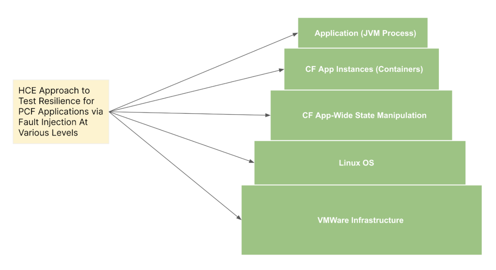
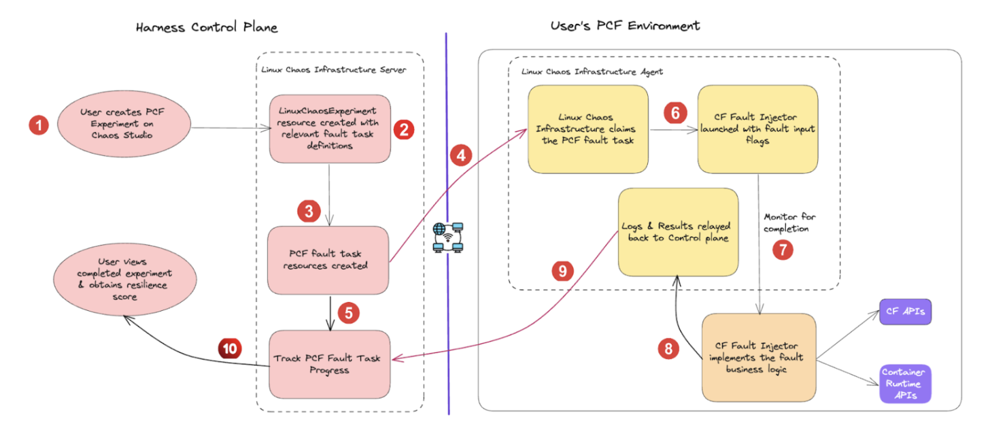
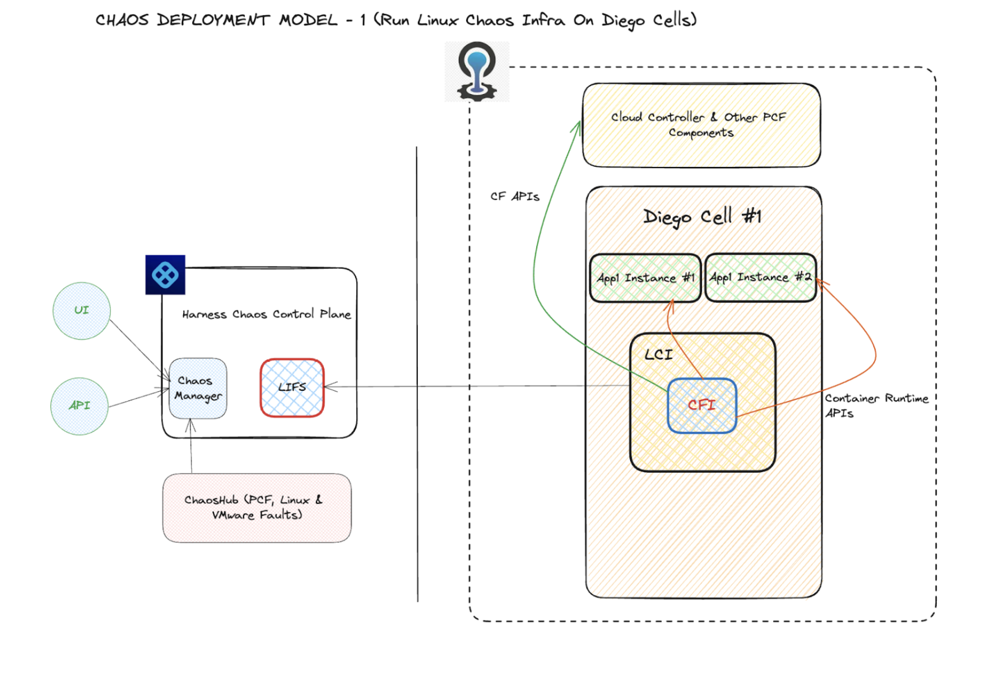
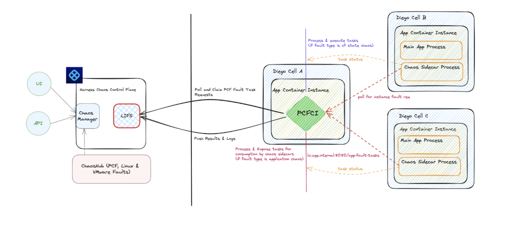
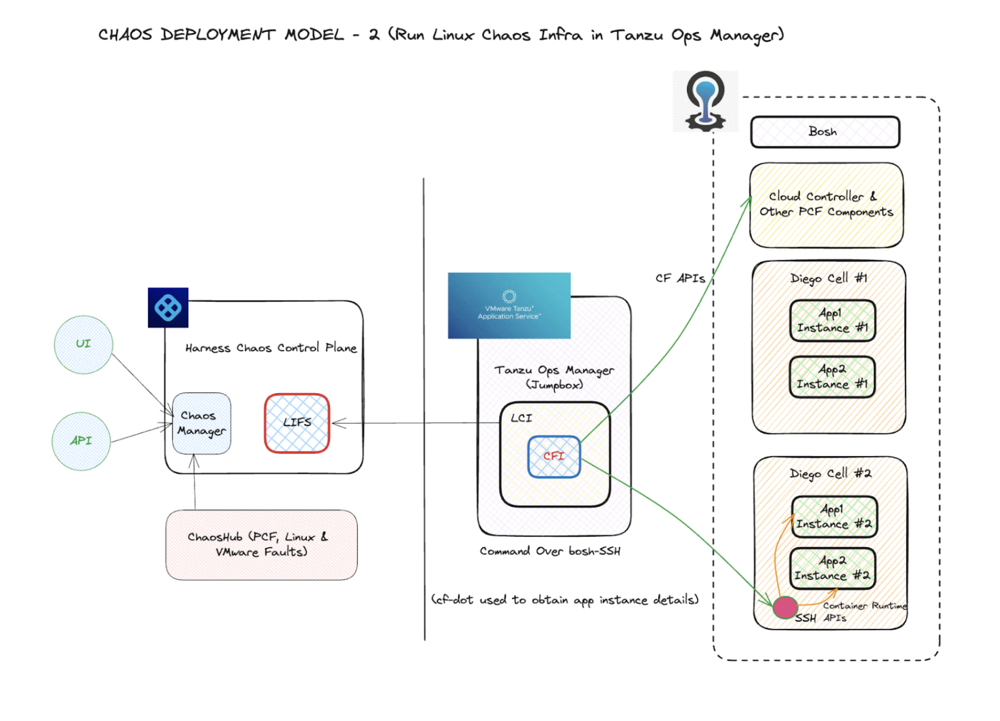

This section describes the components and their deployment architecture associated with injecting chaos on Cloud Foundry (CF).

## Overview

You can use HCE to test the resilience of your CF-based microservices by executing chaos experiments on various layers of CF, ranging from application processes (supported for JVM-based apps currently) to the underlying host (VMware) infrastructure.
HCE supports [resilience probes](/docs/chaos-engineering/use-harness-ce/probes/) which facilitates:
- Out-of-the-box faults against different target types.
- Automated validation of:
  - Resilience of the services (known as performance metrics);
  - Status endpoints;
  - Health check scripts.

You can natively combine custom actions such as load generation when you execute these experiments as a part of Harness pipelines.



:::info note
Currently, the native CF faults are supported from TAS/CF versions which have `containerd` as the default runtime (roughly since CF v6.7+).
:::

## Chaos components

HCE leverages two components that are installed in the user's CF environment to execute CF faults:

- **Linux chaos infrastructure**
    - Also known as Linux chaos agent or LCI in short.
    - It is a continuously running `systemd`-based service that orchestrates the fault injection and validates resilience with the help of resilience probes.
    - It is responsible for reporting the outcomes of the chaos experiments to the control plane.

- **Cloud Foundry fault injector**
    - In short, CFI.
    - It is a tool launched just-in-time by the Linux agent to run as a time-bound or transient process.



## Flow of control

CFI leverages the standard Cloud Foundry APIs (that are exposed by the CF cloud controller), and the container runtime (`containerd`) APIs to result in the desired fault conditions.

When you create a CF chaos experiment, LCI performs the following actions:
1. Fetch the tasks from the HCE control plane.
2. Parse application-specific and fault-specific inputs.
3. Launch the CFI with the appropriate flags to implement the chaos business logic.
4. After the experiment completes, collate the results and relaying it back to the control plane.

## Prerequisites for fault execution

To successfully execute a CF fault, you have to fulfill the following prerequisites:

- Outbound connectivity from the CF VM (where the LCI is installed) to:
    - Harness control plane;
    - CF cloud controller endpoint.

- Cloud Foundry configuration details to identify the app under test. The config details are typically placed in the `/etc/linux-chaos-infrastructure/cf.env` file and include the following attributes:

    ```
    CF_API_ENDPOINT=XXXXXXXXXXXXXXXXXXX
    CF_USERNAME=XXXXXXXXXXXXXXXXXXXXXXX
    CF_PASSWORD=XXXXXXXXXXXXXXXXXXXXXXX
    UAA_SERVER_ENDPOINT=XXXXXXXXXXXXXXX
    ```

## Chaos components deployment modes

Harness supports two deployment modes in the CF environment for the chaos components mentioned earlier. It is designed to support different networking configurations (or constraints) within enterprises.

### Run LCI in Diego cells hosting the app instances

This is the default deployment mode that is simpler, in which the LCI resides on the VM that hosts the app instances, that is, Diego Cells. In this model, the fault blast radius is confined to the app containers and application processes on the cell under test only, with respect to purely CF-API driven faults and app instance (or container)level fault types.



### Run CF infrastructure as native CF app interacting with chaos sidecars

In this model, the CF chaos infrastructure runs as a native CF application that interacts with the chaos sidecars present in the application instances.

The fault injection is achieved using a two-tier agent, with:

1. The first component is a subscriber service that runs as a native CF app (or microservice) that interacts with the Harness control plane, claims the CF fault requests, and performs one of the following:
    1. Injects the fault, for [purely CF-API driven faults](https://developer.harness.io/docs/chaos-engineering/use-harness-ce/chaos-faults/cloud-foundry/cf%20chaos%20components%20and%20their%20deployment%20architecture/#purely-cf-api-driven-faults).
    2. Exposes a task list with every task mapped to a specific app instance, for [application level (or process level faults)](https://developer.harness.io/docs/chaos-engineering/use-harness-ce/chaos-faults/cloud-foundry/cf%20chaos%20components%20and%20their%20deployment%20architecture/#application-framework-or-process-level-faults).

2. The second component runs as a sidecar process in the app instance that queries the first component for any task directed towards its own app instance ID/container, fetches the task and injects the chaos.

:::note
The second mode of deployment doesn't involve root privileges, and hence can't execute [application instance (or container level) faults](https://developer.harness.io/docs/chaos-engineering/use-harness-ce/chaos-faults/cloud-foundry/cf%20chaos%20components%20and%20their%20deployment%20architecture/#application-instance-or-container-level-faults).
:::



### Run LCI with Tanzu Ops manager

This deployment model leverages a jump box (typically the Tanzu Ops Manager) to run the LCI and CFI. The model uses [`bosh` commands to run fault-injection commands](https://community.pivotal.io/s/article/How-to-Run-Bash-Commands-via-BOSH?language=en_US) remotely on the Diego cells. This approach is used where the Diego cells are cordoned off in a private network that doesn't offer outbound connectivity.

In this model, the blast radius can extend to multiple cells as a part of a single fault (if you choose to) since the centralized CFI (on the jump box) can remotely inject faults on app instances across cells from the same location.



## CF faults classification

HCE supports three broad categories of native faults for CF applications.

### Purely CF-API driven faults

These faults involve out-of-band state manipulation of the apps that are deployed in the CF environment using only the Cloud Foundry APIs exposed by the CF cloud controller. For example, [app stop](/docs/chaos-engineering/use-harness-ce/chaos-faults/cloud-foundry/cf-app-stop.md), app delete, [app route unmap](/docs/chaos-engineering/use-harness-ce/chaos-faults/cloud-foundry/cf-app-route-unmap.md), app service unbind.

### Application instance (or container) level faults

These faults involve in-machine actions that impact the individual application instances that run as containers in the Diego cells. CF APIs are leveraged to extract the instance metadata (such as location, and container IDs) after which the instances are either killed ([app instance kill](/docs/chaos-engineering/use-harness-ce/chaos-faults/cloud-foundry/cf-app-container-kill.md)) or subjected to network, stress or I/O based fault injection.

### Application framework (or process) level faults

These faults involve in-machine actions that impact specific app processes running in the app containers. Currently, HCE supports JVM-based apps to inject these faults. The fault inputs reference the exact classes and methods to inject in-app latency, exceptions etc.

[Application instance](#application-instance-or-container-level-faults) and [framework](#application-framework-or-process-level-faults) level faults may require additional information if you choose to run LCI with Tanzu ops manager.

```
BOSH_CLIENT=XXXXXXXXXXXXXXXXXXXXXXX
BOSH_CLIENT_SECRET=XXXXXXXXXXXXXXXX
BOSH_CA_CERT=XXXXXXXXXXXXXXXXXXXXXX
BOSH_ENVIRONMENT=XXXXXXXXXXXXXXXXXX
```

:::tip
- This excludes the VMware and Linux OS based faults, which, though relevant in the CF context, are treated more as infrastructure faults.
- You can execute 3 types of native CF faults described earlier in any of the deployment modes (with [Diego cells hosting the instance](#run-lci-in-diego-cells-hosting-the-app-instances) or with [Tanzu ops manager](#run-lci-with-tanzu-ops-manager))
:::