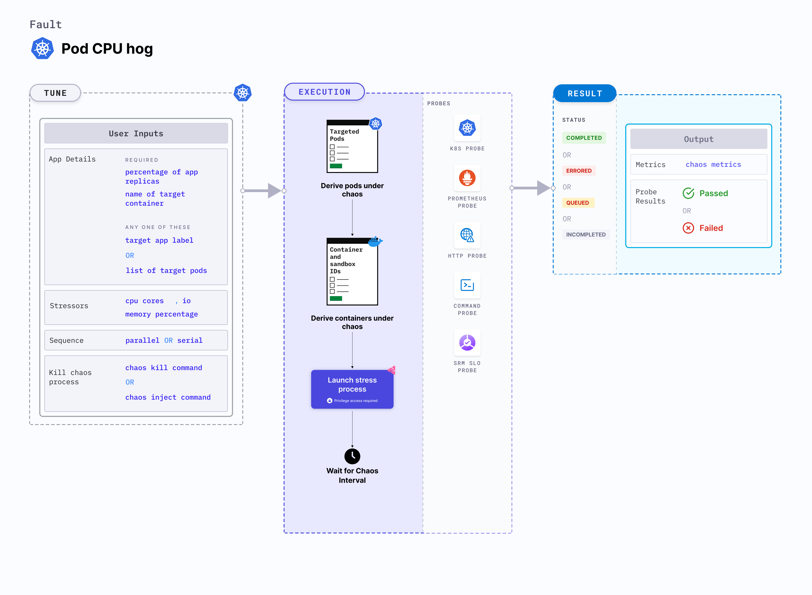

The Pod Application Function Error fault injects an error into a specified function of an application running within a Kubernetes pod. This fault helps assess the application's resilience to failures at the function level.



## Use cases

- Simulate third-party API failure by injecting errors into wrapper functions.
- Test application behavior when core business logic functions return unexpected errors.
- Validate retry mechanisms and fallback strategies for critical service methods.

### Prerequisites
- Kubernetes >= 1.12.0
- The target application pod must be running and accessible.
- The function to inject error into must be identifiable by name.
- The litmus-admin service account must be available in the target namespace.

### Permissions required

Below is a sample Kubernetes role that defines the permissions required to execute the fault.

```yaml
apiVersion: rbac.authorization.k8s.io/v1
kind: Role
metadata:
  namespace: hce
  name: pod-application-function-error
spec:
  definition:
    scope: Cluster # Supports "Namespaced" mode too
permissions:
  - apiGroups: [""]
    resources: ["pods"]
    verbs: ["create", "delete", "get", "list", "patch", "deletecollection", "update"]
  - apiGroups: [""]
    resources: ["events"]
    verbs: ["create", "get", "list", "patch", "update"]
  - apiGroups: [""]
    resources: ["pods/log"]
    verbs: ["get", "list", "watch"]
  - apiGroups: [""]
    resources: ["deployments, statefulsets"]
    verbs: ["get", "list"]
  - apiGroups: [""]
    resources: ["replicasets, daemonsets"]
    verbs: ["get", "list"]
  - apiGroups: [""]
    resources: ["chaosEngines", "chaosExperiments", "chaosResults"]
    verbs: ["create", "delete", "get", "list", "patch", "update"]
  - apiGroups: ["batch"]
    resources: ["jobs"]
    verbs: ["create", "delete", "get", "list", "deletecollection"]
```

### Mandatory tunables

<table>
  <caption>Target Application Tunables for Function Error Injection</caption>
  <thead>
    <tr>
      <th>Tunable</th>
      <th>Description</th>
      <th>Notes</th>
    </tr>
  </thead>
  <tbody>
    <tr>
      <td>NAME</td>
      <td>Name of the target application where the function is defined.</td>
      <td>For example: <code>my-app</code>. For more information, go to <a href="#name">name</a>.</td>
    </tr>
    <tr>
      <td>FUNCTION</td>
      <td>Name of the specific function in the application where the error will be injected..</td>
      <td>For example: <code>myFunction</code>. For more information, go to <a href="#function">function</a>.</td>
    </tr>
  </tbody>
</table>


### Optional tunables

<table>
  <caption>Common Tunables for Function Error Injection</caption>
  <thead>
    <tr>
      <th>Tunable</th>
      <th>Description</th>
      <th>Notes</th>
    </tr>
  </thead>
  <tbody>
    <tr>
      <td>TOTAL_CHAOS_DURATION</td>
      <td>Total duration (in seconds) for which the error will be injected into the function.</td>
      <td>Default: 60 s. For more information, go to <a href="/docs/chaos-engineering/use-harness-ce/chaos-faults/common-tunables-for-all-faults#duration-of-the-chaos">duration of the chaos</a>.</td>
    </tr>
    <tr>
      <td>MESSAGE</td>
      <td>Custom error message to be thrown by the function during chaos.</td>
      <td>For example: <code>Injected error for testing</code>. For more information, go to <a href="#message">message</a>.</td>
    </tr>
  </tbody>
</table>


### Name

The `NAME` env specifies the name of the target application that is under chaos.


[embedmd]:# (./static/manifests/pod-application-function-error/name.yaml yaml)
```yaml
---
# Injects error in a given function of the application pod
apiVersion: litmuschaos.io/v1alpha1
kind: K8sFault
metadata:
  name: pod-application-function-error
spec:
  definition:
    targets:
      application:
        name: 'my-app'
        function: 'myFunction'
    chaos:
      experiment: pod-application-function-error
      serviceAccountName: litmus-admin
      image: docker.io/harness/chaos-ddcr-faults:main-latest
      imagePullPolicy: Always
      env:
        - name: MESSAGE
          value: 'Injected error for testing'
```

### Function

The `FUNCTION` env specifies the specific function in the application where the error will be injected.


[embedmd]:# (./static/manifests/pod-application-function-error/function.yaml yaml)
```yaml
---
# Injects error in a given function of the application pod
apiVersion: litmuschaos.io/v1alpha1
kind: K8sFault
metadata:
  name: pod-application-function-error
spec:
  definition:
    targets:
      application:
        name: 'my-app'
        function: 'myFunction'
    chaos:
      experiment: pod-application-function-error
      serviceAccountName: litmus-admin
      image: docker.io/harness/chaos-ddcr-faults:main-latest
      imagePullPolicy: Always
      env:
        - name: MESSAGE
          value: 'Injected error for testing'
```

### Message

The `MESSAGE` environment variable specifies the exact error message to be thrown as part of the chaos fault injection.

[embedmd]:# (./static/manifests/pod-application-function-error/message.yaml yaml)
```yaml
---
# Injects error in a given function of the application pod
apiVersion: litmuschaos.io/v1alpha1
kind: K8sFault
metadata:
  name: pod-application-function-error
spec:
  definition:
    targets:
      application:
        name: 'my-app'
        function: 'myFunction'
    chaos:
      experiment: pod-application-function-error
      serviceAccountName: litmus-admin
      image: docker.io/harness/chaos-ddcr-faults:main-latest
      imagePullPolicy: Always
      env:
        - name: MESSAGE
          value: 'Injected error for testing'
```