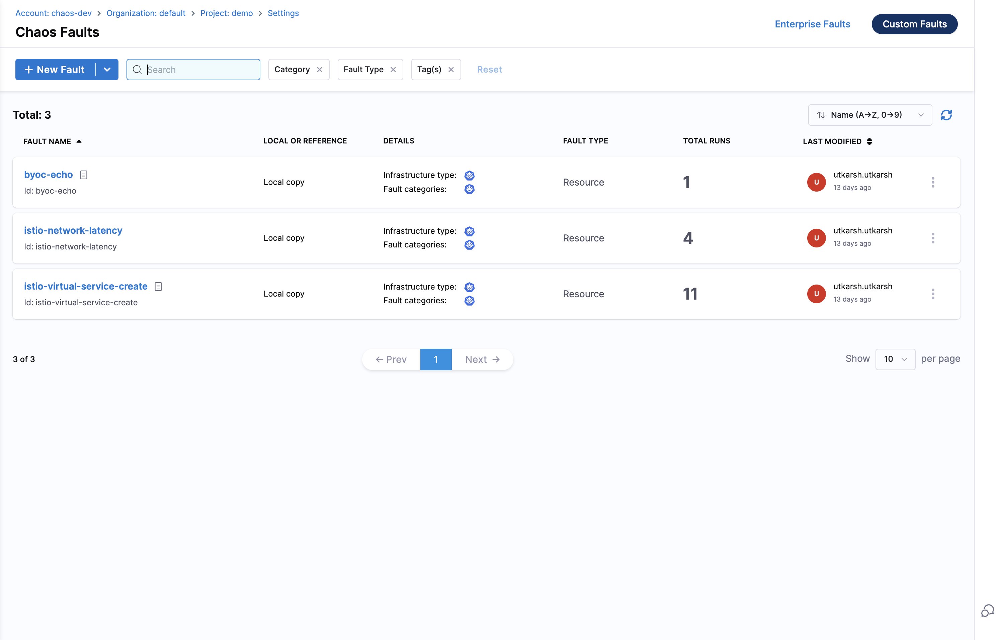

# Create Custom Faults

This approach allows you to build a custom fault from the ground up with complete control over its configuration and behavior.

:::info Feature Availability
This feature is available under the `CHAOS_NG_EXPERIENCE` feature flag. For new onboardings, this feature is enabled by default. 

If you are an existing Harness Chaos customer and would like to access this feature, please contact your Harness support representative to have it enabled for your account.
:::

## Overview

Creating custom faults from scratch gives you maximum flexibility to implement fault injection logic tailored to your specific infrastructure and application requirements. This method is ideal when existing fault types don't meet your needs or when you need precise control over fault behavior.

## When to Use

Choose this approach when:

- You have specific requirements that don't match existing fault types
- You need complete control over fault behavior and execution
- Your infrastructure has unique components requiring specialized fault injection
- You want to implement complex failure scenarios not covered by standard faults
- You need to integrate with custom monitoring or recovery systems

### Step 1: Getting Started

1. Navigate to **Project Settings** for your project and click on **Chaos Faults**. 

    

2. Click **Custom Faults** on the top-right, then click **New Fault** to create a new fault from scratch.

    

:::note Alternative Option
You can also choose **Start with a Template** to begin with a pre-configured fault template that you can customize for your needs. Learn more in the [Custom Fault Templates guide](./custom-fault-templates).
:::

### Step 2: Define Fault Basics

Configure these basic properties of your custom fault:

- **Name**: Provide a descriptive name for your fault (required field)
- **Description (optional)**: Add detailed description of what the fault does
- **Tags (optional)**: Add tags for better organization and searchability
- **Infrastructure type**: Select the target infrastructure (e.g., Kubernetes)
- **Category**: Assign the fault to an appropriate category (e.g., Kubernetes)
- **Permission Level**: Set the required permission level (e.g., Basic)
- **Permissions Required**: Define specific permissions needed for fault execution

### Step 3: Configure Fault Properties

Configure the execution properties and parameters for your custom fault, then click **Create Fault**.

**Basic Configuration**
- **Lib Image**: Container image containing your fault logic
- **Command**: Main command to execute
- **Arguments**: Command-line arguments for fault execution
- **Parameters**: Custom parameters that users can configure

**Advanced Configuration**
Additional options are available for volume dependencies, security settings, and container capabilities. Configure these based on your specific fault requirements.

### Step 4: Add to Experiments

Once your custom fault is created, navigate to **Chaos Experiments** and add your custom fault to a new or existing experiment. Your fault will be available under the **Custom Faults**.

    

## Next Steps

- [Create and run chaos experiments](/docs/chaos-engineering/quickstart)
- [Learn about chaos experiment best practices](/docs/chaos-engineering/guides/chaos-experiments)
