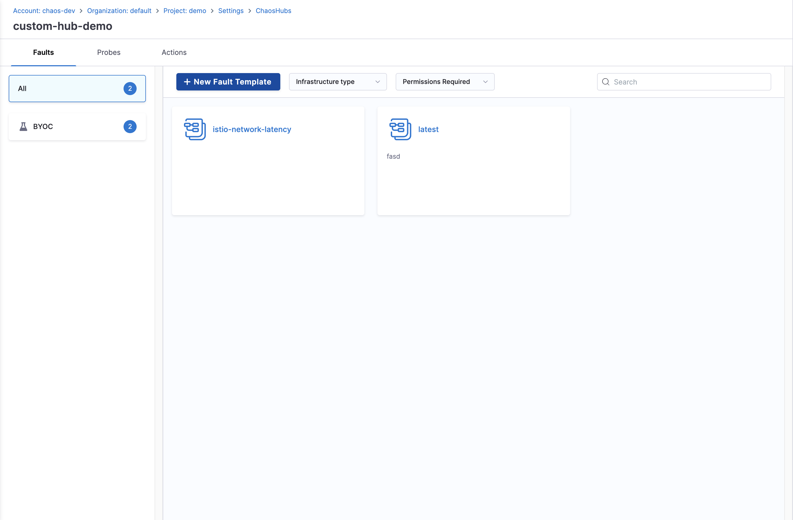
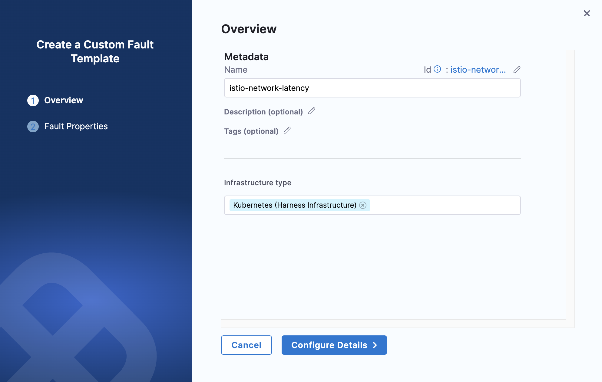
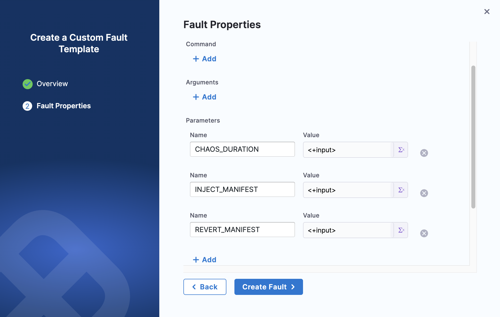
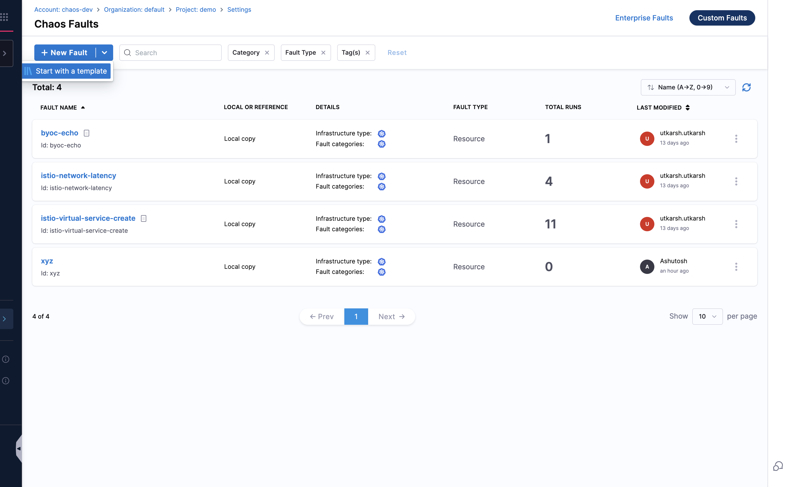
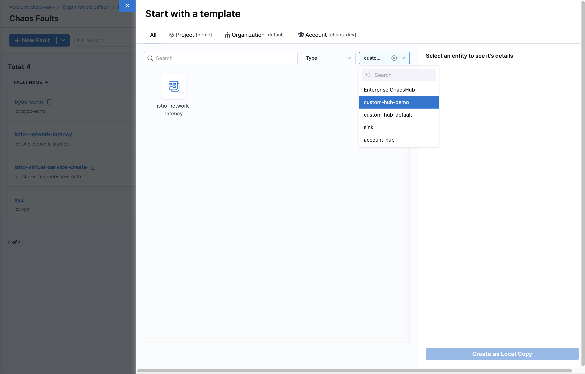
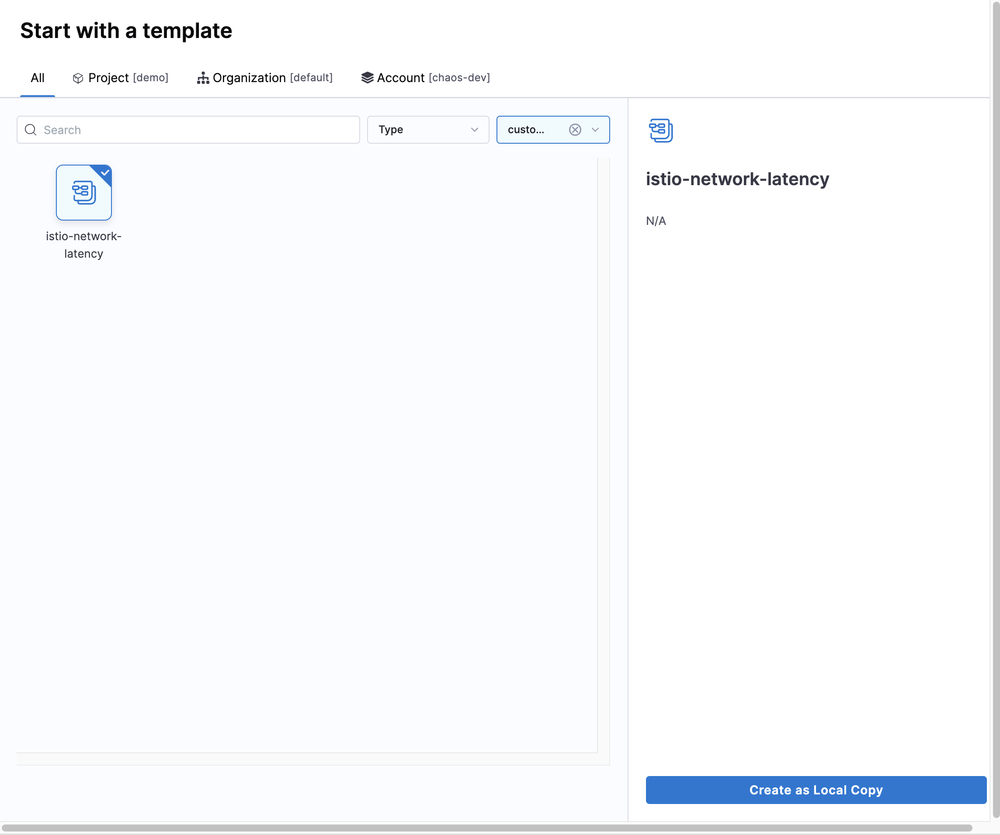
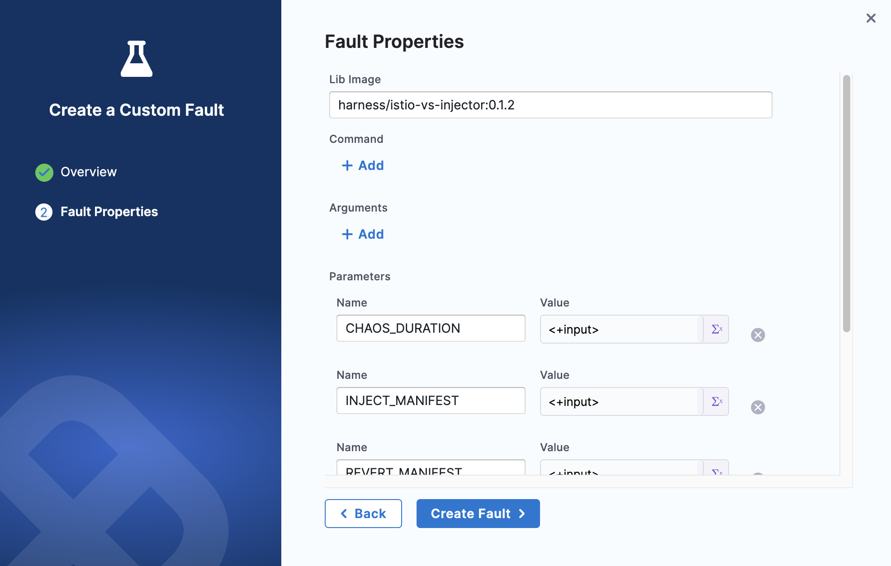

# Custom Fault Templates

This approach provides pre-configured templates that you can customize for your specific needs, enabling faster development and ensuring best practices.

:::info Feature Availability
This feature is available under the `CHAOS_NG_EXPERIENCE` feature flag. For new onboardings, this feature is enabled by default. 

If you are an existing Harness Chaos customer and would like to access this feature, please contact your Harness support representative to have it enabled for your account.
:::

## Overview

Custom fault templates offer a streamlined way to create chaos faults by starting with proven patterns and configurations. Templates include industry-standard settings, safety measures, and common parameters that can be customized for your specific use case.

## When to Use

Choose this approach when:

- Your use case aligns with common fault patterns
- You want to quickly prototype and iterate on fault designs
- You prefer guided configuration over building from scratch
- You want to ensure best practices are followed
- You need to rapidly deploy multiple similar faults

## Creating a Custom Fault Template

1. Navigate to **Project Settings** for your project and open your existing **Chaos Hub** or create a new one. 

    

2. Click **New Fault Template**, and add the basic details likes **Name**, **Description**, **Tags**, and **Category**. Then click **Configure Details**.

    

3. Configure the execution properties and parameters for your custom fault, then click **Create Fault Template**.

    

4. Now, go back to **Project Settings** for your project and open **Chaos Faults**.

5. Click **Custom Faults** on the top-right, then click the dropdown arrow next to **New Fault** and select **Start with a template**.

    

6. Select the custom fault template you created, you will find that in your project's **Chaos Hub**.

    

7. Select your fault template and click **Create as Local Copy**.

    

8. Configure the basic details for your fault. The fault properties will be automatically populated from the template. Review and modify as needed, then click **Create Fault**.

    

9. That's it! Add your custom fault to experiments as you would with any other fault.

## Next Steps

- [Create and run chaos experiments](/docs/chaos-engineering/quickstart)
- [Learn about chaos experiment best practices](/docs/chaos-engineering/guides/chaos-experiments)

