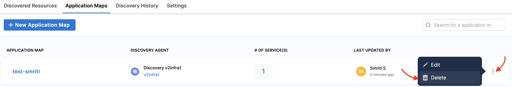
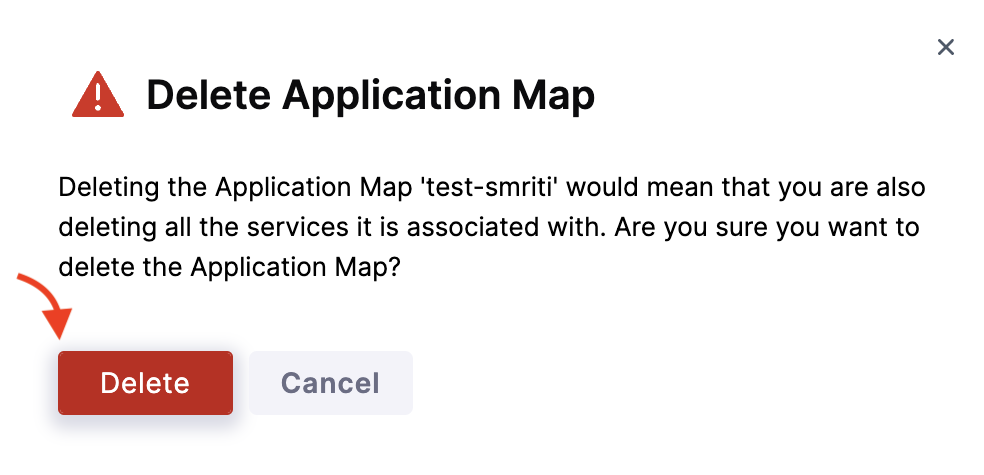

This topic describes application maps, their significance, and how to create, edit, and delete them.

### Before you begin

- [Service discovery](/docs/chaos-engineering/features/service-discovery/intro-service-discovery.md)

### What is an application map?

An application map is a resource on the Harness Platform (also known as the control plane) used to bind multiple interacting [discovered services](/docs/chaos-engineering/features/service-discovery/intro-service-discovery.md) into a single object, thereby allowing the users to act (test, monitor, and so on) on a group of services.

### Why is an application map required?

Application maps help:

- Test and monitor a group of services.
- Determine the resilience coverage and resilience score for the overall application map and its constituent services.
- Manage experiments associated with them.
- Perform trend analysis.

### How is an application map used?

Once you have a list of discovered services, HCE creates an application map (using [auto-suggestion or manual service selection](/docs/chaos-engineering/onboarding/guided-onboarding#create-application-maps)) based on your requirements. You can refer to the real-time topology view to get the connectivity representation.

You can [create](#create-application-map), [edit](#edit-application-map), and [delete](#delete-application-map) application maps.

### Create an application map

1. To create an application map, navigate to **Chaos** module, select **Project Settings**, and then select **Discovery**.

    

2. Select one of the discovery agents or [create a new discovery agent](/docs/chaos-engineering/features/service-discovery/service-discovery-usage#customize-discovery-agent).

    

3. Once you select or create a discovery agent, navigate to the **Application Maps** tab and select **New Application Map**.

    

4. Specify a name, description (optional), and tags (optional). Select **Continue**.

    

5. Select one or more discovered services and select **Next**.

    

6. Optionally, add service relationship details and select **Save Changes**.

    

7. Select **Save**.

    

:::info note
To view chaos-enabled experiment map, navigate to **Chaos** module and select **Application Maps**.

    

:::

### Edit application map

To edit an application map, select **More Options** (&vellip;), then select **Edit**. Make the necessary changes and select **Save**.

### Delete application map

1. To delete an application map, select **More Options** (&vellip;), then select **Delete**.

    

2. To confirm the deletion, select **Delete**.

    
