import Descriptions from './shared/field-descriptions.md'

This section will guide you through creating a new chaos dashboard, and creating custom visualizations for various entities of a chaos experiment.

## Before you begin

Refer to [overview of chaos dashboards](/docs/chaos-engineering/features/chaos-dashboard/overview.md) to understand what a chaos dashboard is, and how you can view a predefined chaos dashboard.

## Create a new visualization
To create a new visualization in a new dashboard, follow the steps mentioned below.

### Step 1: Click Dashboard
* To create a new dashboard, navigate to **Chaos Dashboards** and select **Go to Dashboards**.

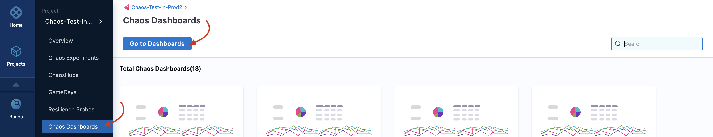

### Step 2: Specify parameters
* Click **+ Dashboard**, and filter by **chaos** dashboards.

* Add values for **Folder**, **Name**, and **Tags** (compulsory).

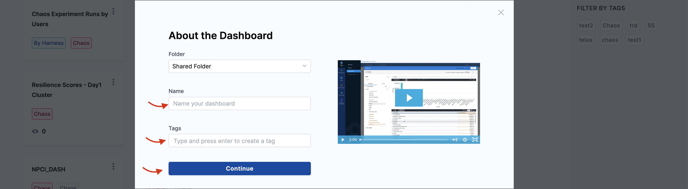

:::tip
Don't forget to add the **Tags** value because this is the field based on which the dashboards are filtered by modules.
:::

* Click **Continue**. This creates an empty dashboard. You can add visualizations (also known as **panels**) by editing this dashboard.

### Step 3: Edit dashboard

As mentioned earlier, you can edit a dashboard that you created.

* Click **Edit Dashboard** to edit the dashboard that you created in the previous step.

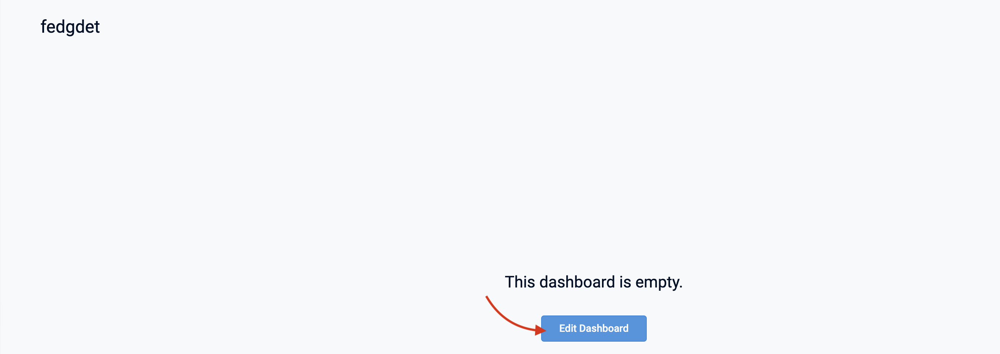

### Step 4: Add a visualization dashboard

* Click **Add** and select **Visualization**.

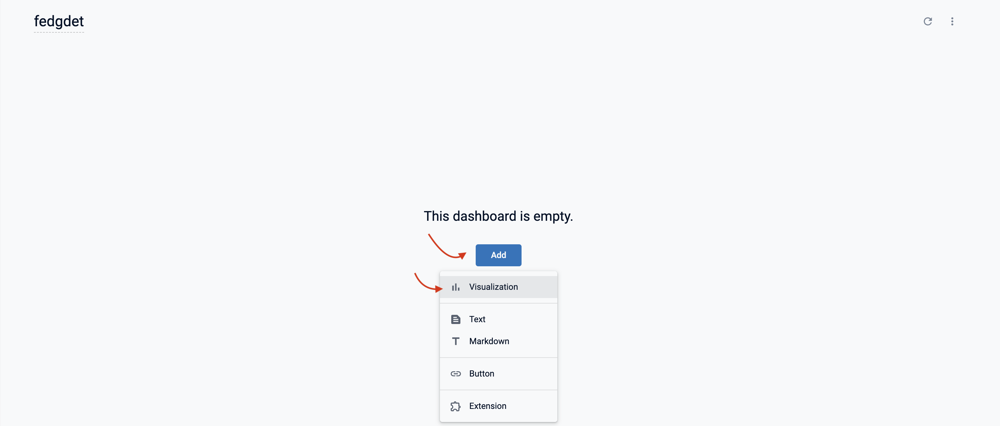

### Visualize the number of experiment runs for a time period

To visualize the number of successful experiment runs for a specific time period (months in this example), you need three fields:

1. Count of successful experiments
2. Experiment runs
3. Months

### Step 5: Select a table
* Select a table whose fields you wish to visualize. HCE currently supports **Chaos Experiment Runs**, **Chaos Experiments**, **Chaos Hub**, and **Chaos Infrastructures**. In this example, select **Chaos Experiment Runs**.

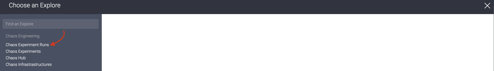

* This will display a left bar with different fields.

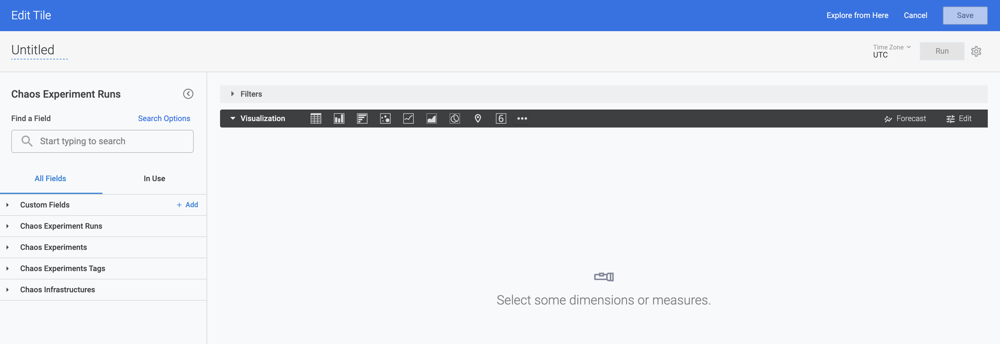

### Step 6: Select fields
* Select 2 or more fields which you wish to visualize. In this example, the first field would be **Month**. To select it, go to **Chaos Experiment Runs** -> **Created time** -> **Month**.

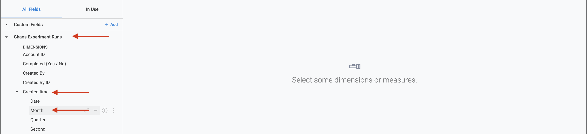

* The second field would be **count**.

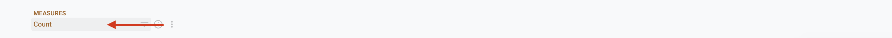

* The third field is not readily available, hence you can create a custom field.

### Step 7: Create a custom field

* To create a custom field, click **Custom Fields** -> **Add** -> **Custom Dimension**.

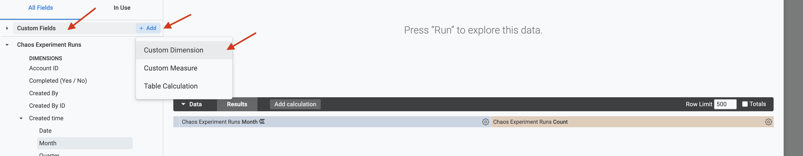

* To create the query to customize the field, use [lookML](https://cloud.google.com/looker/docs/what-is-lookml) query. Provide a name and click **Save**.

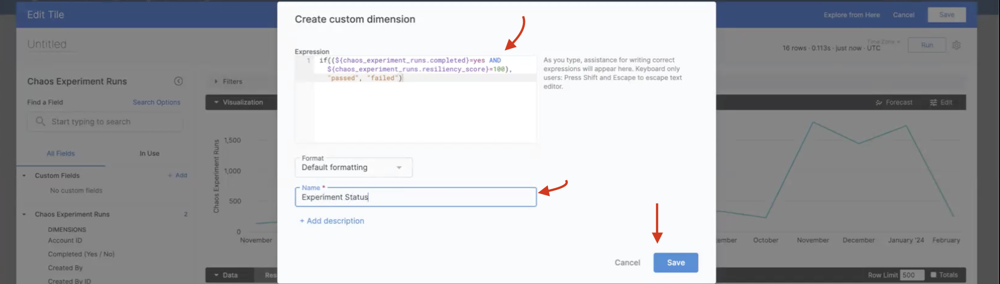

### Step 8: Pivot the results

* To visualize the results with respect to passed and failed experiment runs, click the settings button of the **Experiment Status** and select **Pivot**.

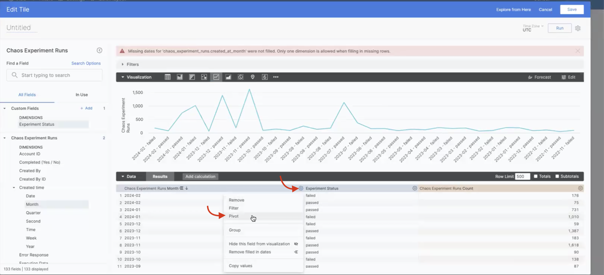

### Step 9: Click Run to view the graph
* When you click **Run**, chaos dashboard displays the graph of number of failed and passed experiment runs (x-axis) over different months (y-axis).

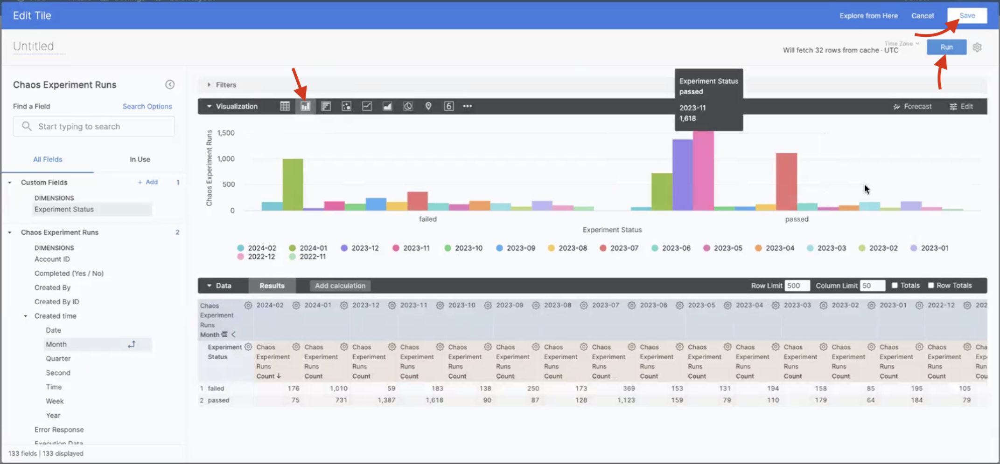

### Step 10: Click Save (Optional)
* If you wish to save your visualization, click **Save**. Otherwise, you can **Cancel** and add visualizations again.

:::info note
You can find the definitions for many of the fields [here](/docs/chaos-engineering/architecture-and-security/architecture/components).
:::

## Description of fields used

<Descriptions />

## Next steps

* [Best practices to build effective dashboards](/docs/platform/dashboards/dashboard-best-practices.md)