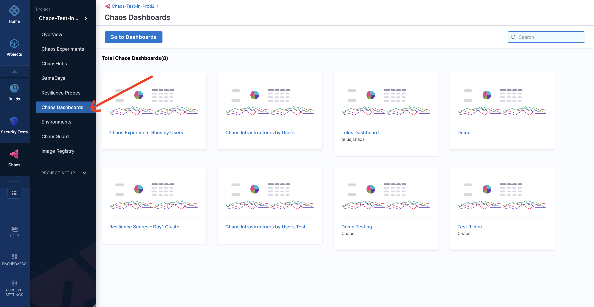
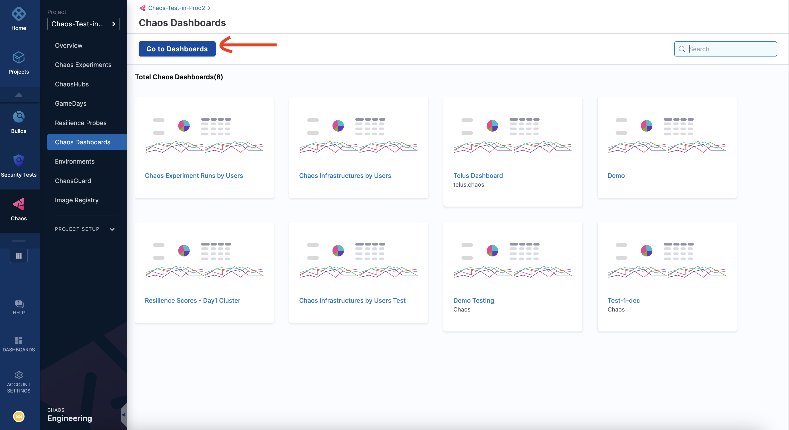
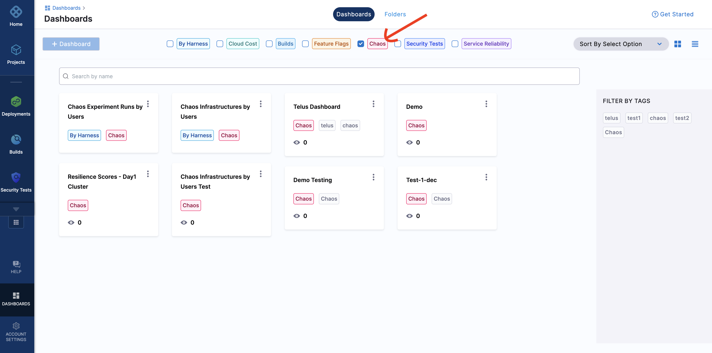
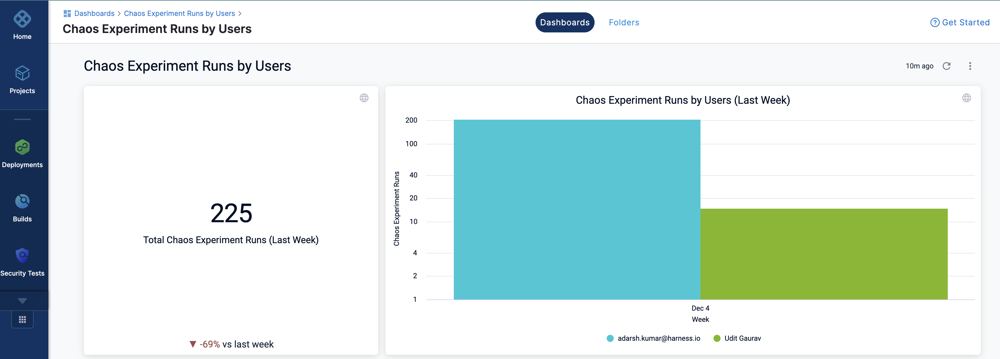
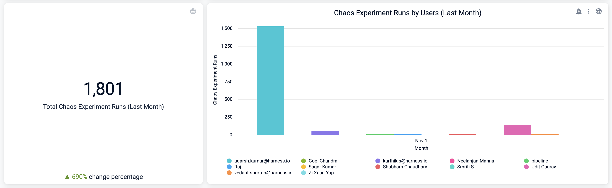
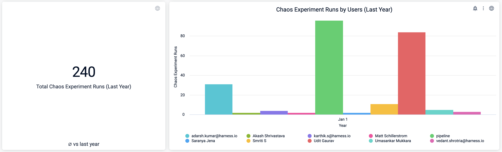
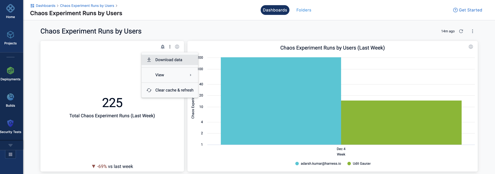

This section walks you through the concepts of Chaos dashboard and how you can visualize different aspects of a chaos experiment.

Dashboards help visualize important metrics and data associated with your experiment runs. They help create an at-a-glance summary to understand the behavior of data. They are also used for business analysis to gain actionable insights into data.

### Chaos dashboard
Chaos dashboard is an interactive user interface that manages, visualizes, and monitors chaos experiments. It helps visualize various features associated with a chaos experiment. It provides a visual of entities in the form of a bar graph, along with a tabular representation of the visualized data.

:::note
For SAAS, this feature is currently behind the feature flag, `CHAOS_DASHBOARD_ENABLED`. Contact [Harness Support](mailto:support@harness.io) to enable this feature.
Contact your [sales representative](mailto:sales@harness.io) to check if you are eligible for the on-prem platform.
:::

## View a chaos dashboard

To view a chaos dashboard, follow the steps below.

### Step 1. Navigate to Chaos Dashboards

* Navigate to **Chaos Dashboards**.

### Step 2. Go to Dashboards

* Click **Go to Dashboards**.

### Step 3. Select Chaos from list of modules

* From the modules displayed at the top, select **Chaos**. You can see a number of predefined chaos dashboards. You can either select one of the experiments or [create a new dashboard](/docs/chaos-engineering/features/chaos-dashboard/create-a-new-dashboard.md). Here, you can select a predefined chaos dashboards.

### Step 4. Predefined dashboard

* You will see multiple visualizations in this predefined dashboard.

:::tip
The values represented in the dashboards refer to previous week, month, and year. These visualizations don't consider the ongoing (or current) week, month, or year.
:::

:::info note 
You can view the data, and download the data in different formats (such as JSON, excel, and so on.)

:::

## Next steps

* [Create a new dashboard](/docs/chaos-engineering/features/chaos-dashboard/create-a-new-dashboard.md) 