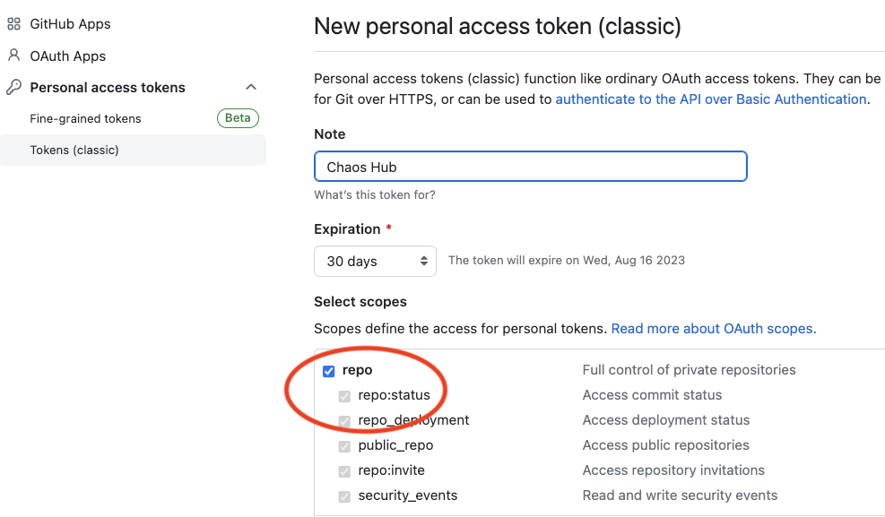
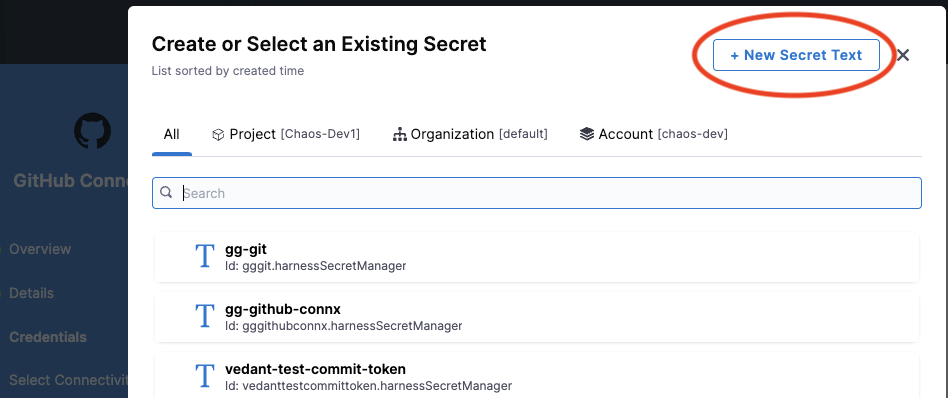
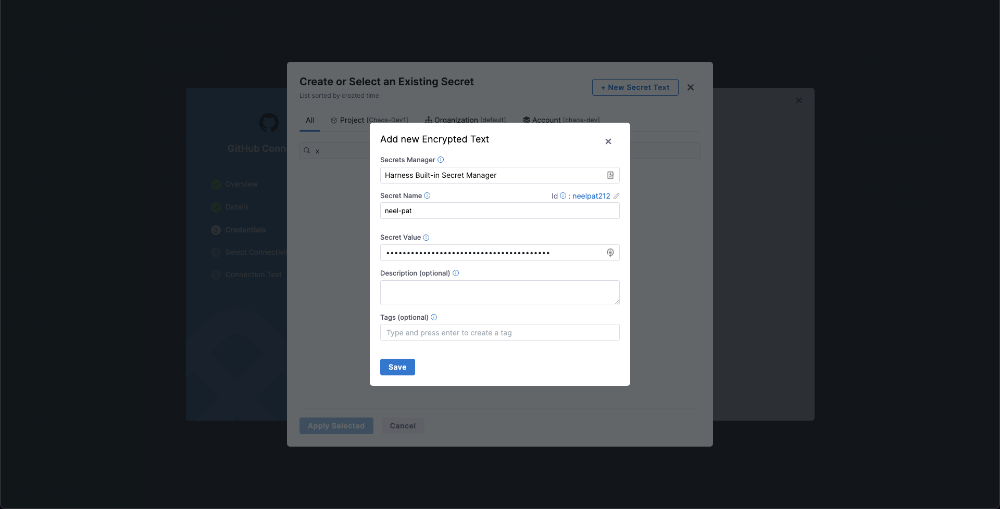

This section describes the reasons for adding a custom ChaosHub and how to add and connect a custom ChaosHub.

## Reasons to add a custom ChaosHub

There are several reasons for adding a custom ChaosHub. A custom hub lets you:

* Add custom experiments suited to specific needs in your organization.

* Share your experiments with others in your Harness project or in other Harness projects—you can add the same custom hub(s) to many projects.

* Maintain and upgrade experiments in one place so those you share your hubs with always have the latest version.

* Provide secure access to your custom experiments.

## Prerequisites to add a custom ChaosHub

1. Ensure you have a Git repository for your custom ChaosHub, where you will store experiments and faults. The repository must include two folders: `experiments` and `faults`. Here's an example repo:

	

1. Generate a personal access token [from GitHub](https://github.com/settings/tokens) to access and sync your repository with Harness. The token must have at least the **repo** scope.

	

## Add a custom ChaosHub

To add a custom ChaosHub:

1. In your Harness project, navigate to the **Chaos > ChaosHubs**, and then select **+ New ChaosHub**.

1. Enter a **Name** for the hub and, optionally, add a **Description** and **Tags**.

1. Select **Continue**.

1. On the Git Connection screen, add a new Git connector to access and sync your repository with Harness.

	

	1. Select the field **ChaosHub Connector**. This displays existing Git connectors listed under separate tabs for Project, Organization, and Account scopes.

		

	1. Select **New Connector**, and then choose **GitHub Connector**.

	1. In the Overview screen, enter a **Name** and optional description and tags, and then select **Continue**.

		The Details screen is displayed.

		

	1. In the Details screen, for **URL Type**, select **Repository**.

		You can select **Account** instead if you want to create an account-scoped GitHub connector. This may be used for connecting multiple ChaosHubs from a single GitHub account.

	1. For **Connection Type**, select **HTTP**.

	1. In **GitHub Repository URL**, enter the URL of your custom ChaosHub repository.

		If you selected **Account** for **URL Type**, fill out these fields instead:

		* In **GitHub Account URL**, enter the account URL for your custom ChaosHub repository.

		* In **Test Repository**, enter any repository name from your GitHub account to validate the connection.

	1. Select **Continue**.

		The Credentials screen is displayed.

		

1. On the Credentials screen, enter the **Username** (in plain text) for authenticating with your GitHub repo.

1. In **Personal Access Token**, select **Create or Select a Secret**.

	This displays all the secrets in separate tabs for Project, Organization, and Account scopes.

	

1. Select **New Secret Text**.

	

1. In the Add new Encrypted Text screen, fill out the fields as follows:

	1. In **Secret Name**, enter a name for this secret.
	1. In **Secret Value**, enter a personal access token (PAT) generated from [GitHub](https://github.com/settings/tokens).

		Ensure that the token has at least a [**repo**](#prerequisites) scope.

1. Select **Save**, and then on the Credentials screen, select **Continue**.

	

	This adds your GitHub repo connector and initializes the PAT for authentication.

1. In the Connect to provider screen, select **Connect through Harness Platform**, and then select **Save and Continue**.

	This starts a connection test, which validates that Harness is able to access the Git repository with the given configuration.

	

1. When the test is successful, select **Finish**.

	The Git Connection screen is displayed.

	

1. In **Hub Repository Branch**, enter the repository branch in which the ChaosHub files exist.
1. Select **Connect Hub**, and then select **Finish**.

	Your new custom ChaosHub appears in the **ChaosHubs** page.

:::info note
To share your custom ChaosHub with another Harness project, add the hub to the other project, using the same procedure above.
:::

## Next steps

Now you can add and launch experiments in your custom ChaosHub, or add YAML fault and experiment definitions directly in your ChaosHub GitHub repo, and then sync it with Harness. Head to [Manage custom ChaosHub](/docs/chaos-engineering/features/chaos-hubs/manage-hub) for details.
