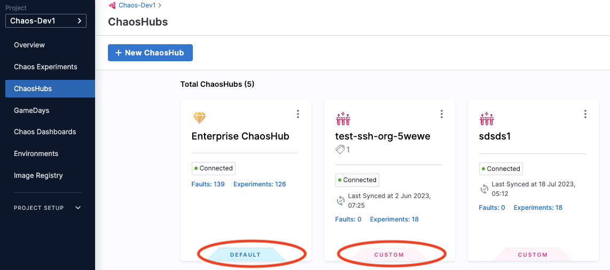
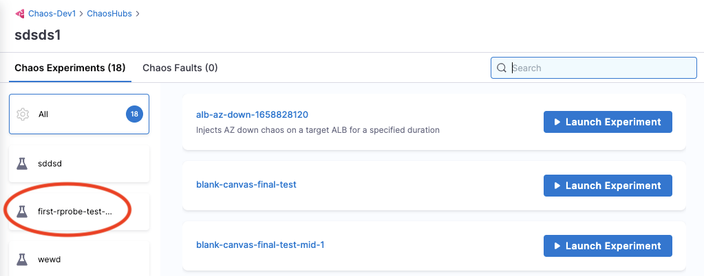
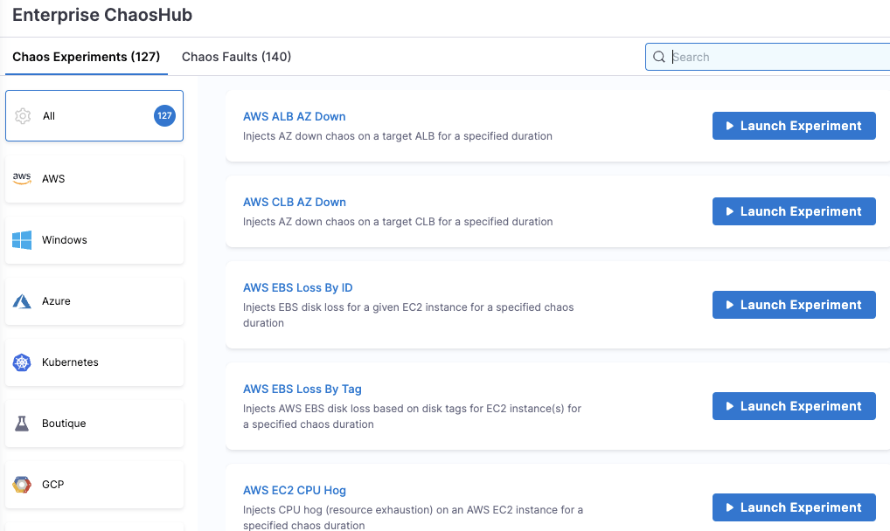
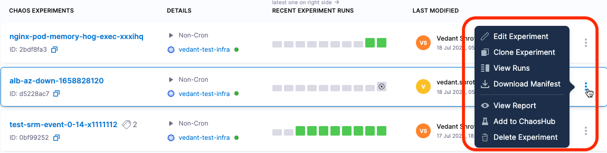
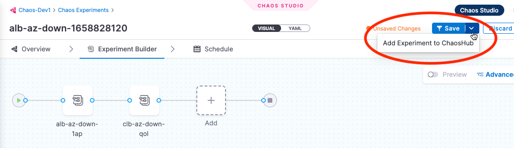

import Launch from '../shared/launch-experiment-from-hub.md'

This section describes how to save and manage experiments in your custom chaoshub(s), and how to sync your ChaosHub GitHub repo with Harness. Go to [Add a custom ChaosHub](/docs/chaos-engineering/features/chaos-hubs/add-chaos-hub.md) for setup instructions.

## View ChaosHubs

The experiments you see in various ChaosHubs are actually templates from which you can launch the experiments after specifying some details.

To view the default and custom ChaosHub:

1. In Harness, navigate to **Chaos > ChaosHubs**.

	This page lists the default Enterprise ChaosHub, and any custom ChaosHubs.

	

1. Select the ChaosHub you want to view.

	The experiments below are in a custom hub. All experiments are displayed by default. You can select a tag (circled below) to see experiments with that tag applied.

	

	The experiments below are in the default Enterprise ChaosHub. They are organized by platform/technology.

	

## Add experiments to a custom ChaosHub

When you add an experiment to a custom ChaosHub, it's saved as a template from which you can [launch](#launch-an-experiment-from-a-custom-chaos-hub) the experiment after specifying some details.

To add an experiment to a custom ChaosHub:

1. [Create an experiment](/docs/chaos-engineering/features/experiments/construct-and-run-custom-chaos-experiments.md) as usual.

1. In the Chaos Experiments page, find the experiment you want to add to a custom ChaosHub, select the **More options** icon (**⋮**), and then select **Add to ChaosHub**.

	

1. In the Save to ChaosHub screen, verify the **Name**, **Description** and **Experiment Category Tag**.

	To add a new tag, type its name and then press the Enter/Return key.

	

	:::tip
	Including **Experiment Category Tag(s)** helps organize your experiments. When you [view](#view-chaos-hubs) the custom ChaosHub, you can see all experiments as well as experiments grouped by tag.
	:::

1. Select the **Hub** field, choose the custom ChaosHub you want to add the experiment to, and then select **Apply**.

1. Select **Save**.

	This saves your experiment as a template in a custom ChaosHub.

:::info note
You can also save an experiment as a template to a custom ChaosHub when [creating the experiment](/docs/chaos-engineering/features/experiments/construct-and-run-custom-chaos-experiments.md) in Chaos Studio. The **Save** button saves the experiment itself so that it appears on the Chaos Experiments page. Selecting the **down-arrow** next to **Save** lets you add the experiment as a template to a custom ChaosHub.

:::

## Sync Harness with a ChaosHub Git repository

When you [connect a custom ChaosHub](/docs/chaos-engineering/features/chaos-hubs/add-chaos-hub.md), you can add and edit experiments in that hub in either Harness or the custom hub's GitHub repository. When you make changes in Harness, your repository is synced automatically. When you make changes in your repository, you must sync it with Harness using the UI.

To sync your custom ChaosHub's git repo with Harness:

1. In Harness, navigate to **Chaos > ChaosHubs**.
1. Select the **More options** icon (**⋮**) for the hub you want to sync, and then select **Sync Hub**.

	

## Launch an experiment from a ChaosHub

<Launch />

