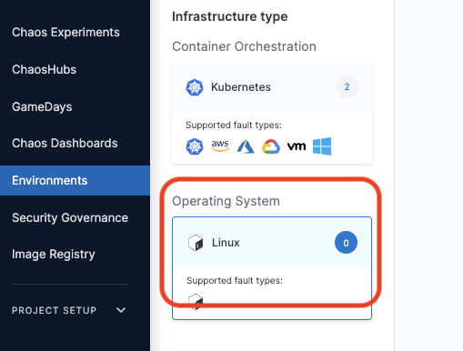

import Tabs from '@theme/Tabs';
import TabItem from '@theme/TabItem';


Chaos infrastructure is a service that runs in your target environment and aids Harness Chaos Engineering (HCE) in accessing and injecting chaos at cloud-native scale. There are different types of chaos infrastructure based on the target environments, such as Kubernetes, Linux VMs, etc. These chaos infrastructures can be installed as a Kubernetes service, as a Linux daemon, and so on, based on their type.

All the chaos infrastructure services adhere to the principle of least privilege, where the services execute with the minimum number of required permissions.

## Step 1. Create an environment

You must create a new environment in Harness to specify where you want the chaos infrastructure to exist.

To create an environment:

1. In your Harness project, navigate to **Chaos > Environments**.

1. Select **+ New Environment**.

1. In the **Create a new environment** screen, specify a **Name** for the environment, and optionally a **Description** and a **Tag**. 
1. For **Environment type**, choose either **Production** or **Non-Production**, and then click **Create**.

  This creates a new environment.

  

## Step 2. Add a chaos infrastructure

<Tabs>
  <TabItem value="Kubernetes">

This section outlines the steps to add a chaos infrastructure to a Kubernetes environment.

You can either setup a chaos infrastructure on existing infrastructures that uses a Harness cluster connector, that is, Harness Kubernetes connector or install the chaos infrastructure on a new infrastructure.

To add a chaos infrastructure on an existing Harness Kubernetes connector:

1. In Harness, navigate to **Chaos > Environments**, and then select the environment you want to add chaos infrastructure to.

1. In  the environment details page, select **+ Enable Chaos**.

1. On the next screen, select where to add chaos infrastructure, and then select **Continue**.

  Select one of the following:

    * **On Existing Infrastructures** 
    * **On New Infrastructures**

<Tabs>
  <TabItem value="On Existing Infrastructure">

2. If you selected **On Existing Infrastructures**, on the next screen, select any connector under the **Project**, **Organization**, or **Account** scope. (Otherwise skip this step.)

  

  :::info note
  A Harness Kubernetes connector with:
    * **Cluster-wide read/write access** can be used to set up chaos infrastructure in cluster scope and namespace scope.
    * **Specific namespace access** can be used to set up a chaos infrastructure in that specific Kubernetes namespace scope only.
    * **Cluster-wide read access** cannot be used to set up a chaos infrastructure.
  :::

1. Select **Continue**.

1. On the next screen, enter a **Name** for the chaos infrastructure, and optional **Description** and **Tags**, and then select **Next**.

  The Configure Chaos Infrastructure screen appears.

  

1. Under **Choose Access Type**, choose one of the following modes.

    * **Cluster Wide:** This mode of infrastructure installation allows targeting resources across the entire cluster, in all the namespaces, as part of an experiment. 
    * **Namespace Mode:** This mode of infrastructure installation allows targeting resources only in the namespace where the chaos infrastructure is deployed.

    By default the installation will take place in the `hce` namespace and uses `hce` service account, which can be configured under the K8s cluster details.
    
    Optionally, you can also specify the node selectors and Kubernetes tolerations for chaos infrastructure deployment.

    :::tip
    - There can only be one cluster-wide chaos infrastructure per cluster.
    - There may be multiple namespace-scoped chaos infrastructures per cluster.
    :::

1. Select **Next**.

  The Deploying your Infrastructure screen appears. 

1. If you're deploying **on existing infrastructure**, select **Done**.  

  This is your final step. Harness installs the chaos infrastructure on your behalf.

</TabItem>

  <TabItem value="On New Infrastructure">

1. If you're deploying on **new infrastructure**, you must run the given commands and/or download and apply the installation manifest YAML file.

    * **For cluster-wide access:** 

      1. Select **Download**, and then copy and run the `kubectl` command shown on your screen to install the chaos infrastructure.

      

    * **For namespace access:** 

      1. Run the first `kubectl` command to create the target namespace.
      1. Run the second `kubectl` command to apply the chaos CRDs.
      1. Select **Download**, and then copy and run the third command to install the chaos infrastructure.

      

1. Select **Done**.

### Use helm template to install chaos infrastructure

HCE provides Helm support to install chaos infrastructure, in addition to installing with the help of a manifest (as explained earlier).

To use Helm to install a chaos infrastructure,

1. Navigate to **Chaos Experiments** -> **Environment**.


2. You can select **New environment** and create an environment and install or upgrade chaos infrastructure. To enable chaos on an existing environment, click the environment.


3. Click **Enable chaos**.


4. You can use Helm commands to enable chaos on new infrastructure only. Click **On new infrastructures** and **Continue**.


5. Add a name, description (optional) and a tag (optional). Click **Next**.


6. Choose installation type as **Helm**, and one of the access types (namespace or cluster-wide). Specify namespace and service account.


7. Depending on the type of access you chose, you will see a set of commands. If you select namespace type, you will need to enter some advanced input values. Click **Next**. 


8. You will see the following commands that you need to execute on your terminal. One you are done, click **Completed Command Execution**.


9. If you select namespace scope, you will see the following commands that you need to execute on your terminal. One you are done, click **Completed Command Execution**.


### Use helm template to upgrade chaos infrastructure

* To upgrade a chaos infrastructure that you installed using the Helm commands, you can navigate to the environment and click **Upgrade now**. This will list the set of commands that you can execute on your terminal.


2. Choose an existing environment or create a new environment

3. If you want to override other values, you can make the changes in the values.yaml file of the respective custom resource in the Helm repository.
1. Download the [helm repository](https://github.com/harness/chaos-infra-helm-chart). This repository contains all the chaos resources required for chaos infrastructure management. The repository also contains resources necessary for namespace and scope installations. You can use this repository to install and manage the infrastructure.

Based on the scope of installation, you have to execute the commands.

1. If you wish to install the infrastructure in namespace scope, you will get a helm command to install the CRDs. You have to apply this command separately before installing or upgrading the infrastructure.
2. If you wish to install the infrastructure in cluster scope, apply the helm upgrade command to install the CRDs and other infrastructure components.

:::tip
1. If you install your infrastructure in cluster scope, HCE supports auto-upgrade for such an infrastructure.
2. It is important that you remember that the flags in the command are based on the input parameters you provide while installing the infrastructure. 
:::

</TabItem>
</Tabs>

</TabItem>
  <TabItem value="Linux">

This section outlines the steps to add a chaos infrastructure to a Kubernetes environment.

:::info note
If you're installing the chaos infrastructure alongside SElinux, you must add a policy module to enable `timedatectl`. SElinux is enabled by default in distributions such as **CentOS**, **SUSE Linux**, **RHEL**, and **Fedora** among others.


<details>

If you have enabled SELinux for your OS, you must add a policy module prior to the installation of the infrastructure to access `timedatectl`, which is used in the **linux-time-chaos** fault.

To add the policy module:

1. Create the file `timedatectlAllow.te` in your Linux machine as follows:

  ```te

  module timedatectlAllow 1.0;

  require {
          type systemd_timedated_t;
          type initrc_t;
          class dbus send_msg;
  }

  #============= systemd_timedated_t ==============
  allow systemd_timedated_t initrc_t:dbus send_msg;

  ```

1. Install the utilities that will help in compiling and packaging the policy module for your system. Here, we're using the yum package manager to install them:

  ```bash
  sudo yum install -y policycoreutils-python checkpolicy
  ```

1. After the installation of these packages, compile the policy module with the following command:

  ```bash
  sudo checkmodule -M -m -o timedatectlAllow.mod timedatectlAllow.te
  ```

  This creates the binary policy module file `timedatectlAllow.mod`. 

1. Use the policy module file from the previous step to create a policy module package:

  ```bash
  sudo semodule_package -o timedatectlAllow.pp -m timedatectlAllow.mod
  ```

  This creates the policy module package file `timedatectlAllow.pp`. 

1. Add the package file from the previous step alongside the other SELinux modules in your system:

  ```bash
  sudo semodule -i timedatectlAllow.pp
  ```

The SELinux policy module is now added, and you can proceed to install the infrastructure.

</details>
:::

To add a Linux chaos infrastructure:

1. In Harness, navigate to **Chaos > Environments**, and then select the environment you want to add chaos infrastructure to.

1. In the environment details page, under **Infrastructure type**, select **Linux**, and then select **+ Enable Chaos**.

  

1. On the next screen, enter a **Name** for the infrastructure, and optionally, a **Description** and **Tags**. 

  
  
  You can also specify the [advanced setup](/docs/chaos-engineering/architecture-and-security/architecture/linux-chaos-infrastructure-advanced-management#advanced-setup) options for the infrastructure. 

1. Select **Next**.

  

1. On the next screen, copy the command to set up Linux chaos access, select **Done**, and then execute the copied command on your Linux machine.

</TabItem>
  <TabItem value="Windows">

:::important
Ensure that you have fulfilled the [prerequisites](/docs/chaos-engineering/chaos-faults/windows/prerequisites.md) before connecting to a Windows chaos infrastructure.
:::

1. Navigate to **Environments** and click **Windows**. click **Enable chaos**.


2. Add name (mandatory), and admin user.


3. Copy the command generated. The [prerequisites](/docs/chaos-engineering/chaos-faults/windows/prerequisites.md) discusses how you can configure a password. If you have a password, replace it in the `<your-password>` placeholder. Execute this command on your terminal (remember to open the command prompt as an admin if you are not admin by default). Click **Done** once you finish the execution.


This displays the following updates about the installation on your terminal.

```
    Directory: C:\


Mode                 LastWriteTime         Length Name
----                 -------------         ------ ----
d-----          3/7/2024   7:48 AM                HCE
Downloading Testlimit...
Extracting Testlimit...
Accepting Testlimit EULA...
Testlimit EULA accepted.
Downloading windows-chaos-infrastructure binary...
Config file created at C:\\HCE\config.yaml


    Directory: C:\HCE\Logs


Mode                 LastWriteTime         Length Name
----                 -------------         ------ ----
-a----          3/7/2024   7:51 AM              0 windows-chaos-infrastructure.log
[SC] CreateService SUCCESS
Service created and started successfully.

```

</TabItem>
</Tabs>


## Step 3. Validate the chaos infrastructure installation

After the final step of adding chaos infrastructure, Harness takes some time to set up all the chaos infrastructure resources. On the UI, if you navigate to **Environments** -> **Windows** (or Kubernetes or Linux), you can see the connection status is `CONNECTED`.


That's it! Now you're all set to inject chaos into your infrastructure.