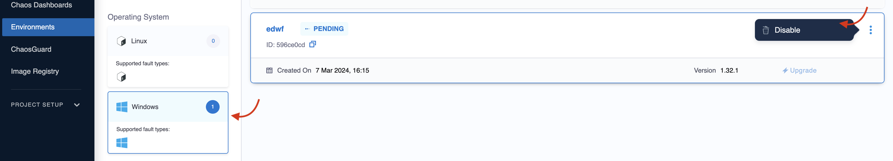

Disconnecting and deleting a chaos infrastructure removes it from the environment where it resides. It also removes the infrastructure services from the Kubernetes cluster.

Go to the **Environments** sidebar option under the **Chaos** tab, where all the environments created under the current project are listed. Select the environment in which the chaos infrastructure to be deleted resides.

Based on the infrastructure you have used, you can follow the steps to disconnect [Kubernetes](#remove-kubernetes-infrastructure), [Linux](#remove-linux-infrastructure), and [Windows](#remove-windows-infrastructure) infrastructure, respectively.

  

## Remove Kubernetes infrastructure

1. To disconnect a Kubernetes infrastructure, select the `⋮` icon against the chaos infrastructure name and select **Disable**.

    

2. Next, execute the commands displayed in the modal from your terminal to remove the chaos infrastructure components. Finally, select **Confirm**.

    

## Remove Linux infrastructure

1. To disconnect a Linux infrastructure, select the `⋮` icon against the chaos infrastructure name and select **Disable**.

    

2. Next, copy the command displayed in the modal, and execute it in your Linux machine to uninstall the chaos infrastructure components. Finally, select **Confirm**.

    

## Remove Windows infrastructure

1. To disconnect a Windows infrastructure, select the `⋮` icon against the chaos infrastructure name and select **Disable**.

    

2. Next, copy the command displayed in the modal, and execute it in your Windows machine terminal to uninstall the chaos infrastructure components. Finally, select **Confirm**.

    

With that, the chaos infrastructure will be disconnected.