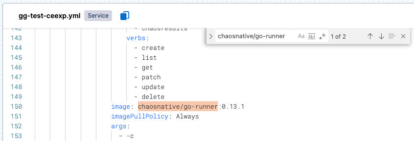

If a HCE release is not backward compatible, upgrade your chaos infrastructure to ensure you can execute all experiments smoothly. This applies only to releases that have breaking changes, which will be clearly indicated in [release notes](/release-notes/chaos-engineering).

:::warning
If you don't upgrade your infrastructure for these types of releases, chaos experiments may fail.
:::

These are the high-level steps to upgrade your chaos infrastructure, explained in detail later:

1. [Delete the old ChaosEngine CRs](#step-1-delete-the-old-chaosengine) where you've deployed a chaos infrastructure.
1. [Update CRDs](#step-2-upgrade-crds-where-youve-deployed-a-chaos-infrastructure) where you've deployed a chaos infrastructure.
1. [Update the chaos infrastructure in Harness](#step-3-update-the-chaos-infrastructure-in-harness) in environments where you've deployed it.
1. [Edit experiment YAML](#step-4-update-the-chaosnativego-runner-image-in-experiment-yaml) to update the chaosnative/go-runner image to the new version.

## How to tell if an infrastructure upgrade is required

Go to **Chaos > Environments**, and select an environment where you've installed chaos infrastructure.  **UPGRADE NEEDED** is displayed next to an infrastructure if it requires an upgrade, along with an **Update** link.


## Upgrade your chaos infrastructure

### Step 1: Delete the old ChaosEngine

This step removes all ChaosEngine custom resources (CRs) in the infrastructure namespace.

1. Connect to the cluster on a console where you can run `kubectl`.
1. Delete the old ChaosEngine CRs from the cluster:

	```
	kubectl delete chaosengines --all -n NAMESPACE_OF_CHAOS_INFRASTRUCTURE
	```

1. If ChaosEngine CRs are not being deleted, remove the finalizer from all the chaosengine CRs.

	```
	kubectl get chaosengine --no-headers -o custom-columns=":metadata.name" -n NAMESPACE_OF_CHAOS_INFRASTRUCTURE | xArgs  kubectl patch chaosengine {}   -p '{"metadata":{"finalizers":[]}}' --type=merge -n NAMESPACE_OF_CHAOS_INFRASTRUCTURE
	```

1. Confirm ChaosEngine CRs are deleted.

	```
	kubectl get chaosengine -n NAMESPACE_OF_CHAOS_INFRASTRUCTURE
	```

### Step 2: Upgrade CRDs where you've deployed a chaos infrastructure

1. Connect to the cluster on a console where you can run `kubectl`.
2. Run this command to upgrade the CRDs:

	```
	kubectl apply -f https://raw.githubusercontent.com/chaosnative/hce-charts/main/hce-saas/hce-saas-crds.yaml
	```

### Step 3: Update the chaos infrastructure in Harness

1. In Harness, go to **Chaos > Environments**, and then select an environment where you've installed chaos infrastructure.

	**UPGRADE NEEDED** is the status displayed next to infrastructures that require an upgrade.

	

1. Select **Update** (next to the old version number), and then follow the instructions on the next screen.

	When the update is complete, the status changes to **CONNECTED**, and the new version number is displayed.

### Step 4: Update the chaosnative/go-runner image in experiment YAML

For existing experiments that use the infrastructure you're upgrading, you must update the version of the chaosnative/go-runner image. You do this by editing the YAML definitions of these experiments. This step is not required for new experiments after the upgrade.

To update the chaosnative/go-runner image version in an experiment:

1. Refer to the [release notes](/release-notes/chaos-engineering) to determine the required version of the chaosnative/go-runner image.

1. In Harness, go to **Chaos > Chaos Experiments**, and then select the experiment you want to update.

1. At the top of the experiment details page, select **YAML**.

1. In the experiments `.yml` file, select **Edit Yaml**.

1. In the edit view, do a browser search (`Ctrl/Cmd + f`) for `chaosnative/go-runner`, and then update its version number.

	For example, this updates chaosnative/go-runner to version 0.13.1.

	

1. Select **Save**.

1. Repeat this procedure to update the relevant existing experiments in any custom chaos hubs that may be connected to your project.