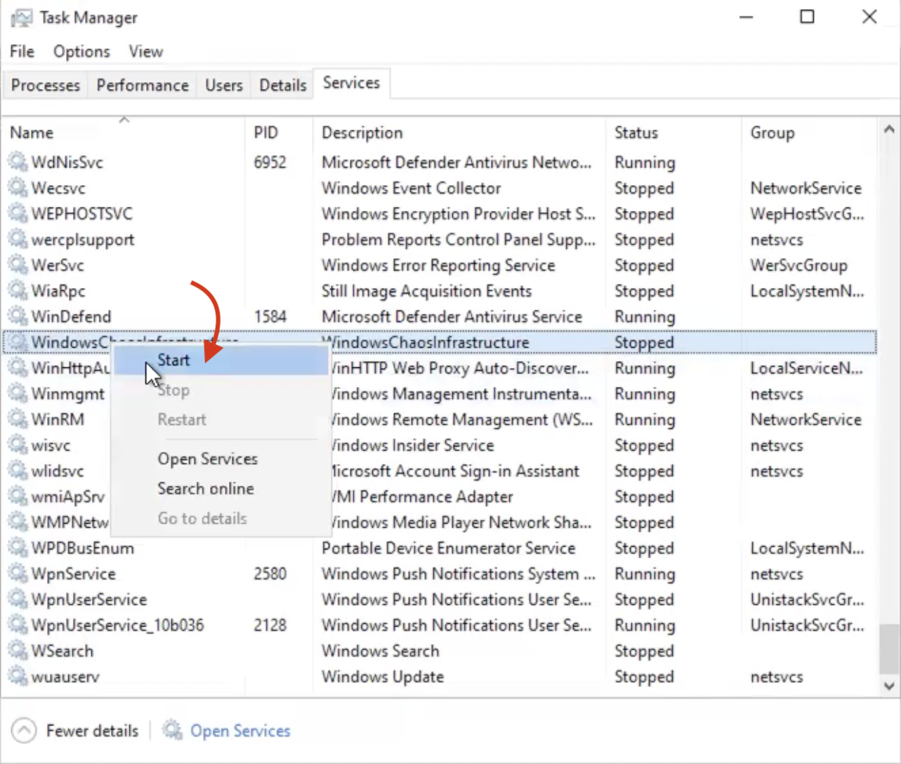

This section describes the [advanced setup](#advanced-setup), [logs](#logs), and [resilience probes](#resilience-probes-for-windows) associated with the Windows chaos infrastructure.

HCE supports executing Windows faults similar to Linux faults.

## Before you begin
* [Prerequisites](/docs/chaos-engineering/chaos-faults/windows/prerequisites.md)

The diagram represents a high-level architecture of the interaction between the Windows execution plane and control plane components.

## Advanced setup

The mandatory input required for the installation of the chaos infrastructure is the `name`.
You can tune the other flags of the infrastructure with the following flags:

1. **admin user**: Administrator used to execute commands on the terminal to install and manage the Windows chaos infrastructure. By default, the logs are stored at `C:\\HCE\logs`.

2. **task poll interval**: Interval between subsequent poll queries to the server for a new experiment. The default value is **5 seconds**.

3. **task update interval**: Duration between subsequent status updates of an active fault to the server. The default value is **5 seconds**.

4. **infrastructure liveness update interval**: Interval between the chaos infrastructure liveness heartbeats. The default value is **5**.

5. **update retries**: Number of retries before the service fails.

6. **update retries interval seconds**: Interval between the subsequent attempts to send a fault status or result, in case of a failure. The default value for it is **5 seconds**.

7. **log file max size**: Maximum size limit for the chaos infrastructure log file rotation. Upon breaching the size limit, a new log file is created to store the logs and the old log file is retired as a backup archive. The default value is **5 MB**.

8. **log file max backups**: Maximum number of backup archives to be retained at any given time. The oldest archive is deleted when a new log file is created. The default value is **2**.

9. **experiment log file max age**: Number of days after which the experiment log files will be deleted. The default value is **30**.

10. **http proxy**: HTTP proxy URL used to communicate with the control plane.

11. **http client timeout**: HTTP client timeout for communicating with the control plane. The default value is **30s**.

## Infrastructure service
The Windows chaos infrastructure is installed as an executable binary on your Windows VM. The service binary is present in `C:\\HCE\windows-chaos-infrastructure.exe` path. The config file is present in `C:\\HCE\config.yaml` path.

## Logs
Logs that are generated are stored in the `C:\\HCE\logs` directory by default.

There are two types of logs:
1. **Infrastructure logs:** Infrastructure logs are generated as a result of any infrastructure operation that is not directly related to the execution of an experiment. Every experiment run has a new log folder with all connectivity logs.

:::info
- The file is rotated based on its size; when the file size is a specified size, it is archived in a separate file with the timestamp of rotation suffixed to the file name. By default, this value is **5 MB**.
- Eventually, the old archives will be deleted. The maximum number of most recent archives that are retained at any given time can be specified. By default, this value is **2**.
:::

2. **Experiment logs:** Experiment logs are stored in separate files, which are scoped to the faults of the experiment. It contains information about the various steps of the execution of that fault, including any errors caused during the execution of the fault. The files use the unique fault name mentioned in the experiment as their filename.

:::info
- These files are rotated based on their age; where files older than a specific number of days are removed. By default, this value is **30 days**.
:::

## Verify Windows infrastructure service status

To verify the status of the service, navigate to the command prompt on your Windows. Search for **Task Manager**, select **More details** and check the status of **WindowsChaosInfrastructure**.

1. If the status reads **Running**, it means the windows infrastructure is up and running.

2. If it reads **Stopped**, right click and select **Start**.

3. Any other status will be associated with logs which you can troubleshoot using our [troubleshooting guide](/docs/chaos-engineering/troubleshooting/troubleshooting.md)

## Resilience probes for Windows

HCE allows you to create the below probes for Windows:

1. [HTTP](/docs/chaos-engineering/features/resilience-probes/http-probe)
